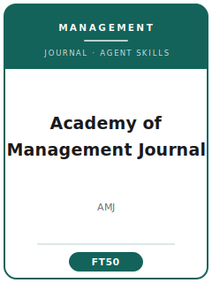

# Academy of Management Journal (AMJ) Skills

<p align="center">
  
</p>

[](LICENSE)
[](https://aom.org/research/journals/journal)
[](https://aom.org/research/journals/journal)
[](https://github.com/anthropics/claude-code)

English | [简体中文](README.zh-CN.md)

Agent skill stack for manuscripts targeted at the **Academy of Management Journal (AMJ)** — the premier *empirical* management journal, published by the Academy of Management (AOM).

This repository is opinionated. It is **not** a generic "management writing" toolbox. It is an **AMJ-specific** stack built around AMJ's defining bar: a strong empirical study that **also makes a clear theoretical contribution**. It covers theory-driven topic selection, a priori theory and hypothesis development, literature positioning, rigorous design and analysis (multilevel/HLM, SEM, panel, experiments, multi-source data), theoretical-contribution framing, AOM house-style exhibits and prose, ScholarOne submission, the developmental review process, and multi-round R&R rebuttals.

> Durable norms only. Editors, fees, exact word/page limits, and policies change — always verify on the official AMJ submission page and the current AOM Style Guide.

---

## Why a Separate AMJ Skill Stack?

AMJ imposes constraints that differ materially from theory-only or economics/finance journals:

| Constraint              | Academy of Management Journal                              | Implication                                                  |
|-------------------------|------------------------------------------------------------|--------------------------------------------------------------|
| Discipline              | Empirical management (OB, strategy, HR, entrepreneurship, OMT) | Pure-economics or pure-methods papers are off-fit         |
| Core bar                | Empirical contribution **and** theoretical contribution    | Strong results with no theory advance read as a tech report  |
| Theory                  | Explicit mechanism; hypotheses derived *a priori*          | Gap-spotting and HARKing are desk-reject / reject signals    |
| Design                  | Archival, survey, experiment, multi-method, field — must *fit* | The method must be able to test the hypotheses            |
| Validity                | Measurement validity, CMB remedies, endogeneity for archival | Single-source self-report or unaddressed endogeneity punished |
| Analysis                | SEM / HLM / panel / experiments matched to the design      | OLS on nested data, causal-steps mediation are flagged       |
| Contribution sentences  | Explicit "what new theory do we learn?" in intro & discussion | Cannot be left implicit                                   |
| Format                  | AOM house style; full intro–theory–methods–results–discussion | Substantial articles; verify current limits                |
| Process                 | ScholarOne; developmental, multi-round R&R culture          | First-round accepts are essentially unheard of               |

Generic "scientific writing" or "social-science methods" packs do not address these constraints.

---

## Quick Start

### Option A — Claude Code Plugin (recommended)

```bash
/plugin marketplace add https://github.com/brycewang-stanford/amj-skills
/plugin install amj-skills
/reload-plugins
```

### Option B — Manual Copy

```bash
git clone https://github.com/brycewang-stanford/amj-skills.git
cd amj-skills

mkdir -p ~/.claude/skills && cp -R skills/amj-* ~/.claude/skills/
# or
mkdir -p ~/.codex/skills && cp -R skills/amj-* ~/.codex/skills/
```

### First Prompt

```
Use amj-workflow to tell me which skill I should use next for my AMJ manuscript.
```

---

## Default Workflow

```text
amj-topic-selection
        ▼
amj-theory-development
        ▼
amj-literature-positioning
        ▼
amj-methods
        ▼
amj-data-analysis
        ▼
amj-contribution-framing
        ▼
amj-tables-figures
        ▼
amj-writing-style        (polish)
        ▼
amj-submission
        ▼
amj-review-process
        ▼
amj-rebuttal
```

`amj-workflow` is the router — it tells you which skill to use next based on where you are.

---

## Skills

| Skill                       | Purpose                                                                 |
|-----------------------------|-------------------------------------------------------------------------|
| `amj-workflow`              | Router — decides which sub-skill to invoke next                         |
| `amj-topic-selection`       | Theory-driven question + AMJ fit test (vs. AMR/ASQ/SMJ)                 |
| `amj-theory-development`    | A priori mechanisms and hypotheses; mediation/moderation done right     |
| `amj-literature-positioning`| Joining a conversation; problematization over gap-spotting              |
| `amj-methods`               | Matching design (archival/survey/experiment/multi-method) to the question |
| `amj-data-analysis`         | Measurement validity, CMB, SEM/HLM/panel estimators, endogeneity, robustness |
| `amj-contribution-framing`  | Explicit theoretical-contribution statement + discussion                |
| `amj-tables-figures`        | Correlation/result tables, model figure, interaction plots in AOM style |
| `amj-writing-style`         | Front-loaded argument, active voice, AOM/APA house style                |
| `amj-submission`            | ScholarOne preflight + manuscript template (anonymization, format, files) |
| `amj-review-process`        | How AMJ review/decisions work; reading a decision letter                |
| `amj-rebuttal`              | Multi-round R&R revision and point-by-point response letter             |

### Resources

- [`skills/amj-submission/templates/manuscript_template.md`](skills/amj-submission/templates/manuscript_template.md) — full AMJ manuscript skeleton
- [`skills/amj-submission/templates/checklist.md`](skills/amj-submission/templates/checklist.md) — 8-section pre-submission self-check
- [`resources/external_tools.md`](resources/external_tools.md) — management-research data sources (Compustat / BoardEx / Execucomp / Qualtrics / Prolific) and analysis software (Mplus / R lavaan / HLM / Stata / SPSS PROCESS)

---

## Differences vs. AMR / ASQ / SMJ

| Dimension          | AMJ                               | AMR                          | ASQ                                | SMJ                          |
|--------------------|-----------------------------------|------------------------------|------------------------------------|------------------------------|
| Data               | **Required** (empirical)          | None (theory only)           | Empirical or theoretical           | Required (often archival)    |
| Core contribution  | Empirical **+** theoretical       | Novel theory                 | Bold framing, deep context         | Strategy/performance theory  |
| Signature methods  | SEM / HLM / panel / experiments   | Conceptual argument          | Qualitative & quantitative         | Panel archival, econometrics |
| Best fit           | Theory-tested-with-data papers    | Pure conceptual papers       | Rich, contextual, contrarian work  | Competitive-advantage questions |

If your paper has no original data and is purely conceptual, target **AMR**, not AMJ.

---

## Related

- [awesome-journal-skills](https://github.com/brycewang-stanford/awesome-journal-skills) — index of journal-specific skill packs
- [Economic-Research-Journal-Skills](https://github.com/brycewang-stanford) — 《经济研究》 (Economic Research Journal)

---

## License

MIT
