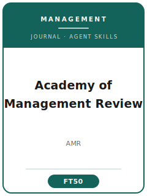

# Academy of Management Review (AMR) 技能包

<p align="center">
  
</p>

[](LICENSE)
[](https://aom.org/research/journals/review)
[](https://aom.org/research/journals/review)
[](https://github.com/anthropics/claude-code)

[English](README.md) | 简体中文

面向 **Academy of Management Review（AMR，《管理学评论》）** 投稿的 Agent 技能栈。AMR 是美国管理学会（Academy of Management）旗下的顶级**理论**期刊，只发表**构建新理论**的概念性论文，**不含任何数据集、不做假设检验、没有实证结果部分**。

本仓库是高度专门化的，**不是**通用的管理学写作工具箱，也**不是**实证管理研究的技能栈。它是一套**专属于 AMR 的理论构建**技能栈，覆盖：理论谜题的提出、对话定位、构念与命题开发、论证逻辑的压力测试、贡献差异化、概念图、AOM 体例、ScholarOne 投稿，以及发展性的多轮评审。

---

## 为什么需要单独的 AMR 技能栈？

相比实证管理期刊（AMJ / ASQ / SMJ），AMR 的约束有本质不同：

| 约束                | Academy of Management Review                          | 含义                                                |
|---------------------|-------------------------------------------------------|-----------------------------------------------------|
| 交付物              | 新**理论**（构念 / 过程模型 / 重新概念化）             | 带数据的研究不契合，应投 AMJ / ASQ / SMJ            |
| 数据                | **无** —— 没有样本、测量、估计或结果                   | 完全没有方法或结果部分                              |
| 核心单元            | **命题**（理论性主张），每条都由论证支撑               | 不是用样本检验的假设                                |
| 标志                | "挑战**并**拓展"某一既有理论对话                        | 纯批评或纯综述都会失败                              |
| 严谨标准            | 论证的**逻辑严密性**                                   | 逻辑在 AMR 的地位等同于实证期刊里的统计严谨         |
| 构念                | 有定义、界定范畴、与相邻构念区分                       | 换个标签的旧构念会被直接拒稿                        |
| 边界条件            | 作为理论的一部分明确陈述                               | 是贡献，而非免责声明                                |
| 贡献                | 差异化的"之前 → 之后"；学者由此能解释什么               | "与已有研究区分不足"是首要拒稿理由                  |
| 图                  | 概念图：过程模型、类型学、多层次框架                   | 没有数据图 —— 每个方框是构念，每条箭头都要被论证    |
| 评审                | 双盲、**发展性**、多轮（ScholarOne）                    | 多轮评审是常态，门槛逐轮抬高                        |

通用的"科研写作"或实证管理技能包都无法处理这些约束。

> 准确性说明：编委团队、确切的篇幅 / 摘要字数限制、费用等会随时间变化。本技能包锚定的是**长期稳定的规范**，并提示你在投稿前到 **AMR / 美国管理学会官方作者页面核实易变的具体信息**。

---

## 快速开始

### 方式 A —— Claude Code 插件（推荐）

```bash
/plugin marketplace add https://github.com/brycewang-stanford/amr-skills
/plugin install amr-skills
/reload-plugins
```

### 方式 B —— 手动复制

```bash
git clone https://github.com/brycewang-stanford/amr-skills.git
cd amr-skills

mkdir -p ~/.claude/skills && cp -R skills/amr-* ~/.claude/skills/
# 或
mkdir -p ~/.codex/skills && cp -R skills/amr-* ~/.codex/skills/
```

### 第一条提示词

```
用 amr-workflow 告诉我，我这篇 Academy of Management Review 稿件下一步该用哪个技能。
```

---

## 默认工作流

```text
amr-topic-selection
        ▼
amr-literature-positioning
        ▼
amr-theory-development
        ▼
amr-methods                （理论构建工艺）
        ▼
amr-data-analysis          （论证逻辑压力测试）
        ▼
amr-contribution-framing
        ▼
amr-tables-figures         （概念模型 / 命题表）
        ▼
amr-writing-style          （润色）
        ▼
amr-submission
        ▼
amr-review-process
        ▼
amr-rebuttal
```

`amr-workflow` 是路由器 —— 它根据你所处的阶段告诉你下一步该用哪个技能。

---

## 技能列表

| 技能                        | 用途                                                                    |
|-----------------------------|-------------------------------------------------------------------------|
| `amr-workflow`              | 路由器 —— 决定下一步调用哪个子技能                                       |
| `amr-topic-selection`       | 是否存在真正的理论谜题，是否契合 AMR（而非实证）？                       |
| `amr-theory-development`    | 构建构念、关系、命题与边界条件                                           |
| `amr-literature-positioning`| 选定对话，"挑战并拓展"它（杜绝综述式写法）                               |
| `amr-methods`               | 理论**构建**工艺 —— 构念范畴、机制（无数据）                            |
| `amr-data-analysis`         | **论证**开发 —— 逻辑检查、反事实、对立解释（无数据）                    |
| `amr-contribution-framing`  | 差异化新理论；陈述"之前 → 之后"                                         |
| `amr-tables-figures`        | 概念图 —— 过程模型、类型学、命题表                                       |
| `amr-writing-style`         | AOM 体例；以论证为驱动的文风（润色）                                     |
| `amr-submission`            | ScholarOne 投稿前自检 + 稿件模板（格式、匿名化、伦理）                   |
| `amr-review-process`        | 理解发展性、多轮评审与决定信                                             |
| `amr-rebuttal`              | R&R 回复文档，证明理论确实得到了实质性强化                               |

### 资源

- [`skills/amr-submission/templates/manuscript_template.md`](skills/amr-submission/templates/manuscript_template.md) —— AMR 概念性论文骨架（谜题式引言、理论开发、命题、概念模型、讨论）
- [`skills/amr-submission/templates/checklist.md`](skills/amr-submission/templates/checklist.md) —— 8 类投稿前自检（契合 / 格式 / 匿名化 / 摘要 / 理论 / 图 / 参考文献 / 伦理与系统）
- [`resources/external_tools.md`](resources/external_tools.md) —— 理论构建工具（引文图谱、文献管理、概念绘图软件、论证逻辑辅助）

---

## 与实证管理技能栈（AMJ / ASQ / SMJ）的差异

| 维度          | Academy of Management Review     | AMJ / ASQ / SMJ（实证）            |
|---------------|----------------------------------|------------------------------------|
| 交付物        | 新理论                           | 用数据**检验**理论                 |
| 数据          | 无                               | 样本、测量、估计                   |
| 核心单元      | 命题（论证）                     | 假设（检验）                       |
| 严谨标准      | 逻辑严密性                       | 统计 / 实证严谨                    |
| 图            | 概念模型、类型学                 | 数据图、结果表                     |
| 方法部分      | 无（理论构建工艺）               | 必需（研究设计）                   |

如果你的项目有数据，更适合用实证管理技能栈 —— AMR 构建的，是那些期刊日后去检验的理论。

---

## 相关

- [awesome-journal-skills](https://github.com/brycewang-stanford/awesome-journal-skills) —— 期刊专属技能包索引
- [Economic-Research-Journal-Skills](https://github.com/brycewang-stanford/economic-research-skills) —— 《经济研究》

---

## 许可

MIT
