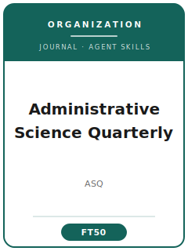

# Administrative Science Quarterly Skills

<p align="center">
  
</p>

[](LICENSE)
[](https://journals.sagepub.com/home/asq)
[](https://journals.sagepub.com/home/asq)
[](https://github.com/anthropics/claude-code)

English | [简体中文](README.zh-CN.md)

Agent skill stack for manuscripts targeted at **Administrative Science Quarterly (ASQ)** — a top, theory-driven journal in organization theory and the sociology of organizations, published by SAGE in association with the Samuel Curtis Johnson Graduate School of Management at Cornell University.

This repository is opinionated. It is **not** a generic management-writing toolbox. It is an **ASQ-specific** stack built around the journal's hallmark: a deep, often *surprising* theoretical insight about organizations, delivered with superb craft. ASQ publishes **both** rigorous quantitative work **and** rich qualitative/inductive studies (grounded-theory, ethnographic, historical) — and this stack treats both as first-class, because at ASQ *method follows the theoretical question*.

---

## Why a Separate ASQ Skill Stack?

ASQ imposes constraints that differ materially from AMJ / SMJ / Organization Science:

| Constraint            | Administrative Science Quarterly                                  | Implication                                                  |
|-----------------------|-------------------------------------------------------------------|--------------------------------------------------------------|
| Discipline            | Organization theory & sociology of organizations                  | Pure micro-cognition or pure-finance questions are off-fit   |
| What's rewarded       | A *surprising* theoretical insight about organizations            | A solid-but-unsurprising finding reads as "so what?"         |
| Contribution          | Theoretical, not methodological                                   | A sophisticated method cannot rescue a thin idea             |
| Method stance         | Qualitative **and** quantitative both first-class                 | Method must follow the question, not the reverse             |
| Qualitative bar       | Transparent coding, theoretical sampling, data-to-theory tables   | "Anecdotal" quotes without rigor are rejected                |
| Quantitative bar      | Rigorous design, identification, robustness                       | Cross-sectional same-source causal claims are punished       |
| Theory form           | Process theory is common; match form to phenomenon                | Variance-speak on a process question is a mismatch           |
| Craft & narrative     | Long-form articles; strong storytelling; superb prose             | "Lab-report" writing underperforms                           |
| Review process        | Developmental, multi-round                                        | Expect deep reviews and 2+ revision rounds                   |
| Scope extras          | Also publishes book reviews                                       | Choose the correct manuscript type                           |

Generic "scientific writing" or "management writing" skill packs do not address these constraints.

---

## Quick Start

### Option A — Claude Code Plugin (recommended)

```bash
/plugin marketplace add https://github.com/brycewang-stanford/asq-skills
/plugin install asq-skills
/reload-plugins
```

### Option B — Manual Copy

```bash
git clone https://github.com/brycewang-stanford/asq-skills.git
cd asq-skills

mkdir -p ~/.claude/skills && cp -R skills/asq-* ~/.claude/skills/
# or
mkdir -p ~/.codex/skills && cp -R skills/asq-* ~/.codex/skills/
```

### First Prompt

```
Use asq-workflow to tell me which skill I should use next for my ASQ manuscript.
```

---

## Default Workflow

```text
asq-topic-selection
        ▼
asq-theory-development
        ▼
asq-literature-positioning
        ▼
asq-methods
        ▼
asq-data-analysis
        ▼
asq-contribution-framing
        ▼
asq-tables-figures
        ▼
asq-writing-style      (polish)
        ▼
asq-submission
        ▼
asq-review-process
        ▼
asq-rebuttal
```

`asq-workflow` is the router — it tells you which skill to use next based on where you are.

---

## Skills

| Skill                       | Purpose                                                                 |
|-----------------------------|-------------------------------------------------------------------------|
| `asq-workflow`              | Router — decides which sub-skill to invoke next                         |
| `asq-topic-selection`       | Puzzle/surprise fit test + contribution-claim template                  |
| `asq-theory-development`    | Process vs. variance theory; generative mechanism; boundary conditions  |
| `asq-literature-positioning`| Join a specific organization-theory conversation, not survey a field    |
| `asq-methods`               | Design choice + rigor bar for qualitative *and* quantitative work       |
| `asq-data-analysis`         | Data-to-theory link (coding/evidence tables) or estimation + robustness |
| `asq-contribution-framing`  | Sharpen the theoretical "so what"; name the contribution type           |
| `asq-tables-figures`        | Data-structure figures, data-to-theory tables, process models, regressions |
| `asq-writing-style`         | Narrative arc, process voice, craft to ASQ's prose bar                  |
| `asq-submission`            | Pre-submission preflight + manuscript template (fit, anonymization, format) |
| `asq-review-process`        | Navigate ASQ's developmental, multi-round review                        |
| `asq-rebuttal`              | R&R response-letter structure (deepen the contribution)                 |

### Resources

- [`skills/asq-submission/templates/manuscript_template.md`](skills/asq-submission/templates/manuscript_template.md) — Qualitative and quantitative manuscript skeletons
- [`skills/asq-submission/templates/checklist.md`](skills/asq-submission/templates/checklist.md) — 8-section pre-submission self-check
- [`resources/external_tools.md`](resources/external_tools.md) — Qualitative CAQDAS + quantitative software, network/historical tools, reference managers, ScholarOne notes

---

## Differences vs. Other Management Journals

| Dimension          | ASQ                              | AMJ                          | AMR              | SMJ                      |
|--------------------|----------------------------------|------------------------------|------------------|--------------------------|
| Core deliverable   | Surprising theory + craft        | Empirical contribution       | Pure theory      | Strategy contribution    |
| Data               | Qualitative **and** quantitative | Mostly quantitative          | None             | Mostly quantitative      |
| Theory form        | Process common                   | Variance/hypothesis-testing  | Conceptual       | Variance/performance     |
| Writing            | Long-form narrative; craft-heavy | Structured empirical         | Argument-driven  | Structured empirical     |
| Review             | Developmental, multi-round       | Developmental                | Developmental    | Developmental            |

If the manuscript is purely conceptual with no data, an AMR-style stack fits better. If it is a hypothesis-test with no theoretical surprise, reconsider whether ASQ is the right home.

---

## What This Repo Does Not Do

- It does not write a submission-ready manuscript for you
- It does not simulate specific reviewers' preferences
- It does not track ASQ's acceptance rate, impact factor, or current editorial team — verify volatile details on the journal's official page
- It does not judge whether your theoretical contribution is genuinely original — that is the researcher's call

---

## Related

- [awesome-journal-skills](https://github.com/brycewang-stanford/awesome-journal-skills) — Index of journal-specific skill packs
- [amj-skills](https://github.com/brycewang-stanford/amj-skills) — Academy of Management Journal
- [smj-skills](https://github.com/brycewang-stanford/smj-skills) — Strategic Management Journal

---

## License

MIT
