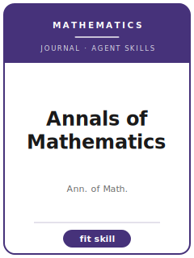

# Annals of Mathematics Skills

<p align="center">
  
</p>

[](LICENSE)
[](https://annals.math.princeton.edu/)
[](https://annals.math.princeton.edu/)
[](https://github.com/anthropics/claude-code)

English | [简体中文](README.zh-CN.md)

Agent skill stack for theorem-and-proof manuscripts targeted at **Annals of Mathematics** — one of the most prestigious journals in pure mathematics, published by the Department of Mathematics at Princeton University and the Institute for Advanced Study (IAS).

This repository is opinionated. It is **not** a generic math-writing toolbox. It is an **Annals-specific** stack for pure-mathematics papers, where the bar is *significance + originality + a complete, correct, rigorously verified proof with clear exposition*. A single hidden gap is fatal, and the importance threshold is very high.

> This pack encodes durable norms and house style. It does **not** assert volatile specifics (current editors, fees, impact factor). Always verify submission details on the journal's official page: <https://annals.math.princeton.edu/>.

---

## Why a Separate Annals-of-Mathematics Skill Stack?

Annals imposes constraints that differ materially from empirical-science journals (PRL, JACS) and from specialist math journals:

| Constraint              | Annals of Mathematics                                          | Implication                                                  |
|-------------------------|----------------------------------------------------------------|--------------------------------------------------------------|
| Discipline              | All of pure mathematics; theorem-and-proof papers              | No experiments; usually few or no figures                    |
| Importance bar          | Major, deep results of lasting importance                      | "Correct + new but incremental" is off-fit                   |
| Rigor                   | Complete, correct, fully verified proofs                       | A single logical gap is fatal                                |
| "Clearly" / "easy"      | Treated as debts to pay, not licenses to skip                  | Hidden gaps behind softening words get caught                |
| Results framing         | Precise Main Theorem, stated early, positioned vs. prior work  | A vague paragraph instead of a statement reads as unfinished |
| Method                  | Proof strategy: architecture, key lemmas, the novel idea       | Monolithic proofs with no roadmap are hard to referee        |
| Exposition              | Statements before proofs; consistent notation; clear sections  | Readable by an expert non-specialist                         |
| Supplement              | No science-style "supplement"; essentials stay in main text    | Appendices are for length relief, not hidden difficulty      |
| Length                  | May be long, but every section must be necessary               | Bloat and padding are penalized; depth is not                |
| Review                  | Expert referees verify proofs in detail; often a year or more  | Plan for slow, thorough, adversarial reading                 |
| Format                  | AMS-LaTeX; abstract + MSC; careful citation of the literature  | Loose paraphrase of cited theorems is a red flag             |

Generic "scientific writing" or "math writing" skill packs do not address these constraints.

---

## Quick Start

### Option A — Claude Code Plugin (recommended)

```bash
/plugin marketplace add https://github.com/brycewang-stanford/annals-of-mathematics-skills
/plugin install annals-of-mathematics-skills
/reload-plugins
```

### Option B — Manual Copy

```bash
git clone https://github.com/brycewang-stanford/annals-of-mathematics-skills.git
cd annals-of-mathematics-skills

mkdir -p ~/.claude/skills && cp -R skills/anmath-* ~/.claude/skills/
# or
mkdir -p ~/.codex/skills && cp -R skills/anmath-* ~/.codex/skills/
```

### First Prompt

```
Use anmath-workflow to tell me which skill I should use next for my Annals of Mathematics manuscript.
```

---

## Default Workflow

```text
anmath-scope-fit
        ▼
anmath-results-framing
        ▼
anmath-methods
        ▼
anmath-figures
        ▼
anmath-supplementary
        ▼
anmath-writing-style       (polish)
        ▼
anmath-length-management   (polish)
        ▼
anmath-cover-letter
        ▼
anmath-submission
        ▼
anmath-referee-strategy
        ▼
anmath-revision
```

`anmath-workflow` is the router — it tells you which skill to use next based on where you are.

---

## Skills

| Skill                      | Purpose                                                                  |
|----------------------------|--------------------------------------------------------------------------|
| `anmath-workflow`          | Router — decides which sub-skill to invoke next                          |
| `anmath-scope-fit`         | Significance/originality screen against the Annals importance bar        |
| `anmath-results-framing`   | Stating the Main Theorem precisely + positioning vs. prior work          |
| `anmath-methods`           | Proof strategy: architecture, key lemmas, the novel technique, the crux  |
| `anmath-figures`           | Exposition & structure: sectioning, notation, statements-before-proofs, diagrams |
| `anmath-supplementary`     | Appendices for auxiliary results / long computations; essentials stay in main text |
| `anmath-writing-style`     | Rigor & prose: eliminate gaps, remove "clearly"/"it is easy to see"      |
| `anmath-length-management` | Long is fine, bloat is not — every section must be necessary             |
| `anmath-cover-letter`      | Concise letter framing significance and scope fit for the editors        |
| `anmath-submission`        | Pre-submission preflight (AMS-LaTeX, MSC, references, arXiv) + templates  |
| `anmath-referee-strategy`  | Anticipate expert proof verification; stress-test the argument           |
| `anmath-revision`          | Fix gaps and write the point-by-point response to a referee report       |

### Resources

- [`skills/anmath-submission/templates/manuscript_template.md`](skills/anmath-submission/templates/manuscript_template.md) — AMS-LaTeX manuscript skeleton (front matter, theorem environments, sectioning, references)
- [`skills/anmath-submission/templates/checklist.md`](skills/anmath-submission/templates/checklist.md) — 8-section pre-submission self-check
- [`resources/external_tools.md`](resources/external_tools.md) — TeX/AMS packages, MathSciNet / zbMATH / arXiv, proof assistants (Lean / Coq / Isabelle), diagram tools (`tikz-cd`)

---

## Differences vs. PRL / JACS Skills

| Dimension          | Annals of Mathematics            | PRL / JACS (empirical science)        |
|--------------------|----------------------------------|---------------------------------------|
| Core object        | Theorem and its proof            | Experimental / computational result   |
| Figures            | Optional, often none             | Central; figures carry the story      |
| Methods section    | Proof strategy & architecture    | Materials, protocols, instrumentation |
| Supplement         | Appendices; essentials in main text | Extensive supplemental information |
| Fatal flaw         | A single logical gap             | Irreproducibility / overclaim         |
| Review timescale   | Often a year or more             | Weeks to months                       |

---

## What This Repository Does Not Do

- It does not write a submittable proof for you
- It does not judge whether your result is *truly* original or important — that is your call
- It does not store the journal's acceptance rate, fees, or impact factor
- It does not simulate a specific editor's or referee's preferences

---

## Related

- [awesome-journal-skills](https://github.com/brycewang-stanford/awesome-journal-skills) — Index of journal-specific skill packs
- [Economic-Research-Journal-Skills](https://github.com/brycewang-stanford/economic-research-skills) — 《经济研究》

---

## License

MIT
