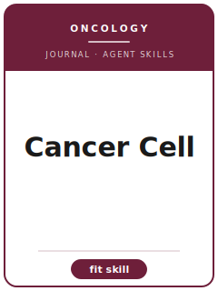

# Cancer Cell Skills

<p align="center">
  
</p>

[](LICENSE)
[](https://www.cell.com/cancer-cell/home)
[](https://www.cell.com/)
[](https://github.com/anthropics/claude-code)

[English](README.md) | 简体中文

面向投稿 **Cancer Cell（Cell Press 旗下）** 的智能体 Skill 工具栈。Cancer Cell 是分子与转化肿瘤学的顶级期刊，覆盖肿瘤生物学、肿瘤遗传学与基因组学、肿瘤微环境、免疫肿瘤学以及临床转化研究。

本仓库立场鲜明，**不是**一个通用的"生物医学写作"工具箱，而是一套**针对 Cancer Cell 的专用工具栈**，围绕该刊的核心要求构建：**清晰的分子机制**，并在**正交体系**（培养细胞、体内模型，以及最好包含人源 / 患者数据）中得到验证；以 **STAR Methods** 标准报告方法学的严谨性与可重复性；在不夸大的前提下凸显**转化价值**。

> 仅描述长期稳定的规范。本工具栈刻意回避易变的具体信息（在任编辑姓名、精确的字数 / 图数上限、费用、影响因子）。投稿前请务必在 Cell Press / Cancer Cell 官方作者页面与最新 STAR Methods 指南上核实当前要求。

---

## 为什么需要独立的 Cancer Cell 工具栈？

Cancer Cell 的约束与宽口径综合刊、以及 JAMA 这类临床试验期刊存在实质差异：

| 约束维度        | Cancer Cell                                              | 含义                                                |
|-----------------|----------------------------------------------------------|-----------------------------------------------------|
| 学科            | 分子 / 转化肿瘤学（非临床试验报告）                       | 纯描述性组学或单一细胞系故事不契合                   |
| 核心诉求        | 机制 **加上** 转化价值                                    | "有趣的相关性"但无机制会被视为增量工作               |
| 验证            | 正交体系：细胞 + 体内 + 人源肿瘤数据                      | 仅凭单一体系下结论常被拒                             |
| 严谨性          | 强制 STAR Methods + 关键资源表（KRT）                     | 细胞系未鉴定 / `n` 未定义属于硬伤级问题             |
| 可重复性        | 细胞系鉴定、支原体检测、抗体验证                          | 缺失这些是审稿人重点追打的漏洞                       |
| 动物实验        | IACUC 批准 + 类 ARRIVE 报告、随机化、盲法                 | 只写"n 只小鼠"而无功效 / 分组细节易致拒稿           |
| 统计            | `n` 定义为生物学重复；检验恰当；误差棒明确                | 伪重复与误差棒未定义是常见拒稿点                     |
| 数据 / 代码     | 数据存储：GEO / SRA（测序）、PRIDE（质谱）、PDB（结构）   | "数据可应要求提供"不被接受                           |
| 格式            | Cell Press 结构：Summary、Highlights、eTOC、图形摘要      | 非 IMRaD 临床模板                                   |
| 论断            | 治疗性论断需体内和 / 或人源验证支撑                       | 夸大的转化论断是审稿人标志性的打击目标               |

通用的"科研写作"工具包并不能编码这些 Cell Press 与 Cancer Cell 特有的要求。

---

## 快速开始

### 方式 A — Claude Code 插件（推荐）

```bash
/plugin marketplace add https://github.com/brycewang-stanford/cancer-cell-skills
/plugin install cancer-cell-skills
/reload-plugins
```

### 方式 B — 手动复制

```bash
git clone https://github.com/brycewang-stanford/cancer-cell-skills.git
cd cancer-cell-skills

mkdir -p ~/.claude/skills && cp -R skills/cc-* ~/.claude/skills/
# 或者
mkdir -p ~/.codex/skills && cp -R skills/cc-* ~/.codex/skills/
```

### 第一条提示

```
用 cc-workflow 告诉我，我这篇 Cancer Cell 稿件下一步该用哪个 skill。
```

---

## 默认工作流

```text
cc-scope-fit
        ▼
cc-study-design
        ▼
cc-reporting-standards
        ▼
cc-statistics
        ▼
cc-figures-tables
        ▼
cc-structured-abstract
        ▼
cc-ethics-registration
        ▼
cc-writing-style      （润色）
        ▼
cc-cover-letter
        ▼
cc-submission
        ▼
cc-peer-review-revision
```

`cc-workflow` 是路由器——它根据你所处的阶段告诉你下一步该用哪个 skill。

---

## Skills 列表

| Skill                       | 用途                                                                  |
|-----------------------------|-----------------------------------------------------------------------|
| `cc-workflow`               | 路由器——决定下一步调用哪个子 skill                                    |
| `cc-scope-fit`              | 这是不是一篇 Cancer Cell 论文？机制 + 转化价值的契合门槛              |
| `cc-study-design`           | 跨细胞 / 小鼠 / PDX / 类器官 / 人源肿瘤体系的实验设计                 |
| `cc-reporting-standards`    | STAR Methods、关键资源表、细胞系 / 抗体 / 动物实验的严谨性报告        |
| `cc-statistics`             | 生物统计：`n` 的定义、重复、检验、多重比较校正                        |
| `cc-figures-tables`         | 多面板机制图、定量化、图像完整性                                      |
| `cc-structured-abstract`    | Summary + eTOC 简介 + Highlights + 图形摘要                          |
| `cc-ethics-registration`    | IACUC / IRB / 知情同意 / 生物安全 + 数据可用性与存储声明             |
| `cc-writing-style`          | Cell Press 文体：Summary / Results / Discussion 写法、论断分寸       |
| `cc-cover-letter`           | 投稿信：凸显意义、契合度，以及建议 / 排除审稿人                       |
| `cc-submission`             | 投稿前预检 + 稿件模板（格式、文件、数据存储链接）                     |
| `cc-peer-review-revision`   | 协商式审稿回复：逐条答复、补充实验、收窄论断                          |

### 资源

- [`skills/cc-submission/templates/manuscript_template.md`](skills/cc-submission/templates/manuscript_template.md) — Cell Press 稿件骨架（Summary、Highlights、STAR Methods、关键资源表、数据可用性）
- [`skills/cc-submission/templates/checklist.md`](skills/cc-submission/templates/checklist.md) — 投稿前自检清单（涵盖契合度、严谨性、统计、图表、伦理与数据存储）
- [`resources/external_tools.md`](resources/external_tools.md) — 肿瘤学数据库（GEO / SRA / PRIDE / PDB / cBioPortal / TCGA）、报告框架与生信 / 影像软件

---

## 与 JAMA Skills 的差异

| 维度          | Cancer Cell（Cell Press）            | JAMA                                |
|---------------|---------------------------------------|--------------------------------------|
| 学科          | 分子 / 转化肿瘤学                     | 临床医学 / 试验                      |
| 核心单元      | 跨体系验证的机制                      | 患者层面的临床结局                   |
| 方法报告      | STAR Methods + 关键资源表             | CONSORT / STROBE + 试验注册          |
| 统计          | 生物学 `n`、重复、无伪重复            | 预设分析、ITT、置信区间              |
| 结构          | Summary / Highlights / 图形摘要       | 结构化临床摘要（IMRaD）              |
| 数据共享      | GEO / SRA / PRIDE / PDB 存储          | 去标识化受试者数据 / IPD             |

---

## 相关链接

- [awesome-journal-skills](https://github.com/brycewang-stanford/awesome-journal-skills) — 期刊专用 skill 工具包索引
- [Cancer Cell（Cell Press）](https://www.cell.com/cancer-cell/home) — 期刊官网
- [Cell Press STAR Methods](https://www.cell.com/star-methods) — 结构化、透明、可获取的方法报告

---

## 许可证

MIT
