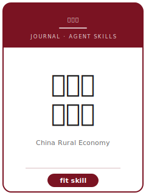

# China-Rural-Economy Skills

<p align="center">
  
</p>

[](LICENSE)
[](https://www.cssn.cn/)
[](https://www.cssn.cn/)
[](https://github.com/anthropics/claude-code)

English | [简体中文](README.zh-CN.md)

Agent skill stack for manuscripts targeted at **《中国农村经济》 (China Rural Economy)** — the top journal in China's agricultural and rural economics field, hosted by the Rural Development Institute of the Chinese Academy of Social Sciences. Its sister journal is 《中国农村观察》 (China Rural Survey).

This repository is opinionated. It is **not** a generic Chinese-economics writing toolbox. It is a **China-Rural-Economy-specific** stack covering 三农 (agriculture / rural / farmer) topic selection, bilingual literature review, micro-household quasi-experimental identification, household-level mechanism / heterogeneity analysis, CSSCI house style, rural-revitalization policy implications, and R&R rebuttals.

---

## Why a Separate China-Rural-Economy Skill Stack?

《中国农村经济》 imposes constraints that differ materially from general economics journals:

| Constraint                | China Rural Economy                                        | Implication                                                |
|---------------------------|------------------------------------------------------------|------------------------------------------------------------|
| Discipline                | Agricultural & rural economics (三农)                       | Off-scene "generic" empirics are off-fit                   |
| Topic                     | Theory + China rural-policy reality, in a 三农 scene        | Must say "why this is a rural problem, why now"            |
| Contribution sentences    | 3–5 explicit "边际贡献" bullets in intro                    | Cannot be a single paragraph                               |
| Data                      | Micro household / village surveys (CFPS, CHFS, CLDS, 固定观察点) | Province-panel descriptives alone read as a working paper |
| Identification            | Quasi-experimental + farmer self-selection handled         | OLS / descriptive stats often desk-rejected                |
| Endogeneity               | Self-selection into co-ops / migration / land transfer     | Ignoring it is a desk-reject signal                        |
| Mechanism                 | Near-mandatory, anchored at the household level             | Macro narratives without a farmer rarely accepted          |
| Heterogeneity             | Strongly preferred, in rural-relevant dimensions           | "East / Central / West" only reads as lazy                 |
| Policy implications       | Significance-level but anchored in concrete 三农 targets    | The "加强完善推进" formula is punished                      |
| Length                    | ~15–25k Chinese characters incl. exhibits (verify on site)  | Full structure expected                                    |

Generic "scientific writing" or "economics writing" skill packs do not address these constraints.

> Accuracy note: exact word limits, reference caps, figure counts, the submission URL, and review specifics change year to year. This pack describes the durable norms — verify the current numbers on the journal's official 投稿须知 page.

---

## Quick Start

### Option A — Claude Code Plugin (recommended)

```bash
/plugin marketplace add https://github.com/brycewang-stanford/china-rural-economy-skills
/plugin install china-rural-economy-skills
/reload-plugins
```

### Option B — Manual Copy

```bash
git clone https://github.com/brycewang-stanford/china-rural-economy-skills.git
cd china-rural-economy-skills

mkdir -p ~/.claude/skills && cp -R skills/cre-* ~/.claude/skills/
# or
mkdir -p ~/.codex/skills && cp -R skills/cre-* ~/.codex/skills/
```

### First Prompt

```
Use cre-workflow to tell me which skill I should use next for my China-Rural-Economy manuscript.
```

---

## Default Workflow

```text
cre-topic-selection
        ▼
cre-literature-review
        ▼
cre-identification
        ▼
cre-mechanism
        ▼
cre-heterogeneity
        ▼
cre-tables-figures
        ▼
cre-policy-implication
        ▼
cre-abstract      (polish)
        ▼
cre-style         (polish)
        ▼
cre-submission
        ▼
cre-rebuttal
```

`cre-workflow` is the router — it tells you which skill to use next based on where you are.

---

## Skills

| Skill                     | Purpose                                                        |
|--------------------------|----------------------------------------------------------------|
| `cre-workflow`            | Router — decides which sub-skill to invoke next                |
| `cre-topic-selection`     | 三农-scene fit + theoretical grounding + contribution sentences |
| `cre-literature-review`   | Bilingual structure + 三农 canonical-theory checklist          |
| `cre-identification`      | Micro-household quasi-experimental design (DID / IV / RDD / PSM) + self-selection |
| `cre-mechanism`           | Household-level mechanism paths and writing template           |
| `cre-heterogeneity`       | Rural-relevant heterogeneity cuts (beyond East/Central/West)   |
| `cre-tables-figures`      | Three-line tables, variable-definition table, figure aesthetics |
| `cre-policy-implication`  | Significance-level policy framing anchored in 三农 targets      |
| `cre-abstract`            | Five-sentence abstract + blacklist-phrase removal              |
| `cre-style`               | Language polish: empty significance / "加强完善推进" → concrete  |
| `cre-submission`          | Pre-submission checklist + manuscript template (format, double-blind) |
| `cre-rebuttal`            | R&R response-letter structure                                  |

### Resources

- [`skills/cre-submission/templates/manuscript_template.md`](skills/cre-submission/templates/manuscript_template.md) — Standard manuscript skeleton (abstract, variable table, references)
- [`skills/cre-submission/templates/checklist.md`](skills/cre-submission/templates/checklist.md) — 8-section pre-submission self-check
- [`resources/external_tools.md`](resources/external_tools.md) — 三农 data sources (CFPS / CHFS / CLDS / 农村固定观察点 / 农业农村部统计) + Stata / Python / R packages

---

## Differences vs. China-Rural-Survey (sister journal)

| Dimension          | China Rural Economy             | China Rural Survey               |
|--------------------|---------------------------------|----------------------------------|
| Emphasis           | Causal-identification empirics  | More open to qualitative / cases |
| Method bar         | High (DID / IV / RDD / PSM-DID) | More tolerant                    |
| Policy observation | Less common                     | Accepted                         |
| Both               | 三农 scene required, hosted by RDI-CASS | Same                       |

---

## Related

- [awesome-journal-skills](https://github.com/brycewang-stanford/awesome-journal-skills) — Index of journal-specific skill packs
- [Economic-Research-Journal-Skills](https://github.com/brycewang-stanford/economic-research-skills) — 《经济研究》

---

## License

MIT
