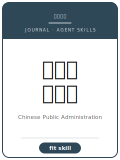

# 中国行政管理 Skills

<p align="center">
  
</p>

[](LICENSE)
[](https://www.cpaj.com.cn/)
[](https://www.cpaj.com.cn/)
[](skills/cpa-workflow)
[](https://github.com/anthropics/claude-code)

[English](README.md) | 简体中文

面向 **《中国行政管理》** 投稿的 Agent Skill 工具栈。覆盖**选题、文献综述、研究设计与因果推断、治理机制、异质性、图表、政策含义、投稿规范、修改回复**等环节，配套问卷 / 行政数据 / 案例研究模板。

本仓库刻意**不通用**——它是面向《中国行政管理》编委审稿口味的方法论沉淀，不是泛化的"中文社科写作助手"。《中国行政管理》由中国行政管理学会主办，是 CSSCI 来源期刊，也是中国公共行政 / 公共管理领域最具影响力的权威期刊之一。

---

## 为什么要为《中国行政管理》单独做一套 Skills？

《中国行政管理》的约束维度与经济学期刊（如《经济研究》）、与国际公共管理顶刊（JPART / PAR / Governance）都**显著不同**：

| 维度       | 《中国行政管理》要求                          | 隐含含义                                       |
|----------|--------------------------------------|------------------------------------------|
| 学科定位    | 公共行政 / 政府治理 / 公共政策             | 偏纯经济学 / 纯管理学的稿件不适合                  |
| 理论框架    | 须有公共管理理论定位（治理、新公共管理/新公共服务、政策过程）| "数据 + 回归"而无理论框架会被认为脱离学科          |
| 方法多元    | 定量与定性**并重**                        | 规范研究、案例、比较、实证设计都可接受             |
| 问题与方法匹配| 方法服务于问题，而非赶方法时髦              | 把准实验硬套到治理问题上会被识破                  |
| 中国治理现实 | 选题须锚定真实的中国治理实践                | 抽象"全球"框架而无中国情境会显单薄                |
| 机制       | 期待治理 / 政策过程机制                    | "只有效应、没有过程"对公共管理审稿人偏弱           |
| 政策含义    | 比经济学期刊更"可操作"，但必须建立在分析之上    | "强化 / 完善 / 健全 / 推进"四件套是退稿信号        |
| 篇幅与图表  | 完整结构的中文论文；按需配图表               | 工作论文式片段不适合                            |
| 摘要       | 简洁中文摘要：问题 → 方法 → 发现 → 意义       | 以空泛意义开篇会被当作套话                       |

通用的"社科写作"或"经济学写作"Skill 包不会处理这些约束。

---

## 快速开始

### 方式 A —— Claude Code 插件（推荐）

```bash
/plugin marketplace add https://github.com/brycewang-stanford/chinese-public-administration-skills
/plugin install chinese-public-administration-skills
/reload-plugins
```

### 方式 B —— 手动拷贝

```bash
git clone https://github.com/brycewang-stanford/chinese-public-administration-skills.git
cd chinese-public-administration-skills

mkdir -p ~/.claude/skills && cp -R skills/cpa-* ~/.claude/skills/
# 或
mkdir -p ~/.codex/skills && cp -R skills/cpa-* ~/.codex/skills/
```

### 第一条 Prompt

```
用 cpa-workflow 告诉我这份《中国行政管理》目标稿子下一步该做什么。
```

---

## 默认工作流

```text
cpa-topic-selection
        ▼
cpa-literature-review
        ▼
cpa-identification     （研究设计：定量 / 定性 / 规范）
        ▼
cpa-mechanism
        ▼
cpa-heterogeneity
        ▼
cpa-tables-figures
        ▼
cpa-policy-implication
        ▼
cpa-abstract      （polish）
        ▼
cpa-style         （polish）
        ▼
cpa-submission
        ▼
cpa-rebuttal
```

`cpa-workflow` 是路由器，会根据当前阶段告诉你下一个该用哪个 Skill。

---

## Skill 一览

| Skill                     | 用途                                            |
|---------------------------|------------------------------------------------|
| `cpa-workflow`            | 路由器：判断当前阶段，推荐下一个 skill              |
| `cpa-topic-selection`     | 选题 + 治理理论定位 + 研究问题 + 贡献阐述           |
| `cpa-literature-review`   | 中英公共管理理论 + 中国治理文献的对话式综述          |
| `cpa-identification`      | 研究设计：定量（问卷 / 行政数据 / DID-IV-断点）+ 定性（案例 / 过程追踪 / 扎根理论）+ 规范分析 |
| `cpa-mechanism`           | 治理 / 政策过程机制（政策执行、注意力分配、央地关系、激励与问责）|
| `cpa-heterogeneity`       | 跨地区 / 层级 / 治理情境的差异与条件性              |
| `cpa-tables-figures`      | 三线表、编码表、过程图、图表规范                    |
| `cpa-policy-implication`  | 面向政府实践、可操作但建立在分析之上的政策含义        |
| `cpa-abstract`            | 简洁中英文摘要 + 黑名单短语清除                     |
| `cpa-style`               | 全文语言 polish：四件套套话 → 有据可依的分析性表述    |
| `cpa-submission`          | 投稿 checklist + 稿件模板（格式、匿名、规范）        |
| `cpa-rebuttal`            | 修改回复信结构                                   |

### 附属资源

- [`skills/cpa-submission/templates/manuscript_template.md`](skills/cpa-submission/templates/manuscript_template.md) —— 公共管理稿件结构骨架（摘要、理论框架、研究设计、编码 / 变量表、参考文献）
- [`skills/cpa-submission/templates/checklist.md`](skills/cpa-submission/templates/checklist.md) —— 投稿前 8 类自检清单
- [`resources/external_tools.md`](resources/external_tools.md) —— 公共管理数据资源（CGSS / CFPS / 政府开放数据 / 政策文本库等）+ Stata / Python / R / NVivo 包速查

---

## 与《经济研究》Skill 包的差异

| 维度        | 《中国行政管理》            | 《经济研究》              |
|----------|----------------------|----------------------|
| 学科定位    | 公共行政 / 政府治理         | 经济学（宏观 / 制度偏多）    |
| 方法       | 定量 + 定性并重，规范研究亦可    | 定量因果推断              |
| 理论框架    | 治理 / 新公共管理-服务 / 政策过程 | 经济学理论               |
| 政策含义    | 面向政府实践、可操作但有据      | 政策意义、制度层启示         |
| 案例 / 质性 | 一等公民                  | 较少接受                |

---

## 关于这个仓库不做什么

- 不替你写出可以直接投稿的稿件
- 不模拟审稿人偏好
- 不收录《中国行政管理》历年拒稿率、影响因子等元数据
- 不评估你的"理论贡献"是否真有原创性——这是研究者本人的判断
- 不提供易变的具体数字（现任编委、确切版面费、字数上限）——请以官网"投稿须知"为准

---

## 相关仓库

- [awesome-journal-skills](https://github.com/brycewang-stanford/awesome-journal-skills) —— 期刊 Skill 索引
- [Economic-Research-Journal-Skills](https://github.com/brycewang-stanford/economic-research-skills) —— 《经济研究》投稿工具栈
- [management-world-skills](https://github.com/brycewang-stanford/management-world-skills) —— 《管理世界》投稿工具栈

---

## License

MIT
