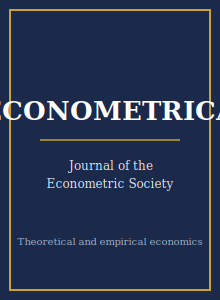

# Econometrica Skills

<p align="center">
  
</p>

[](LICENSE)
[](https://www.econometricsociety.org/publications/econometrica)
[](https://www.econometricsociety.org/)
[](https://github.com/anthropics/claude-code)

[English](README.md) | 简体中文

面向 **Econometrica**（计量经济学会会刊）投稿的智能体技能栈。Econometrica 是**计量经济理论、微观经济理论、博弈论、决策论**以及严谨的结构化 / 实证研究的旗舰期刊。

本仓库立场鲜明：它**不是**通用的经济学写作工具箱，而是一套**专为 Econometrica 设计**的技能栈，核心是数学严谨性——一个带有**完整、正确证明**的新方法或新定理，以一般性与简洁优雅取胜，并辅以识别条件与渐近理论（或公理与存在性 / 唯一性）、有限样本（蒙特卡洛）证据、简洁的形式化行文风格，以及符合期刊数据与代码可得性政策（Data and Code Availability Policy）的复现包。

> 易变的具体信息——当前编委会、确切投稿费、会员折扣、影响因子，以及数据与代码可得性政策的精确措辞——会随时间变化。本技能栈编码的是**持久的规范**，并提醒你在[期刊官网](https://www.econometricsociety.org/publications/econometrica)核实当前数据。

---

## 为什么需要独立的 Econometrica 技能栈？

相比通用综合性经济学期刊（AER / QJE / JPE）以及应用领域期刊，Econometrica 的约束有本质差异：

| 约束维度 | Econometrica | 含义 |
|---------|--------------|------|
| 学科 | 计量理论、微观 / 博弈 / 决策论、严谨结构 / 实证 | 纯粹"拿来即用"的应用即便做得再好也不对口 |
| 贡献 | 一个新方法或新定理 | "用现成估计量做政策评估"属于投错地方 |
| 证明 | **完整且正确**；审稿人逐行检查 | 一个真正的漏洞就足以毙稿 |
| 一般性 | 重于狭窄应用 | "只对这个例子成立"是退稿信号 |
| 结构 | 定义 → 假设 → 定理 → 证明 | 完整长证明放入在线 / 补充附录 |
| 有限样本证据 | 方法类论文必备 | 只有渐近理论而无蒙特卡洛常被退稿 |
| 正则条件 | 明确列出、原始、最小 | 隐藏的 / 高层次条件会被挑出 |
| 复现 | 严格的数据与代码可得性政策，会被核查 | 蒙特卡洛表格须逐位（bit-for-bit）可复现 |
| 流程 | Editorial Express；周期长、多轮审 | 应按大修而非快速接收来规划 |
| 行文风格 | 简洁、形式化、定理编号 | 叙事型应用文风会显得不合调性 |

通用的"科研写作"或"经济学写作"技能包无法应对这些约束。

---

## 快速开始

### 方式 A — Claude Code 插件（推荐）

```bash
/plugin marketplace add https://github.com/brycewang-stanford/econometrica-skills
/plugin install econometrica-skills
/reload-plugins
```

### 方式 B — 手动复制

```bash
git clone https://github.com/brycewang-stanford/econometrica-skills.git
cd econometrica-skills

mkdir -p ~/.claude/skills && cp -R skills/ecta-* ~/.claude/skills/
# 或
mkdir -p ~/.codex/skills && cp -R skills/ecta-* ~/.codex/skills/
```

### 第一条提示

```
Use ecta-workflow to tell me which skill I should use next for my Econometrica manuscript.
```

---

## 默认工作流

```text
ecta-topic-selection
        ▼
ecta-literature-positioning
        ▼
ecta-identification
        ▼
ecta-theory-model
        ▼
ecta-robustness
        ▼
ecta-tables-figures
        ▼
ecta-writing-style        (打磨)
        ▼
ecta-replication-package
        ▼
ecta-referee-strategy
        ▼
ecta-submission
        ▼
ecta-rebuttal
```

`ecta-workflow` 是路由器——它根据你所处的阶段告诉你下一步该用哪个技能。

---

## 技能清单

| 技能 | 用途 |
|------|------|
| `ecta-workflow` | 路由器——决定下一步调用哪个子技能 |
| `ecta-topic-selection` | 一般性 / 深度的对口判断 + 定理式贡献陈述 |
| `ecta-literature-positioning` | 在方法 / 理论谱系中精确定位 |
| `ecta-identification` | 识别条件与渐近理论；或公理与存在性 / 唯一性 |
| `ecta-theory-model` | 核心定理、假设、一般性与证明策略 |
| `ecta-robustness` | 蒙特卡洛设计、有限样本表现、正则条件 / 边界情形 |
| `ecta-tables-figures` | 自洽的仿真表格与实证 / 示意图表 |
| `ecta-writing-style` | 简洁形式化文风；编号化的假设与定理 |
| `ecta-replication-package` | 数据与代码可得性政策下的代码（及数据）复现包 |
| `ecta-referee-strategy` | 对证明、一般性、有限样本证据的自我攻防；主编视角 |
| `ecta-submission` | Editorial Express 投稿前检查 + 在线附录组装 + 清单 / 模板 |
| `ecta-rebuttal` | （大修）R&R 的回复信结构与修订纪律 |

### 资源

- [`skills/ecta-submission/templates/manuscript_template.md`](skills/ecta-submission/templates/manuscript_template.md) — 理论 / 方法类稿件骨架（假设、定理、证明梗概、在线附录）
- [`skills/ecta-submission/templates/checklist.md`](skills/ecta-submission/templates/checklist.md) — 11 节投稿前自检清单
- [`resources/external_tools.md`](resources/external_tools.md) — 排版（LaTeX / `amsthm`）、符号 / 计算（Mathematica / SymPy / Julia / MATLAB）与可复现工具链

---

## 与通用综合性应用经济学技能栈的差异

| 维度 | Econometrica | 通用综合性应用（AER / QJE / JPE） |
|------|--------------|-----------------------------------|
| 核心产出 | 一个方法或定理 | 对某个经济问题的回答 |
| 证明 | 完整、被逐行审阅 | 通常较轻；方法现成可用 |
| 一般性 | 重视；"只对这个例子"会被退 | 一个干净识别的效应即可支撑全文 |
| 有限样本证据 | 方法类论文必备 | 检验的是估计值的稳健性，而非估计量本身 |
| 行文风格 | 简洁、形式化、定理编号 | 更偏叙事 / 动机铺陈 |

如果贡献是用现成方法**回答一个经济问题**，那么通用综合性应用技能栈更合适。

---

## 相关项目

- [awesome-journal-skills](https://github.com/brycewang-stanford/awesome-journal-skills) — 期刊专用技能包索引
- [Quarterly-Journal-of-Economics-Skills](https://github.com/brycewang-stanford/awesome-journal-skills) — QJE
- [Journal-of-Political-Economy-Skills](https://github.com/brycewang-stanford/awesome-journal-skills) — JPE

---

## 许可证

MIT
