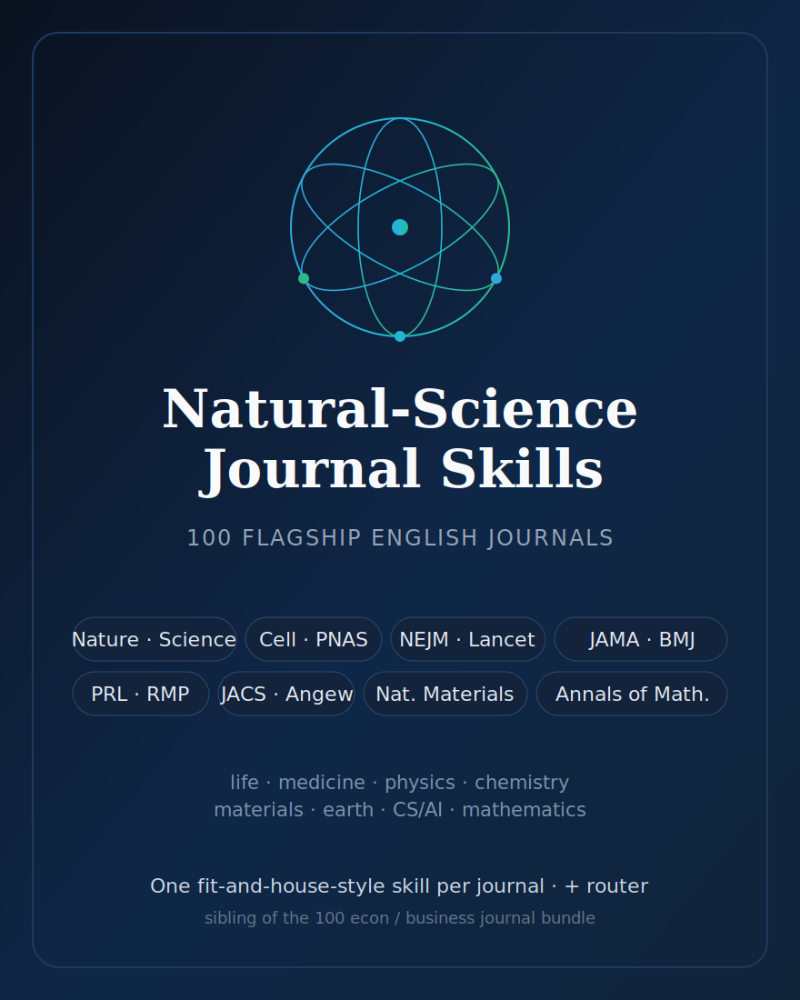

# 英文自然科学期刊 Skills（English Natural-Science Journal Skills）

<p align="center">
  
</p>

[](LICENSE)
[](#)
[](https://github.com/anthropics/claude-code)

[English](README.md) | 简体中文

针对 **100 本英文主流自然科学 / 临床医学 / 物理科学 / 形式科学期刊** 的一套 agent skill：覆盖三大通刊（Nature、Science、PNAS）、Cell Press 与 Nature 子刊家族、APS Physical Review 家族、ACS / RSC / Wiley 化学旗舰、四大综合医学刊与各临床学会旗舰，以及纯数学最高级别期刊。

这是 [`English-SocialScience-Journal-Skills`](../English-SocialScience-Journal-Skills/)（英文经管 100 刊）的自然科学姊妹包——与之互补的“另一个 100”。延续姊妹包的设计：**每本期刊一个自包含的“选刊定位 + 写作风格”skill**，外加一个 `en-natsci-journal-workflow` 路由 skill。每个期刊 skill 回答四个问题：稿件是否对口、应如何重新框定、本刊要求什么方法与证据、投稿前必须重新核对哪些官方要求。

父仓库中已有 first-party 深度包的旗舰刊（Science、Cell、PNAS、NEJM、The Lancet）与第三方 Nature 包，在本包中同样以“快速选刊卡”形式收录——与 `american-economic-review` 同时出现在深度包和经管 breadth 包中的处理完全一致。

## 覆盖范围

| 分组 | 数量 | 范围 |
|---|--:|---|
| 综合 / 多学科科学 | 7 | Nature、Science、PNAS 等通刊与多学科旗舰。 |
| 细胞、分子与基因组生物学 | 16 | Cell Press 与 Nature 子刊的细胞/分子/遗传/方法主力刊。 |
| 生态、演化与植物科学 | 5 | 生态学、演化生物学与植物科学旗舰。 |
| 免疫、微生物与实验医学 | 4 | 免疫学、微生物学与实验医学顶刊。 |
| 开放获取与基因组学 | 3 | eLife、PLOS Biology 等开放获取与基因组学刊。 |
| 神经科学与行为科学 | 4 | 神经科学与人类行为科学顶刊。 |
| 临床医学 — 综合 | 7 | NEJM、Lancet、JAMA、BMJ 等四大综合医学刊。 |
| 临床医学 — 专科 | 11 | 心血管、肿瘤、感染、神经、血液、消化、内分泌等专科旗舰。 |
| 转化与肿瘤医学 | 4 | 机制到病床的转化医学与肿瘤学顶刊。 |
| 物理学 | 9 | APS Physical Review 家族与 Nature 物理子刊。 |
| 天文与天体物理 | 3 | 天文与天体物理主力刊。 |
| 化学 | 10 | ACS / RSC / Wiley / Nature 化学旗舰（含综述刊）。 |
| 材料与能源 | 5 | 材料科学与能源研究顶刊。 |
| 地球、环境与气候 | 5 | 地球系统、气候与可持续/环境科学刊。 |
| 计算机科学、AI 与工程 | 4 | AI/ML、机器人与计算机视觉顶刊。 |
| 数学 | 3 | 纯数学最高级别期刊。 |
| **合计** | **100** | |

## 快速开始

```bash
/plugin marketplace add https://github.com/brycewang-stanford/awesome-journal-skills
/plugin install english-natsci-journal-skills
/reload-plugins
```

手动复制：

```bash
cp -R skills/* ~/.claude/skills/
# 或 Codex
cp -R skills/* ~/.codex/skills/
```

## 使用方式

不确定目标期刊时，先用 `en-natsci-journal-workflow`：它按“突破类型、证据形态、读者广度、投稿目标”给稿件分类，再路由到对应单刊 skill。若目标已明确，直接点名期刊，例如：“用 `nature-methods` 评估这个新方法是否足够通用、适合投 Nature Methods。”

每个 skill 都会返回：匹配度判断、方法/证据要求、高频拒稿风险、官方核验清单、改投建议。

## Skill 清单

### 综合 / 多学科科学（7）

| Skill | 期刊 |
|---|---|
| `nature` | Nature（Nature） |
| `science` | Science（Science） |
| `pnas` | Proceedings of the National Academy of Sciences（PNAS） |
| `nature-communications` | Nature Communications（Nat Commun） |
| `science-advances` | Science Advances（Sci Adv） |
| `national-science-review` | National Science Review（NSR） |
| `the-innovation` | The Innovation（The Innovation） |

### 细胞、分子与基因组生物学（16）

| Skill | 期刊 |
|---|---|
| `cell` | Cell（Cell） |
| `molecular-cell` | Molecular Cell（Mol Cell） |
| `cell-stem-cell` | Cell Stem Cell（Cell Stem Cell） |
| `cancer-cell` | Cancer Cell（Cancer Cell） |
| `cell-metabolism` | Cell Metabolism（Cell Metab） |
| `immunity` | Immunity（Immunity） |
| `neuron` | Neuron（Neuron） |
| `developmental-cell` | Developmental Cell（Dev Cell） |
| `current-biology` | Current Biology（Curr Biol） |
| `nature-genetics` | Nature Genetics（Nat Genet） |
| `nature-methods` | Nature Methods（Nat Methods） |
| `nature-biotechnology` | Nature Biotechnology（Nat Biotechnol） |
| `nature-cell-biology` | Nature Cell Biology（Nat Cell Biol） |
| `nature-structural-and-molecular-biology` | Nature Structural & Molecular Biology（NSMB） |
| `the-embo-journal` | The EMBO Journal（EMBO J） |
| `nucleic-acids-research` | Nucleic Acids Research（NAR） |

### 生态、演化与植物科学（5）

| Skill | 期刊 |
|---|---|
| `nature-ecology-and-evolution` | Nature Ecology & Evolution（Nat Ecol Evol） |
| `molecular-biology-and-evolution` | Molecular Biology and Evolution（MBE） |
| `ecology-letters` | Ecology Letters（Ecol Lett） |
| `the-plant-cell` | The Plant Cell（Plant Cell） |
| `nature-microbiology` | Nature Microbiology（Nat Microbiol） |

### 免疫、微生物与实验医学（4）

| Skill | 期刊 |
|---|---|
| `nature-immunology` | Nature Immunology（Nat Immunol） |
| `science-immunology` | Science Immunology（Sci Immunol） |
| `cell-host-and-microbe` | Cell Host & Microbe（Cell Host Microbe） |
| `journal-of-experimental-medicine` | Journal of Experimental Medicine（JEM） |

### 开放获取与基因组学（3）

| Skill | 期刊 |
|---|---|
| `elife` | eLife（eLife） |
| `plos-biology` | PLOS Biology（PLOS Biol） |
| `genome-biology` | Genome Biology（Genome Biol） |

### 神经科学与行为科学（4）

| Skill | 期刊 |
|---|---|
| `nature-neuroscience` | Nature Neuroscience（Nat Neurosci） |
| `nature-human-behaviour` | Nature Human Behaviour（Nat Hum Behav） |
| `trends-in-cognitive-sciences` | Trends in Cognitive Sciences（TiCS） |
| `molecular-psychiatry` | Molecular Psychiatry（Mol Psychiatry） |

### 临床医学 — 综合（7）

| Skill | 期刊 |
|---|---|
| `nejm` | The New England Journal of Medicine（NEJM） |
| `the-lancet` | The Lancet（Lancet） |
| `jama` | JAMA（JAMA） |
| `the-bmj` | The BMJ（BMJ） |
| `annals-of-internal-medicine` | Annals of Internal Medicine（Ann Intern Med） |
| `nature-medicine` | Nature Medicine（Nat Med） |
| `plos-medicine` | PLOS Medicine（PLOS Med） |

### 临床医学 — 专科（11）

| Skill | 期刊 |
|---|---|
| `the-lancet-oncology` | The Lancet Oncology（Lancet Oncol） |
| `journal-of-clinical-oncology` | Journal of Clinical Oncology（JCO） |
| `the-lancet-infectious-diseases` | The Lancet Infectious Diseases（Lancet Infect Dis） |
| `the-lancet-neurology` | The Lancet Neurology（Lancet Neurol） |
| `circulation` | Circulation（Circulation） |
| `journal-of-the-american-college-of-cardiology` | Journal of the American College of Cardiology（JACC） |
| `european-heart-journal` | European Heart Journal（EHJ） |
| `gastroenterology` | Gastroenterology（Gastroenterology） |
| `gut` | Gut（Gut） |
| `blood` | Blood（Blood） |
| `diabetes-care` | Diabetes Care（Diabetes Care） |

### 转化与肿瘤医学（4）

| Skill | 期刊 |
|---|---|
| `journal-of-clinical-investigation` | Journal of Clinical Investigation（JCI） |
| `science-translational-medicine` | Science Translational Medicine（Sci Transl Med） |
| `cancer-discovery` | Cancer Discovery（Cancer Discov） |
| `ca-a-cancer-journal-for-clinicians` | CA: A Cancer Journal for Clinicians（CA Cancer J Clin） |

### 物理学（9）

| Skill | 期刊 |
|---|---|
| `physical-review-letters` | Physical Review Letters（PRL） |
| `reviews-of-modern-physics` | Reviews of Modern Physics（RMP） |
| `physical-review-x` | Physical Review X（PRX） |
| `nature-physics` | Nature Physics（Nat Phys） |
| `nature-photonics` | Nature Photonics（Nat Photonics） |
| `prx-quantum` | PRX Quantum（PRX Quantum） |
| `physical-review-d` | Physical Review D（PRD） |
| `physical-review-b` | Physical Review B（PRB） |
| `reports-on-progress-in-physics` | Reports on Progress in Physics（RoPP） |

### 天文与天体物理（3）

| Skill | 期刊 |
|---|---|
| `nature-astronomy` | Nature Astronomy（Nat Astron） |
| `the-astrophysical-journal` | The Astrophysical Journal（ApJ） |
| `monthly-notices-of-the-royal-astronomical-society` | Monthly Notices of the Royal Astronomical Society（MNRAS） |

### 化学（10）

| Skill | 期刊 |
|---|---|
| `journal-of-the-american-chemical-society` | Journal of the American Chemical Society（JACS） |
| `angewandte-chemie-international-edition` | Angewandte Chemie International Edition（Angew Chem Int Ed） |
| `nature-chemistry` | Nature Chemistry（Nat Chem） |
| `chemical-reviews` | Chemical Reviews（Chem Rev） |
| `chemical-society-reviews` | Chemical Society Reviews（Chem Soc Rev） |
| `nature-catalysis` | Nature Catalysis（Nat Catal） |
| `accounts-of-chemical-research` | Accounts of Chemical Research（Acc Chem Res） |
| `chem` | Chem（Chem） |
| `acs-nano` | ACS Nano（ACS Nano） |
| `nature-nanotechnology` | Nature Nanotechnology（Nat Nanotechnol） |

### 材料与能源（5）

| Skill | 期刊 |
|---|---|
| `nature-materials` | Nature Materials（Nat Mater） |
| `advanced-materials` | Advanced Materials（Adv Mater） |
| `nature-energy` | Nature Energy（Nat Energy） |
| `joule` | Joule（Joule） |
| `energy-and-environmental-science` | Energy & Environmental Science（EES） |

### 地球、环境与气候（5）

| Skill | 期刊 |
|---|---|
| `nature-geoscience` | Nature Geoscience（Nat Geosci） |
| `nature-climate-change` | Nature Climate Change（Nat Clim Chang） |
| `nature-sustainability` | Nature Sustainability（Nat Sustain） |
| `environmental-science-and-technology` | Environmental Science & Technology（ES&T） |
| `one-earth` | One Earth（One Earth） |

### 计算机科学、AI 与工程（4）

| Skill | 期刊 |
|---|---|
| `nature-machine-intelligence` | Nature Machine Intelligence（Nat Mach Intell） |
| `science-robotics` | Science Robotics（Sci Robot） |
| `ieee-transactions-on-pattern-analysis-and-machine-intelligence` | IEEE Transactions on Pattern Analysis and Machine Intelligence（TPAMI） |
| `journal-of-machine-learning-research` | Journal of Machine Learning Research（JMLR） |

### 数学（3）

| Skill | 期刊 |
|---|---|
| `annals-of-mathematics` | Annals of Mathematics（Ann. of Math.） |
| `inventiones-mathematicae` | Inventiones Mathematicae（Invent. Math.） |
| `journal-of-the-american-mathematical-society` | Journal of the American Mathematical Society（JAMS） |

### 路由

| Skill | 角色 |
|---|---|
| `en-natsci-journal-workflow` | 英文自然科学期刊路由 workflow（非期刊） |

## 事实纪律

期刊规则会变。随包的 [`resources/source-basis.md`](resources/source-basis.md) 记录了本次扩展所参考的清单与取材原则，以及对易变事实（影响因子、接收率、字数/图数限制、APC 费用）的刻意省略；[`resources/_build-spec.md`](resources/_build-spec.md) 是卡片模板与事实纪律的契约，[`resources/journal-roster.md`](resources/journal-roster.md) 是锁定的 100 刊清单。正式投稿前，务必在出版社官网或投稿系统核对当期官方作者须知——临床类还需核对适用的报告规范（CONSORT / PRISMA / STROBE / ARRIVE）与试验注册要求。
