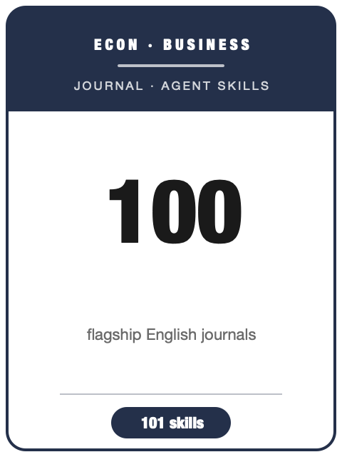

# 英文经管社科期刊 Skills（English Social-Science Journal Skills）

<p align="center">
  
</p>

[](LICENSE)
[](#)
[](https://github.com/anthropics/claude-code)

[English](README.md) | 简体中文

针对父仓库 roadmap 中 **100 本英文主流经济学 / 金融 / 管理 / 会计 / 营销 / 运营 / 信息系统期刊** 的一套 agent skill：覆盖经济学全部 “top-5”、金融 “top-3”、AOM / SMS 管理学顶级期刊，以及 FT50 / UTD24 / ABS 4★ 期刊。

这是 [`Chinese-SocialScience-Journal-Skills`](../Chinese-SocialScience-Journal-Skills/)（中文经管期刊包）的英文姊妹包。与中文包一致：**每本期刊一个自包含的“选刊定位 + 写作风格”skill**，外加一个 `en-journal-workflow` 路由 skill。每个期刊 skill 回答四个问题：稿件是否对口、应如何重新框定、本刊要求什么方法与证据、投稿前必须重新核对哪些官方要求。

AEA 旗舰另有完整生命周期包 `AER-skills`（`aer-*` 系列）。本包的 `american-economic-review` 是快速选刊层，会把用户路由进该深度包——与中文 `economic-research` 路由进 `Economic-Research-Journal-Skills` 的关系完全一致。

## 覆盖范围

| 分组 | 数量 | 范围 |
|---|--:|---|
| 经济学 | 50 | top-5 + AEJ 系列、JEL/JEP/REStat、各领域旗舰（计量、宏观货币、劳动、公共、产业组织、贸易、发展、健康、城市、环境、法经济学），以及政策/综述类期刊。 |
| 金融 | 13 | top-3（JF/JFE/RFS）加上各精英领域刊（银行、中介、微观结构、公司金融、国际金融、实证金融、数理金融）。 |
| 管理 / 战略 / 组织 | 15 | AMJ/AMR/AMA/ASQ/SMJ/OrgSci、JOM、JMS、OS、Human Relations、HRM、JIBS、Research Policy、JBV、ETP。 |
| 营销 | 6 | JM、JMR、Marketing Science、JCR、JCP、JAMS。 |
| 会计 | 6 | TAR、JAR、JAE、RAST、CAR、AOS。 |
| 运营与信息系统 | 10 | Management Science、OR、M&SOM、JOM-ops、POM；MISQ、ISR、JMIS、JAIS、IJOC。 |

## 快速开始

```bash
/plugin marketplace add https://github.com/brycewang-stanford/awesome-journal-skills
/plugin install english-socsci-journal-skills
/reload-plugins
```

手动复制：

```bash
cp -R skills/* ~/.claude/skills/
# 或 Codex
cp -R skills/* ~/.codex/skills/
```

## 使用方式

不确定目标期刊时，先用 `en-journal-workflow`：它按“贡献类型、方法形态、学科读者、投稿目标”给稿件分类，再路由到对应单刊 skill。若目标已明确，直接点名期刊，例如：“用 `journal-of-finance` 评估这篇资产定价论文是否适合 JF。”

每个 skill 都会返回：匹配度判断、方法/证据要求、高频拒稿风险、官方核验清单、改投建议。

## Skill 清单

完整的 100 本期刊 → skill 对照表（按学科分组）见英文版 [README.md](README.md#skills)。下面给出分组与数量速览：

- **经济学（50）**：`american-economic-review`、`quarterly-journal-of-economics`、`journal-of-political-economy`、`econometrica`、`review-of-economic-studies`、`aer-insights`、`aej-applied-economics`、`aej-macroeconomics`、`aej-microeconomics`、`aej-economic-policy`、`journal-of-economic-literature`、`journal-of-economic-perspectives`、`review-of-economics-and-statistics`、`journal-of-econometrics`、`journal-of-monetary-economics`、`journal-of-economic-growth`、`journal-of-labor-economics`、`journal-of-the-european-economic-association`、`the-economic-journal`、`rand-journal-of-economics`、`journal-of-international-economics`、`journal-of-public-economics`、`journal-of-development-economics`、`journal-of-economic-theory`、`journal-of-money-credit-and-banking`、`review-of-economic-dynamics`、`european-economic-review`、`journal-of-human-resources`、`international-economic-review`、`experimental-economics`、`journal-of-applied-econometrics`、`journal-of-business-and-economic-statistics`、`journal-of-health-economics`、`journal-of-environmental-economics-and-management`、`journal-of-urban-economics`、`games-and-economic-behavior`、`journal-of-law-and-economics`、`journal-of-law-economics-and-organization`、`world-development`、`world-bank-economic-review`、`imf-economic-review`、`annual-review-of-economics`、`brookings-papers-on-economic-activity`、`economic-policy`、`journal-of-risk-and-uncertainty`、`quantitative-economics`、`the-econometrics-journal`、`econometric-theory`、`journal-of-economic-behavior-and-organization`、`journal-of-economic-geography`。
- **金融（13）**：`journal-of-finance`、`journal-of-financial-economics`、`review-of-financial-studies`、`review-of-finance`、`journal-of-financial-and-quantitative-analysis`、`journal-of-financial-intermediation`、`journal-of-financial-markets`、`journal-of-banking-and-finance`、`journal-of-corporate-finance`、`journal-of-international-money-and-finance`、`mathematical-finance`、`journal-of-empirical-finance`、`financial-management`。
- **管理 / 战略 / 组织（15）**：`academy-of-management-journal`、`academy-of-management-review`、`academy-of-management-annals`、`administrative-science-quarterly`、`strategic-management-journal`、`organization-science`、`journal-of-management-en`、`journal-of-management-studies`、`organization-studies`、`human-relations`、`human-resource-management`、`journal-of-international-business-studies`、`research-policy`、`journal-of-business-venturing`、`entrepreneurship-theory-and-practice`。
- **营销（6）**：`journal-of-marketing`、`journal-of-marketing-research`、`marketing-science`、`journal-of-consumer-research`、`journal-of-consumer-psychology`、`journal-of-the-academy-of-marketing-science`。
- **会计（6）**：`the-accounting-review`、`journal-of-accounting-research`、`journal-of-accounting-and-economics`、`review-of-accounting-studies`、`contemporary-accounting-research`、`accounting-organizations-and-society`。
- **运营与信息系统（10）**：`management-science`、`operations-research`、`manufacturing-and-service-operations-management`、`journal-of-operations-management`、`production-and-operations-management`、`mis-quarterly`、`information-systems-research`、`journal-of-management-information-systems`、`journal-of-the-association-for-information-systems`、`informs-journal-on-computing`。
- **路由**：`en-journal-workflow`（路由 skill，非期刊）。

## 来源与核验纪律

期刊要求会变。本包内置的 [`resources/source-basis.md`](resources/source-basis.md) 记录了本次扩展使用的排名清单与来源策略，[`resources/official-source-map.md`](resources/official-source-map.md) 为每本期刊列出官方来源起点，并说明了为什么刻意不写入易变事实（影响因子、录用率、字数限制、版面费）。正式投稿前，请务必到出版商官网或投稿系统核对最新的作者须知。

> 命名说明：SAGE 的 *Journal of Management* 使用 slug `journal-of-management-en`，因为 `journal-of-management` 已被中文包用于《管理学刊》——这沿用了中文包自身的 `-cn` 消歧约定。
