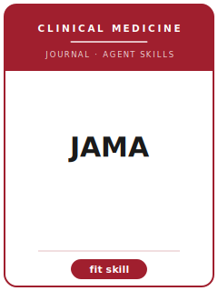

# JAMA Skills

<p align="center">
  
</p>

[](LICENSE)
[](https://jamanetwork.com/journals/jama)
[](https://jamanetwork.com/journals/jama)
[](https://github.com/anthropics/claude-code)

[English](README.md) | 简体中文

面向 **JAMA（美国医学会杂志，Journal of the American Medical Association）** 临床论文投稿的 Agent Skill 工具栈。JAMA 由美国医学会（AMA）出版，与 NEJM、The Lancet、The BMJ 并称综合医学"四大刊"。

本仓库刻意**不通用**——它不是泛化的"医学写作助手"，而是面向 JAMA 编委审稿口味的方法论沉淀：覆盖**普适临床重要性判定、研究设计、EQUATOR 报告规范（CONSORT / STROBE / PRISMA / STARD）、效应量与 95% 置信区间的统计严谨性、JAMA 结构化摘要与 Key Points 框、临床试验注册与 ICMJE 伦理/披露、图表、文风、投稿信、投稿前检查、审稿回复**。

---

## 为什么要为 JAMA 单独做一套 Skills？

JAMA 的约束维度与专科刊 / 基础研究刊**显著不同**：

| 维度        | JAMA 要求                                          | 隐含含义                                      |
|-----------|-------------------------------------------------|-------------------------------------------|
| 定位        | 面向广大临床医生的**普适医学重要性**                      | 偏专科 / 纯机制的稿件不适合                       |
| 核心设计     | RCT、观察性研究、诊断准确性研究、系统综述/Meta              | 样本不足的预试验 / 无对照病例系列命中率低             |
| 报告规范     | 必须使用对应的 EQUATOR 指南 + 流程图                    | 缺 CONSORT/PRISMA 流程图是危险信号               |
| 试验注册     | 入组前**前瞻性注册**（ICMJE 政策）                      | 回顾性注册通常无法在投稿时补救                      |
| 统计        | 效应量 + 95% CI；ITT；多重比较；**专门统计审稿**           | 只报 p 值、无估计/CI 过不了统计审稿                 |
| 摘要        | JAMA 结构化标题（约 350 词）+ Key Points 框             | 一整段式摘要不符合格式                            |
| 伦理/披露    | IRB、知情同意、ICMJE 署名与利益冲突、数据共享                | 缺声明会拖延甚至葬送投稿                          |
| 结论        | 必须以预设的主要结局为界                                 | "spin"（夸大）与对关联做因果表述会被惩罚              |
| 文风        | AMA Manual of Style；以人为先的措辞                    | 记号/单位不合规暴露稿件准备不足                     |

通用的"科研写作"Skill 包不会处理这些约束。所有当年的字数 / 参考文献 / 图表上限、费用与编辑信息，请以 JAMA 官方 Instructions for Authors 页面为准。

---

## 快速开始

### 方式 A —— Claude Code 插件（推荐）

```bash
/plugin marketplace add https://github.com/brycewang-stanford/jama-skills
/plugin install jama-skills
/reload-plugins
```

### 方式 B —— 手动拷贝

```bash
git clone https://github.com/brycewang-stanford/jama-skills.git
cd jama-skills

mkdir -p ~/.claude/skills && cp -R skills/jama-* ~/.claude/skills/
# 或
mkdir -p ~/.codex/skills && cp -R skills/jama-* ~/.codex/skills/
```

### 第一条 Prompt

```
用 jama-workflow 告诉我这份 JAMA 目标稿子下一步该用哪个 skill。
```

---

## 默认工作流

```text
jama-scope-fit
        ▼
jama-study-design
        ▼
jama-reporting-standards
        ▼
jama-statistics
        ▼
jama-figures-tables
        ▼
jama-structured-abstract
        ▼
jama-ethics-registration
        ▼
jama-writing-style          （polish）
        ▼
jama-cover-letter
        ▼
jama-submission
        ▼
jama-peer-review-revision
```

`jama-workflow` 是路由器，会根据当前阶段告诉你下一个该用哪个 Skill。

---

## Skill 一览

| Skill                        | 用途                                                       |
|------------------------------|----------------------------------------------------------|
| `jama-workflow`              | 路由器：判断当前阶段，推荐下一个 skill                            |
| `jama-scope-fit`             | 普适医学重要性判定 + 文章类型匹配                                |
| `jama-study-design`          | 设计选择 + 内部效度保障（ITT、偏倚、功效）                        |
| `jama-reporting-standards`   | EQUATOR 清单 + 流程图（CONSORT / STROBE / PRISMA / STARD）   |
| `jama-statistics`            | 效应量 + 95% CI、多重比较、ITT、专门统计审稿                     |
| `jama-figures-tables`        | 流程图、基线表、森林图/KM 曲线、图表规范                          |
| `jama-structured-abstract`   | JAMA 结构化摘要 + Key Points 框（Question/Findings/Meaning） |
| `jama-ethics-registration`   | 注册、IRB/知情同意、ICMJE 署名/利益冲突、数据共享                  |
| `jama-writing-style`         | AMA 文风、去 spin、关联性措辞、局限性                            |
| `jama-cover-letter`          | 面向编辑的普适医学重要性陈述 + 各项声明                          |
| `jama-submission`            | 投稿前检查 + 清单与稿件模板                                    |
| `jama-peer-review-revision`  | 对审稿人与统计审稿意见的逐条回复                                 |

### 附属资源

- [`skills/jama-submission/templates/manuscript_template.md`](skills/jama-submission/templates/manuscript_template.md) —— JAMA 稿件骨架（结构化摘要、Key Points、IMRaD、各项声明）
- [`skills/jama-submission/templates/checklist.md`](skills/jama-submission/templates/checklist.md) —— 投稿前 8 类自检清单
- [`resources/external_tools.md`](resources/external_tools.md) —— EQUATOR 指南、注册库（ClinicalTrials.gov / PROSPERO）、R / Stata / Python 包，以及参考文献/制图工具

---

## 与专科刊 Skill 包的差异

| 维度        | JAMA（综合医学）              | 专科刊 / 基础研究刊            |
|-----------|--------------------------|------------------------|
| 读者        | 全科临床医生                  | 专科医生 / 实验科学家           |
| 重要性门槛    | 普适医学重要性                 | 领域特异 / 机制创新            |
| 结局        | 患者相关终点                  | 替代/机制终点常可接受           |
| 报告规范     | 强制 EQUATOR + 流程图        | 因刊而异                   |
| 统计审稿     | 设有专门统计审稿               | 通常仅常规同行评审             |

---

## 关于这个仓库不做什么

- 不替你写出可直接投稿的稿件
- 不模拟某位编辑的个人偏好
- 不收录 JAMA 拒稿率、版面费、影响因子（请以官网为准）
- 不替你判断临床问题是否真有重要性——这是研究者本人的判断

---

## 相关仓库

- [awesome-journal-skills](https://github.com/brycewang-stanford/awesome-journal-skills) —— 期刊 Skill 索引
- [Economic-Research-Journal-Skills](https://github.com/brycewang-stanford/economic-research-skills) —— 《经济研究》投稿工具栈

---

## License

MIT
