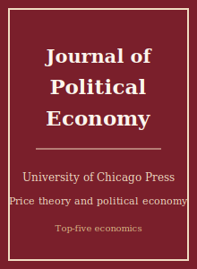

# 政治经济学杂志（JPE）Skills

<p align="center">
  
</p>

[](LICENSE)
[](https://www.journals.uchicago.edu/journals/jpe/about)
[](https://www.journals.uchicago.edu/journals/jpe/about)
[](https://github.com/anthropics/claude-code)

[English](README.md) | 简体中文

面向 **《政治经济学杂志》（Journal of Political Economy, JPE）** 投稿的智能体（agent）Skill 技能栈 —— 该刊由芝加哥大学出版社（University of Chicago Press）出版，是经济学“五大刊”（top-five）之一，植根于芝加哥学派的价格理论传统，并设有子刊（JPE: Microeconomics、JPE: Macroeconomics）。

本仓库立场鲜明，**不是**通用的经济学写作工具箱，而是一套 **JPE 专属** 技能栈，围绕该刊的核心提问 ——*“经济理论预测了什么，证据是否印证了它？”*—— 展开：以机制为驱动的选题、作者-年份制（author-date）文献定位、可信的因果识别、结构估计与价格理论建模、对竞争性机制的稳健性检验、具有经济含义的图表、JPE 行文规范、符合 AEA 标准的复制包（replication package）、审稿人预判、投稿前自检与 R&R 回复信。

> **准确性说明。** 易变的具体信息 —— 现任编委、确切的投稿费、精确的字数/格式上限、最新的数据/代码政策 —— 会随时间变化。本技能栈描述该刊**持久稳定**的规范，并提示你在期刊官网核对当前数据。

---

## 为什么需要单独的 JPE 技能栈？

JPE 虽属五大刊，但其办刊口味与 QJE / Econometrica / REStud 存在实质差异：

| 约束维度           | 《政治经济学杂志》（JPE）                                  | 含义                                                  |
|--------------------|----------------------------------------------------------|-------------------------------------------------------|
| 学科范围           | 经济学全谱系，植根价格理论                                | 在产业组织、劳动、宏观、公共、理论、结构实证上尤强    |
| 核心提问           | “理论预测什么，证据是否印证？”                            | 只有干净因果效应、却无机制，只能算半篇论文            |
| 机制 / 理论        | 即便是实证论文也要求紧密的经济机制                        | 无理论的相关性挖掘是“桌拒”（desk-reject）信号         |
| 识别门槛           | 既要可信的因果识别，**又要**经济解释                      | 仅靠 OLS + 控制变量通常不够                            |
| 结构估计           | 欢迎；但参数识别须透明                                    | 期望出现“什么识别什么”的论述段落                       |
| 均衡推理           | 一般均衡 / 激励因素会被严格审视                            | 忽视一般均衡（GE）反馈的局部均衡叙事很脆弱            |
| 参考文献           | 作者-年份制（Chicago / 芝加哥大学出版社）                  | 数字/方括号引用不符合该刊体例                          |
| 格式               | 理论与实证融合；证明与稳健性放入附录                      | 在线附录承载繁重材料                                  |
| 流程               | Editorial Express 投稿系统；收取投稿费（请核实）           | 选择性强、要求高；缴费环节是进入评审的前提            |
| 复制               | 录用论文须提交数据/代码（AEA 标准；请核实）                | 期望可复现的主控脚本 + README                         |

通用的“科研写作”或“经济学写作”技能包无法覆盖上述约束。

---

## 快速开始

### 方式 A —— Claude Code 插件（推荐）

```bash
/plugin marketplace add https://github.com/brycewang-stanford/jpe-skills
/plugin install jpe-skills
/reload-plugins
```

### 方式 B —— 手动复制

```bash
git clone https://github.com/brycewang-stanford/jpe-skills.git
cd jpe-skills

mkdir -p ~/.claude/skills && cp -R skills/jpe-* ~/.claude/skills/
# 或
mkdir -p ~/.codex/skills && cp -R skills/jpe-* ~/.codex/skills/
```

### 第一条提示词

```
用 jpe-workflow 告诉我，我的 JPE 稿件下一步该用哪个技能。
```

---

## 默认工作流

```text
jpe-topic-selection
        ▼
jpe-literature-positioning
        ▼
jpe-identification
        ▼
jpe-theory-model
        ▼
jpe-robustness
        ▼
jpe-tables-figures
        ▼
jpe-writing-style          （润色）
        ▼
jpe-referee-strategy
        ▼
jpe-replication-package
        ▼
jpe-submission
        ▼
jpe-rebuttal
```

`jpe-workflow` 是路由器 —— 它根据你所处的阶段告诉你下一步用哪个技能。在 JPE，模型与识别常常交替迭代：模型往往会反过来约束实证设定。

---

## 技能清单

| 技能                           | 用途                                                                  |
|--------------------------------|-----------------------------------------------------------------------|
| `jpe-workflow`                 | 路由器 —— 决定下一步调用哪个子技能                                     |
| `jpe-topic-selection`          | JPE 适配性检验（以机制为驱动的问题）+ 贡献陈述                         |
| `jpe-literature-positioning`   | 作者-年份制引言结构 + 经典理论的对接                                   |
| `jpe-identification`           | 可信识别（DID / IV / RDD / 结构）**且**给出经济含义                    |
| `jpe-theory-model`             | 赋予结果经济解释的模型 / 机制                                          |
| `jpe-robustness`               | 设定稳健性 + 竞争性机制的甄别                                          |
| `jpe-tables-figures`           | 符合芝加哥大学出版社风格、具备经济可读性的图表                         |
| `jpe-writing-style`            | 简练、以经济学为先的行文 + 作者-年份制体例                             |
| `jpe-replication-package`      | 符合 AEA 数据编辑标准的数据/代码包与 README                           |
| `jpe-referee-strategy`         | 预判：价格理论 / 一般均衡 / 识别方面的反对意见                         |
| `jpe-submission`               | Editorial Express 投稿前自检（格式、文献、费用、匿名）                 |
| `jpe-rebuttal`                 | R&R 回复信结构与修订计划                                              |

### 资源

- [`skills/jpe-submission/templates/manuscript_template.md`](skills/jpe-submission/templates/manuscript_template.md) —— JPE 稿件骨架（章节顺序、作者-年份制文献、变量定义表）
- [`skills/jpe-submission/templates/checklist.md`](skills/jpe-submission/templates/checklist.md) —— 8 大类投稿前自检清单
- [`resources/external_tools.md`](resources/external_tools.md) —— 经济学数据源（IPUMS / Census-FSRDC / FRED / WRDS / Penn World Table）+ 用于简约式、结构式与复制工作的 Stata / R / Python / Julia 包

---

## 与 QJE / Econometrica / REStud 技能栈的差异

| 维度               | JPE                                | QJE                          | Econometrica                | REStud                     |
|--------------------|------------------------------------|------------------------------|-----------------------------|----------------------------|
| 首要标准           | 经济机制 + 价格理论                | 重要问题 + 干净识别          | 方法 / 形式理论的新意       | 技术深度，偏前沿           |
| 简约式实证         | 必须对接模型 / 机制                | 识别干净时可独立成篇         | 需有方法 / 理论贡献         | 在严谨前提下受欢迎         |
| 结构估计           | 核心；参数识别透明                 | 常见                         | 核心                        | 核心                       |
| 无理论论文         | 有“桌拒”风险                       | 有风险                       | 不契合                      | 有风险                     |
| 引用体例           | 作者-年份制                        | 作者-年份制                  | 作者-年份制                 | 作者-年份制                |

如果论文是纯方法、缺乏经济学应用，Econometrica 可能更合适；如果是无理论的政策评估，请先在 `jpe-topic-selection` 中重塑框架，再投 JPE。

---

## 相关项目

- [awesome-journal-skills](https://github.com/brycewang-stanford/awesome-journal-skills) —— 期刊专属技能包索引
- [AER-skills](https://github.com/brycewang-stanford/AER-skills) —— American Economic Review
- [economic-research-skills](https://github.com/brycewang-stanford/economic-research-skills) —— 《经济研究》

---

## 许可证

MIT
