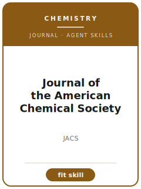

# JACS Skills

<p align="center">
  
</p>

[](LICENSE)
[](https://pubs.acs.org/journal/jacsat)
[](https://pubs.acs.org/journal/jacsat)
[](https://github.com/anthropics/claude-code)

[English](README.md) | 简体中文

面向 **《美国化学会志》（Journal of the American Chemical Society, JACS）** 投稿的 Agent Skill 工具栈。JACS 是美国化学会（ACS）出版的综合性顶级化学期刊，覆盖有机、无机、有机金属、催化、材料、物理、分析与生物化学。

本仓库刻意**不通用**——它不是泛化的"科研写作助手"，而是面向 JACS 的方法论沉淀，覆盖**领域契合度、化学进展的提炼、合成与完整表征的严谨性**（NMR / HRMS / IR/UV-vis / 元素分析或 HPLC / 单晶 X 射线与 CCDC 存档 / 催化对照实验与机理）、**ACS 风格的反应式与图、支持信息（SI）、ACS 写作规范、Article 与 Communication 的篇幅取舍、投稿信、Paragon Plus 投稿、审稿策略与修回**。

> 本工具栈描述的是**长期稳定的规范**，而非易变细节。当前主编、文章类型、字数/图数限制、费用与政策，请始终以 ACS 官方 JACS 作者页面为准。

---

## 为什么要为 JACS 单独做一套 Skills？

JACS 的约束维度与物理快报、数学期刊、临床期刊**显著不同**：

| 维度 | JACS 要求 | 隐含含义 |
|------|----------|---------|
| 学科定位 | 综合化学（有机 / 无机 / 催化 / 材料 / 物理 / 生物） | 仅限子领域的进展更适合专门的 ACS 期刊 |
| 标准 | 具有**广泛兴趣**的重要化学进展 | "工作量大"≠重要性；必须论证广泛性 |
| 证据 | 结论须由表征数据与对照实验**充分支撑** | 仅靠断言的新颖性/机理会被退稿或被严批 |
| 新化合物 | 完整表征 + 证明**纯度** | 缺元素分析/HPLC 或缺干净 ¹³C 是严谨性红线 |
| 晶体结构 | 须向 **CCDC** 存档，checkCIF 通过 | 未存档结构会阻碍录用 |
| 机理 | 须由对照/动力学/同位素标记支撑 | 只画循环而无探针实验="臆测" |
| 支持信息 | 完整实验步骤、全部数据、谱图复印件、CIF | "数据备索"不可接受 |
| 文章类型 | **Article** 与 **Communication** | 选错类型会招致"不匹配"的批评 |
| 投稿 | **ACS Paragon Plus**；须提供 TOC 图 | 格式/文件规则是机械性关卡 |
| 风格 | ACS 数字引用；化合物编号加粗 | 非 ACS 格式显得不专业 |

通用的"科研写作"Skill 包不会处理这些约束。

---

## 快速开始

### 方式 A —— Claude Code 插件（推荐）

```bash
/plugin marketplace add https://github.com/brycewang-stanford/jacs-skills
/plugin install jacs-skills
/reload-plugins
```

### 方式 B —— 手动拷贝

```bash
git clone https://github.com/brycewang-stanford/jacs-skills.git
cd jacs-skills

mkdir -p ~/.claude/skills && cp -R skills/jacs-* ~/.claude/skills/
# 或
mkdir -p ~/.codex/skills && cp -R skills/jacs-* ~/.codex/skills/
```

### 第一条 Prompt

```
用 jacs-workflow 告诉我这份 JACS 目标稿子下一步该用哪个 skill。
```

---

## 默认工作流

```text
jacs-scope-fit
        ▼
jacs-results-framing
        ▼
jacs-methods
        ▼
jacs-figures
        ▼
jacs-supplementary
        ▼
jacs-writing-style       （polish）
        ▼
jacs-length-management   （polish）
        ▼
jacs-cover-letter
        ▼
jacs-submission
        ▼
jacs-referee-strategy
        ▼
jacs-revision
```

`jacs-workflow` 是路由器，会根据当前阶段告诉你下一个该用哪个 Skill。

---

## Skill 一览

| Skill | 用途 |
|-------|------|
| `jacs-workflow` | 路由器：判断当前阶段，推荐下一个 skill |
| `jacs-scope-fit` | 广泛兴趣检验 + JACS 与专门期刊的取舍 + Article/Communication 选择 |
| `jacs-results-framing` | 提炼化学进展、广泛性来源与意义 |
| `jacs-methods` | 合成 + 完整表征严谨性（NMR/HRMS/X 射线/CCDC、催化对照/机理/动力学） |
| `jacs-figures` | ACS 风格反应式、谱图、ORTEP 结构、机理图、TOC 图 |
| `jacs-supplementary` | 支持信息：实验步骤、全部数据、谱图复印件、CIF/CCDC |
| `jacs-writing-style` | ACS 写作规范、命名法、单位与措辞克制 |
| `jacs-length-management` | Article 与 Communication 取舍；按 ACS 规范精简 |
| `jacs-cover-letter` | 面向编辑的"进展+契合"陈述 |
| `jacs-submission` | ACS Paragon Plus 投稿前 preflight + 稿件模板 |
| `jacs-referee-strategy` | 推荐/排除审稿人 + 预先化解常见质疑 |
| `jacs-revision` | 审稿意见分类处理 + 逐条回复 |

### 附属资源

- [`skills/jacs-submission/templates/manuscript_template.md`](skills/jacs-submission/templates/manuscript_template.md) —— JACS 风格稿件 + SI 骨架（Article/Communication）
- [`skills/jacs-submission/templates/checklist.md`](skills/jacs-submission/templates/checklist.md) —— 12 类投稿前自检清单
- [`resources/external_tools.md`](resources/external_tools.md) —— 表征平台、CCDC/PDB 存档、ChemDraw/晶体学/计算软件、ACS 引用样式

---

## 与专门 ACS 期刊 Skill 包的差异

| 维度 | JACS | 专门 ACS 期刊（如 *Org. Lett.* / *Inorg. Chem.* / *ACS Catal.* / *Chem. Mater.*） |
|------|------|----------------------------------------------------------------------------------|
| 范围 | 跨化学的广泛兴趣 | 子领域内的兴趣 |
| 标准 | 重要且具普遍性的进展 | 扎实、聚焦的贡献 |
| 广泛性论证 | **必需** | 不那么核心 |
| 严谨性（表征/CCDC/对照） | 最高标准 | 按子领域要求 |
| 文章类型 | Article / Communication | 因刊而异 |

如果你的进展范围较窄，`jacs-scope-fit` 会如实指出，并建议更契合的 ACS 期刊。

---

## 关于这个仓库不做什么

- 不替你写出可直接投稿的稿件
- 不模拟审稿人偏好，也不保证录用
- 不收录 JACS 录用率、影响因子等易变元数据
- 不评估你的化学进展是否真有原创性——这是研究者本人的科学判断

---

## 相关仓库

- [awesome-journal-skills](https://github.com/brycewang-stanford/awesome-journal-skills) —— 期刊 Skill 索引
- [Economic-Research-Journal-Skills](https://github.com/brycewang-stanford/economic-research-skills) —— 《经济研究》参考包
- [ACS JACS 作者资源](https://pubs.acs.org/journal/jacsat) —— 官方指南（当前规则以此为准）

---

## License

MIT
