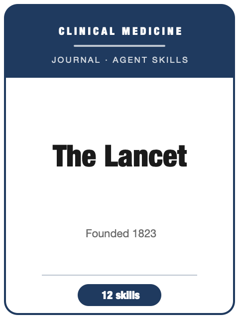

# Lancet Skills

<p align="center">
  
</p>

[](LICENSE)
[](https://www.thelancet.com/)
[](https://www.thelancet.com/)
[](https://github.com/anthropics/claude-code)

English | [简体中文](README.zh-CN.md)

Agent skill stack for manuscripts targeted at **The Lancet** — the flagship clinical-medicine and global-health journal.

This pack is opinionated. It is **not** a generic "medical writing" toolbox. It is a **Lancet-specific** stack that encodes the journal's editorial bar — **clinically and public-health important, globally relevant, and likely to change practice or policy, often with an equity lens** — and the concrete conventions that follow from it: prospective trial registration, protocol + statistical analysis plan, EQUATOR reporting guidelines with the mandatory study-flow diagram, the signature **Research in context** panel, the structured abstract with **Findings / Interpretation / Funding** headings, clinical statistics, the **Declaration of interests** and **role of the funding source** statements, the data sharing statement, and SAGER sex/gender plus equity reporting.

---

## Why a Separate Lancet Stack?

The Lancet imposes constraints that differ materially from a basic-science journal — and from NEJM, JAMA, and BMJ:

| Constraint                | The Lancet                                                       | Implication                                                  |
|---------------------------|------------------------------------------------------------------|--------------------------------------------------------------|
| Editorial bar             | Clinically/public-health important, **globally relevant**, practice/policy-changing, equity-aware | Most papers are **rejected without review** if narrow or local |
| Trial registration        | **Prospective** registration (before enrollment) is mandatory; number in the abstract | A retrospectively registered trial may be ineligible          |
| Reporting guideline        | CONSORT / STROBE / PRISMA via EQUATOR, with the **flow diagram**  | An RCT without a CONSORT flow diagram is not submission-ready  |
| Research in context        | A **required three-part panel** with a documented systematic search | A search-free panel signals an unsystematic review            |
| Abstract                  | Structured, ≤ ~300 words, **Background / Methods / Findings / Interpretation / Funding** | "Results / Conclusions" headings are off-style                |
| Disclosures               | **Declaration of interests** + **role of the funding source** + data sharing statement | Missing funder-role / data-sharing statements block submission |
| Equity reporting          | **SAGER** sex/gender + race/ethnicity + PROGRESS-Plus where relevant | Sex-blind reporting is a flagged omission                     |
| Over-claiming             | Cautious language; no causal claim beyond the design             | Conclusions must not outrun the evidence                      |

Generic "medical writing" packs do not encode these venue constraints — and a basic-science framing (broad significance, supplement-first methods) is the wrong model here.

---

## Quick Start

### Option A — Claude Code Plugin (recommended)

```bash
/plugin marketplace add https://github.com/brycewang-stanford/awesome-journal-skills
/plugin install lancet-skills
/reload-plugins
```

### Option B — Manual Copy

```bash
git clone https://github.com/brycewang-stanford/awesome-journal-skills.git
cd awesome-journal-skills/Lancet-Skills

mkdir -p ~/.claude/skills && cp -R skills/lancet-* ~/.claude/skills/
# or
mkdir -p ~/.codex/skills && cp -R skills/lancet-* ~/.codex/skills/
```

### First Prompt

```
Use lancet-workflow to tell me which skill I should use next for my manuscript targeted at The Lancet.
```

---

## Default Workflow

```text
lancet-fit                 (clear the importance / global-relevance / policy bar first)
        ▼
lancet-study-design        (registration + protocol + SAP + design rigor)
        ▼
lancet-reporting           (CONSORT / STROBE / PRISMA + flow diagram)
        ▼
lancet-statistics          (pre-specified analysis, ITT, CIs, subgroups)
        ▼
lancet-figures-tables      (Table 1, Kaplan–Meier, forest, study-flow diagram)
        ▼
lancet-research-in-context (the signature three-part panel + systematic search)
        ▼
lancet-abstract            (structured abstract: Findings / Interpretation / Funding ≤300w)
        ▼
lancet-writing             (IMRaD structure; cautious Discussion; ~3000–3500w)
        ▼
lancet-ethics              (declaration of interests, role of funding, data sharing, SAGER)
        ▼
lancet-submission          (preflight + cover letter)
        ▼
lancet-rebuttal            (after review — incl. the statistical reviewer)
```

`lancet-workflow` is the router — it tells you which skill to use next based on where you are.

---

## Skills

| Skill                        | Purpose                                                                          |
|------------------------------|----------------------------------------------------------------------------------|
| `lancet-workflow`            | Router — decides which sub-skill to invoke next; how The Lancet differs from NEJM/JAMA/BMJ |
| `lancet-fit`                 | Triage filter: clinical/global importance, practice-or-policy change, equity; venue routing |
| `lancet-study-design`        | Prospective trial registration, protocol + SAP, randomisation/blinding/ITT, observational design |
| `lancet-reporting`           | EQUATOR guideline (CONSORT/STROBE/PRISMA) + the mandatory flow diagram + checklist |
| `lancet-research-in-context` | The signature panel: Evidence before / Added value / Implications + systematic search |
| `lancet-abstract`            | Structured abstract ≤300w: Background / Methods / **Findings** / **Interpretation** / Funding |
| `lancet-writing`             | IMRaD structure, ~3000–3500w, ~30 refs, cautious globally minded Discussion        |
| `lancet-statistics`          | CIs over bare P, ITT + per-protocol, multiplicity, pre-specified subgroups + interaction, absolute + relative effects |
| `lancet-figures-tables`      | Table 1, Kaplan–Meier with numbers at risk, forest plots, CONSORT/study-flow diagram, maps |
| `lancet-ethics`              | Declaration of interests, role of the funding source, data sharing, ICMJE authorship, SAGER + equity |
| `lancet-submission`          | Full preflight checklist + templates (checklist, cover letter)                    |
| `lancet-rebuttal`            | Decision triage, statistical-reviewer track, point-by-point response, cautious causal language |

### Resources

- [`skills/lancet-submission/templates/checklist.md`](skills/lancet-submission/templates/checklist.md) — full preflight checklist
- [`skills/lancet-submission/templates/cover_letter_template.md`](skills/lancet-submission/templates/cover_letter_template.md) — clinical/global-importance cover-letter scaffold
- [`resources/external_tools.md`](resources/external_tools.md) — registries, EQUATOR reporting standards, ICMJE/Helsinki, GRADE, equity (SAGER/PROGRESS-Plus), statistics/figure tooling, and key Lancet author pages

---

## Differences vs. NEJM / JAMA / BMJ

| Dimension          | The Lancet                                  | NEJM                          | JAMA                          | BMJ                           |
|--------------------|---------------------------------------------|-------------------------------|-------------------------------|-------------------------------|
| Emphasis           | Global health, equity, public health, policy | Clinically definitive, US-centric | Clinical + health policy    | Generalist EBM, patient partnership |
| Signature artifact | **Research in context** panel (systematic search) | None equivalent            | Structured abstract           | "What this paper adds" box    |
| Abstract headings  | Findings / Interpretation (not Results / Conclusions) | Conclusions               | Conclusions                   | Conclusions                   |
| Voice              | International, explicit advocacy             | Conservative                  | Methodological                | Open-access, EBM-forward      |
| When to switch     | —                                           | Definitive RCT, no equity angle | Strong stats/policy fit     | Strong patient-partnership angle |

For Science, see [Science-Skills](https://github.com/brycewang-stanford/awesome-journal-skills/tree/main/Science-Skills). Within the Lancet family, consider *Lancet Global Health*, *Lancet Public Health*, a specialty title, or *EClinicalMedicine* via `lancet-fit`.

---

## Related

- [awesome-journal-skills](https://github.com/brycewang-stanford/awesome-journal-skills) — index of journal-specific skill packs
- [Science-Skills](https://github.com/brycewang-stanford/awesome-journal-skills/tree/main/Science-Skills) · [Cell-Skills](https://github.com/brycewang-stanford/awesome-journal-skills/tree/main/Cell-Skills) · [PNAS-Skills](https://github.com/brycewang-stanford/awesome-journal-skills/tree/main/PNAS-Skills) · [NEJM-Skills](https://github.com/brycewang-stanford/awesome-journal-skills/tree/main/NEJM-Skills)

---

## Disclaimer

This is an independent, community-built skill pack. It is **not** affiliated with, endorsed by, or produced by The Lancet, Elsevier, or any Lancet family journal. All targets (word counts, reference limits, style rules) reflect publicly documented author guidelines and ICMJE recommendations at the time of writing — **always confirm against the current [Lancet Information for Authors](https://www.thelancet.com/for-authors) and [ICMJE Recommendations](https://www.icmje.org/recommendations/)** before submitting.

---

## License

MIT
