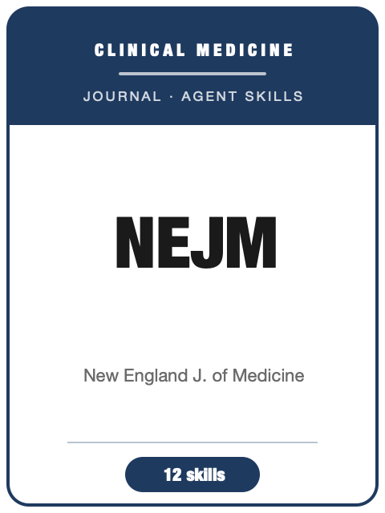

# NEJM Skills

<p align="center">
  
</p>

[](LICENSE)
[](https://www.nejm.org/)
[](https://www.nejm.org/)
[](https://github.com/anthropics/claude-code)

[English](README.md) | 简体中文

面向 **《新英格兰医学杂志》（The New England Journal of Medicine, NEJM）** 投稿的 Agent Skill 工具栈——临床医学旗舰刊。

本仓库刻意**不通用**。它不是泛化的"医学写作助手"，而是把 NEJM 的编辑底线——**改变临床实践的影响力 + 方法学严谨 + 可推广性**——以及由此衍生的具体临床规范沉淀成一套方法论：强制的前瞻性试验注册及方案与统计分析计划（SAP）、EQUATOR 报告规范与 CONSORT 流程图、含注册号的结构化 ≤250 词摘要、简洁的 IMRAD 写作、临床统计（置信区间优先于 P 值、意向性治疗分析、绝对风险与 NNT）、临床图表（Table 1、Kaplan–Meier 曲线、森林图）、临床伦理（IRB、知情同意、ICMJE 利益冲突披露、数据共享声明）、以及 Vancouver/ICMJE 引用体例。

---

## 为什么要为 NEJM 单独做一套 Skills？

NEJM 的约束维度与基础科学刊、乃至其临床姊妹刊都**显著不同**：

| 维度        | NEJM 要求                                                  | 隐含含义                                       |
|-----------|---------------------------------------------------------|--------------------------------------------|
| 编辑底线     | 改变实践的影响力 + 严谨 + 可推广                              | 范围窄的稿件**多数不送审、直接拒稿**               |
| 试验注册     | 入组前**前瞻性**注册（ClinicalTrials.gov/ICTRP）             | 未注册的试验通常直接失格                          |
| 方案 + SAP  | 随试验一并提交并发表；SAP 须事先设定                          | 事后补的分析计划是可信度问题                       |
| 报告规范     | EQUATOR：**CONSORT**（+流程图）/ STROBE / PRISMA           | RCT 没有 CONSORT 流程图即未准备好                 |
| 摘要        | **结构化 ≤250 词**：Background/Methods/Results/Conclusions，含 NCT 号 + 资助来源 | 非结构化摘要不合体例          |
| 统计        | **置信区间优先于裸 P 值**；ITT 为主；绝对风险 + NNT            | 只报相对风险/只报 P 会被挑出                       |
| 图表        | Table 1（基线不放 P 值）；Kaplan–Meier 带风险人数；森林图       | 体例不对显得不专业                              |
| 伦理与诚信   | IRB + 知情同意；**ICMJE 披露 + 数据共享声明**                | 缺披露/数据共享会卡住投稿                         |
| 参考文献     | **Vancouver / ICMJE** 编号制，六位作者后 et al.             | 著者-年份体例必须转换                            |
| 过度声称/因果 | 拒稿首要原因之一；观察性数据用因果语言会被挑出                  | 结论须与设计强度匹配                            |

通用的"医学写作"Skill 包不会编码这些"按刊定制"的约束。

---

## 快速开始

### 方式 A — Claude Code 插件（推荐）

```bash
/plugin marketplace add https://github.com/brycewang-stanford/awesome-journal-skills
/plugin install nejm-skills
/reload-plugins
```

### 方式 B — 手动复制

```bash
git clone https://github.com/brycewang-stanford/awesome-journal-skills.git
cd awesome-journal-skills/NEJM-Skills

mkdir -p ~/.claude/skills && cp -R skills/nejm-* ~/.claude/skills/
# 或
mkdir -p ~/.codex/skills && cp -R skills/nejm-* ~/.codex/skills/
```

### 第一条提示词

```
用 nejm-workflow 告诉我，针对 NEJM 的临床稿件，下一步该用哪个 skill。
```

---

## 默认工作流

```text
nejm-fit             （先过"改变实践"这一关）
        ▼
nejm-study-design    （试验注册 + 方案 + SAP；设计严谨性）
        ▼
nejm-reporting       （CONSORT / STROBE / PRISMA + 必备流程图）
        ▼
nejm-writing         （Original Article vs Brief Report；简洁 IMRAD）
        ▼
nejm-statistics      （置信区间、ITT、多重性、预设亚组、NNT）
        ▼
nejm-figures-tables  （Table 1、Kaplan–Meier、森林图、CONSORT 流程图）
        ▼
nejm-ethics          （IRB、知情同意、ICMJE 披露、数据共享声明）
        ▼
nejm-abstract        （含 NCT 号的结构化 ≤250 词摘要——润色）
        ▼
nejm-citation        （Vancouver / ICMJE 编号体例——润色）
        ▼
nejm-submission      （投稿前自检 + 投稿信模板）
        ▼
nejm-rebuttal        （送审之后——含统计审稿人）
```

`nejm-workflow` 是路由器——根据你所处阶段告诉你下一个该用哪个 skill。

---

## Skills 一览

| Skill                 | 作用                                                          |
|-----------------------|-------------------------------------------------------------|
| `nejm-workflow`       | 路由器——决定下一步调用哪个子 skill                              |
| `nejm-fit`            | 初筛过滤：改变实践的影响力 + 严谨 + 可推广；选刊路由                |
| `nejm-study-design`   | 前瞻性试验注册、方案 + SAP、随机化/盲法/ITT                       |
| `nejm-reporting`      | EQUATOR 规范选择；CONSORT/STROBE/PRISMA 清单 + 流程图           |
| `nejm-abstract`       | 结构化 ≤250 词摘要（Background/Methods/Results/Conclusions）+ NCT |
| `nejm-writing`        | Original Article vs Brief Report；简洁 IMRAD；克制的讨论 + 局限性  |
| `nejm-statistics`     | 置信区间优先于 P；ITT；多重性；预设亚组 + 交互检验；NNT             |
| `nejm-figures-tables` | Table 1（基线不放 P）；带风险人数的 Kaplan–Meier；森林图；CONSORT |
| `nejm-ethics`         | IRB + 知情同意；ICMJE 披露 + 署名；资助方角色；数据共享            |
| `nejm-citation`       | Vancouver / ICMJE 编号体例；六位作者后 et al.；NLM 缩写           |
| `nejm-submission`     | 完整临床投稿前自检清单 + 模板                                    |
| `nejm-rebuttal`       | 决议分诊；统计审稿人回复；逐条回复信                              |

### 资源

- [`skills/nejm-submission/templates/checklist.md`](skills/nejm-submission/templates/checklist.md) — 完整临床投稿前自检清单
- [`skills/nejm-submission/templates/cover_letter_template.md`](skills/nejm-submission/templates/cover_letter_template.md) — 临床投稿信脚手架
- [`resources/external_tools.md`](resources/external_tools.md) — 注册库、EQUATOR 规范、ICMJE/伦理标准、数据共享平台、统计工具、NEJM 作者页面

---

## 与 Lancet / JAMA / BMJ 的差异

| 维度      | NEJM                       | The Lancet            | JAMA                  | BMJ                   |
|---------|----------------------------|-----------------------|-----------------------|-----------------------|
| 门槛      | 改变实践、决定性              | 改变实践 + 全球健康       | 改变实践、读者面广        | 严谨 + 开放科学理念       |
| 风格      | 简洁、平实，正文约 2700 词     | 框架更宏观/带倡导          | 结构化、Key Points       | 重方法/注册             |
| 摘要      | 结构化 ≤250 词，四段           | 自有结构化格式            | 结构化 + Key Points      | 结构化格式              |
| 评审      | 单盲；常有统计审稿人           | 单盲                    | 常有统计评审            | 公开同行评审（常公开）      |
| 共性(ICMJE)| 注册 · CONSORT · 披露 · 数据共享——**四家都执行** | | | |

注册、报告规范、统计与伦理这些工作在四家之间通用——但**格式与语气不通用**。Lancet 和 Cell 见 [awesome-journal-skills](https://github.com/brycewang-stanford/awesome-journal-skills) 里的姊妹包；JAMA 与 BMJ 在这里是分刊比较对象，并非本仓库已打包的 skill。

---

## 免责声明

本包为独立、社区构建的 skill 包，**与 NEJM、马萨诸塞州医学会（Massachusetts Medical Society）及其任何期刊均无任何隶属、背书或合作关系**。所有指标（字数、参考文献上限、体例规则、政策细节）均依据写作时公开的作者指南与 ICMJE 推荐——**投稿前请务必以最新的 [NEJM 作者中心](https://www.nejm.org/author-center) 与 [ICMJE 推荐](http://www.icmje.org/recommendations/) 为准**。

---

## 许可证

MIT
