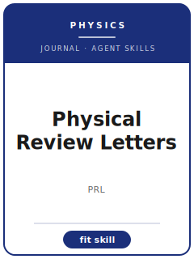

# Physical Review Letters Skills

<p align="center">
  
</p>

[](LICENSE)
[](https://journals.aps.org/prl/)
[](https://www.aps.org/)
[](https://github.com/anthropics/claude-code)

English | [简体中文](README.zh-CN.md)

Agent skill stack for manuscripts targeted at **Physical Review Letters (PRL)** — the American Physical Society's premier physics *letters* journal, publishing short, high-impact communications across **all** of physics (condensed matter, AMO, particle/nuclear, gravitation/astro, statistical/soft, quantum information, and more).

This repository is opinionated. It is **not** a generic physics-writing toolbox. It is a **PRL-specific** stack built around the journal's defining constraint: a result that is **important** and of **broad interest** to physicists, communicated **concisely** within a strict deductible length limit, with detail pushed to Supplemental Material.

---

## Why a Separate PRL Skill Stack?

PRL imposes constraints that differ materially from the specialized Physical Review journals (PR A–E, PR Research):

| Constraint            | Physical Review Letters                                          | Implication                                                          |
|-----------------------|-----------------------------------------------------------------|----------------------------------------------------------------------|
| The gate              | Importance **AND** broad interest (both required)               | A correct-but-incremental result is rejected on breadth grounds      |
| Audience              | All of physics, not just your subfield                          | The opening and abstract must read out-of-subfield                   |
| Length                | Short — on the order of ~3750 words / ~4 pages (verify)         | Substantially shorter than a PR article; ruthless trimming required  |
| Length counting       | **Deductible budget**: figures + equations + references count   | An extra figure can cost a paragraph of text                         |
| Figures               | A few high-impact figures only                                  | Fig. 1 must convey the central result at a glance                    |
| Supplemental Material | Hosts derivations, extended data, methods detail                | The Letter must **stand alone** without it                           |
| Central claim         | Exactly **one** headline result                                 | "Kitchen-sink" Letters reporting everything are off-fit              |
| Cover letter          | Must justify importance + broad interest                        | Missing the breadth argument is the most common miss                 |
| Process               | APS editors + referees; selective                               | May decline a correct Letter on importance/breadth; appeal routes exist |

Generic "scientific writing" packs do not address the deductible length budget, the importance/breadth gate, or the stand-alone-Letter rule.

> Volatile specifics (current word/figure/reference limits, length formula, classification scheme, portal URL, fees) change — always verify on the official APS / PRL author page.

---

## Quick Start

### Option A — Claude Code Plugin (recommended)

```bash
/plugin marketplace add https://github.com/brycewang-stanford/prl-skills
/plugin install prl-skills
/reload-plugins
```

### Option B — Manual Copy

```bash
git clone https://github.com/brycewang-stanford/prl-skills.git
cd prl-skills

mkdir -p ~/.claude/skills && cp -R skills/prl-* ~/.claude/skills/
# or
mkdir -p ~/.codex/skills && cp -R skills/prl-* ~/.codex/skills/
```

### First Prompt

```
Use prl-workflow to tell me which skill I should use next for my Physical Review Letters manuscript.
```

---

## Default Workflow

```text
prl-scope-fit
        ▼
prl-results-framing
        ▼
prl-methods
        ▼
prl-figures
        ▼
prl-supplementary
        ▼
prl-writing-style       (polish)
        ▼
prl-length-management   (fit the deductible limit)
        ▼
prl-cover-letter
        ▼
prl-submission
        ▼
prl-referee-strategy
        ▼
prl-revision
```

`prl-workflow` is the router — it tells you which skill to use next based on where you are.

---

## Skills

| Skill                    | Purpose                                                                  |
|--------------------------|--------------------------------------------------------------------------|
| `prl-workflow`           | Router — decides which sub-skill to invoke next                          |
| `prl-scope-fit`          | The importance + broad-interest gate; PRL vs. PR A–E / PR Research        |
| `prl-results-framing`    | One-claim narrative, opening that front-loads significance, abstract craft |
| `prl-methods`            | Trust-minimum methods in the body; full detail to Supplemental Material   |
| `prl-figures`            | A few high-impact figures; lead figure conveys the result at a glance     |
| `prl-supplementary`      | Partition derivations / extended data to SM; keep the Letter stand-alone  |
| `prl-writing-style`      | APS house style, concision, defined notation, out-of-subfield readability |
| `prl-length-management`  | Fit the deductible budget (text + figures + equations + references)       |
| `prl-cover-letter`       | Justify importance + broad interest to the editors                        |
| `prl-submission`         | Pre-submission preflight + Letter template (length, format, files, metadata) |
| `prl-referee-strategy`   | Suggested / opposed referees; pre-empt likely objections                  |
| `prl-revision`           | Referee-report response, resubmission, and the APS appeal route           |

### Resources

- [`skills/prl-submission/templates/manuscript_template.md`](skills/prl-submission/templates/manuscript_template.md) — Letter skeleton (abstract, body, figure/equation/reference budgeting, SM outline, cover letter)
- [`skills/prl-submission/templates/checklist.md`](skills/prl-submission/templates/checklist.md) — 10-section pre-submission self-check
- [`resources/external_tools.md`](resources/external_tools.md) — REVTeX / LaTeX, figure tools, computation packages, and data repositories (Zenodo / arXiv / ADS / INSPIRE-HEP)

---

## Differences vs. Specialized Physical Review Journals

| Dimension          | Physical Review Letters             | Phys. Rev. A–E / PR Research        |
|--------------------|-------------------------------------|-------------------------------------|
| The gate           | Importance **+ broad interest**     | Rigor + subfield relevance          |
| Audience           | All of physics                      | The specific subfield               |
| Length             | Short, strict deductible limit      | Generous; full archival treatment   |
| Methods            | Trust-minimum in body; rest to SM   | Full methods in the body            |
| Incremental result | Rejected on breadth grounds         | Appropriate and welcome             |

If your result is solid but specialist or incremental, `prl-scope-fit` will recommend retargeting to the appropriate PR journal rather than fighting the breadth gate.

---

## Related

- [awesome-journal-skills](https://github.com/brycewang-stanford/awesome-journal-skills) — Index of journal-specific skill packs
- [Physical Review Letters](https://journals.aps.org/prl/) — Official APS journal page
- [American Physical Society](https://www.aps.org/) — Publisher

---

## License

MIT
