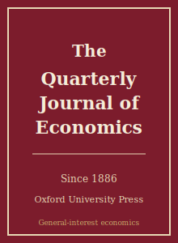

# 《经济学季刊》(QJE) Skills

<p align="center">
  
</p>

[](LICENSE)
[](https://academic.oup.com/qje)
[](https://academic.oup.com/qje)
[](https://github.com/anthropics/claude-code)

[English](README.md) | 简体中文

面向 **Quarterly Journal of Economics（QJE，《经济学季刊》）** 投稿的 Agent Skill 工具栈。QJE 创刊于 1886 年，是历史最悠久的英文经济学期刊，由牛津大学出版社（OUP）出版，编辑部历史上设于哈佛，是经济学**五大顶刊（top-5）**之一。

本仓库刻意**不通用**——它不是泛化的"经济学写作助手"，而是面向 QJE 编委口味的方法论沉淀：以**一个大的概念性想法 + 干净可信的实证**为核心，尤其是实证微观（劳动、公共、发展、行为、经济史、政治经济学），强调可信的因果识别、超长的在线附录、图形优先的呈现、可复现的复制包，以及"轮次少"的修改回复纪律。

---

## 为什么要为 QJE 单独做一套 Skills？

QJE 的约束维度与方法类期刊（Econometrica）或顶级领域刊**显著不同**：

| 维度        | QJE                                          | 隐含含义                                  |
|-----------|----------------------------------------------|---------------------------------------|
| 读者       | 面向全经济学的综合性读者                          | 只对小圈子有意义的问题不适合                  |
| 看重       | **大想法** + 干净可信的实证                       | 以方法/技术为卖点的文章更适合 Econometrica    |
| 标志       | 好问题 + 可信识别 + 可推广的普遍启示               | 没有"普遍启示"的简约式系数像工作论文           |
| 识别门槛    | RCT / 交叠 DID（现代估计量）/ IV / RDD，且论证扎实 | OLS + 控制变量会被快速 desk reject       |
| 理论       | 与问题相匹配的概念框架（常常较轻）                  | 多余的结构模型会被扣分                       |
| 稳健性/附录 | 期望**超长**的在线附录                           | 附录单薄会被读作"未完成的论文"                |
| 呈现       | 越来越**图形优先**                              | 主结果常应是一张干净的图                     |
| 参考文献    | 作者—年份（author-date）格式                     | 编号/脚注式引用显得不合规                    |
| 流程       | Editorial Express 投稿；有投稿费；要求复制材料      | desk reject 快；轮次少，审稿人苛刻          |
| 过度声称    | 会被惩罚                                        | 结论不得超出设计所能支撑的范围                |

通用的"科研写作"或"经济学写作"Skill 包不会处理这些约束。所有易变的具体信息（现任编辑、确切投稿费、复制材料政策）会随时间变化——请**到期刊官网核实**。

---

## 快速开始

### 方式 A —— Claude Code 插件（推荐）

```bash
/plugin marketplace add https://github.com/brycewang-stanford/qje-skills
/plugin install qje-skills
/reload-plugins
```

### 方式 B —— 手动拷贝

```bash
git clone https://github.com/brycewang-stanford/qje-skills.git
cd qje-skills

mkdir -p ~/.claude/skills && cp -R skills/qje-* ~/.claude/skills/
# 或
mkdir -p ~/.codex/skills && cp -R skills/qje-* ~/.codex/skills/
```

### 第一条 Prompt

```
用 qje-workflow 告诉我这份 QJE 目标稿子下一步该用哪个 skill。
```

---

## 默认工作流

```text
qje-topic-selection
        ▼
qje-literature-positioning
        ▼
qje-identification
        ▼
qje-theory-model
        ▼
qje-robustness
        ▼
qje-tables-figures
        ▼
qje-writing-style        （polish）
        ▼
qje-replication-package
        ▼
qje-referee-strategy
        ▼
qje-submission
        ▼
qje-rebuttal
```

`qje-workflow` 是路由器，会根据当前阶段告诉你下一个该用哪个 Skill。

---

## Skill 一览

| Skill                        | 用途                                              |
|------------------------------|--------------------------------------------------|
| `qje-workflow`               | 路由器：判断当前阶段，推荐下一个 skill                |
| `qje-topic-selection`        | 大问题契合度 + "可推广普遍启示"的门槛                 |
| `qje-literature-positioning` | 对照前沿确立贡献（不写独立综述章节）                   |
| `qje-identification`         | 可信因果设计（RCT / 交叠 DID / IV / RDD）            |
| `qje-theory-model`           | 与问题相匹配的概念框架                              |
| `qje-robustness`             | 顶刊审稿人期望的超长在线附录                          |
| `qje-tables-figures`         | 图形优先的图表、自洽的图表注释                        |
| `qje-writing-style`          | 让大想法在综合读者面前迅速落地                        |
| `qje-replication-package`    | 录用论文的可复现数据 + 代码复制包                     |
| `qje-referee-strategy`       | 投稿前预演审稿人的反对意见                            |
| `qje-submission`             | Editorial Express 投稿前 preflight + 稿件模板       |
| `qje-rebuttal`               | "轮次少"的 R&R 修改回复策略                          |

### 附属资源

- [`skills/qje-submission/templates/manuscript_template.md`](skills/qje-submission/templates/manuscript_template.md) —— QJE 稿件结构骨架（摘要、引言弧线、设计、图表、author-date 参考文献）
- [`skills/qje-submission/templates/checklist.md`](skills/qje-submission/templates/checklist.md) —— 投稿前 8 类自检清单
- [`resources/external_tools.md`](resources/external_tools.md) —— 数据资源（IPUMS / Census FSRDC / Opportunity Insights / DHS 等）+ 面向可信识别实证微观的 Stata / R / Python 包

---

## 与其他 Top-5 Skill 包的差异

| 维度        | QJE                            | Econometrica          | JPE                          |
|-----------|--------------------------------|-----------------------|------------------------------|
| 主线       | 一个大的实证微观问题               | 方法 / 定理              | 问题（常由模型引领）             |
| 识别       | 自然实验，图形优先                 | 估计量性质               | 识别 + 定量模型                |
| 理论权重    | 常常较轻，与问题相匹配              | 核心                   | 常常偏重 / 结构化              |
| 体例       | author-date，超长附录            | 定理—证明的严谨           | author-date，形式多样          |

---

## 关于这个仓库不做什么

- 不替你写出可以直接投稿的稿件
- 不模拟任何特定编辑或审稿人的偏好
- 不断言易变的元数据（现任编辑、确切投稿费、确切复制材料规则）——请到官网核实
- 不评判你的"大想法"是否真有原创性——这是研究者本人的判断

---

## 相关仓库

- [awesome-journal-skills](https://github.com/brycewang-stanford/awesome-journal-skills) —— 期刊 Skill 索引
- [Economic-Research-Journal-Skills](https://github.com/brycewang-stanford/economic-research-skills) —— 《经济研究》投稿工具栈
- [Quarterly Journal of Economics（官网）](https://academic.oup.com/qje) —— 牛津大学出版社

---

## License

MIT
