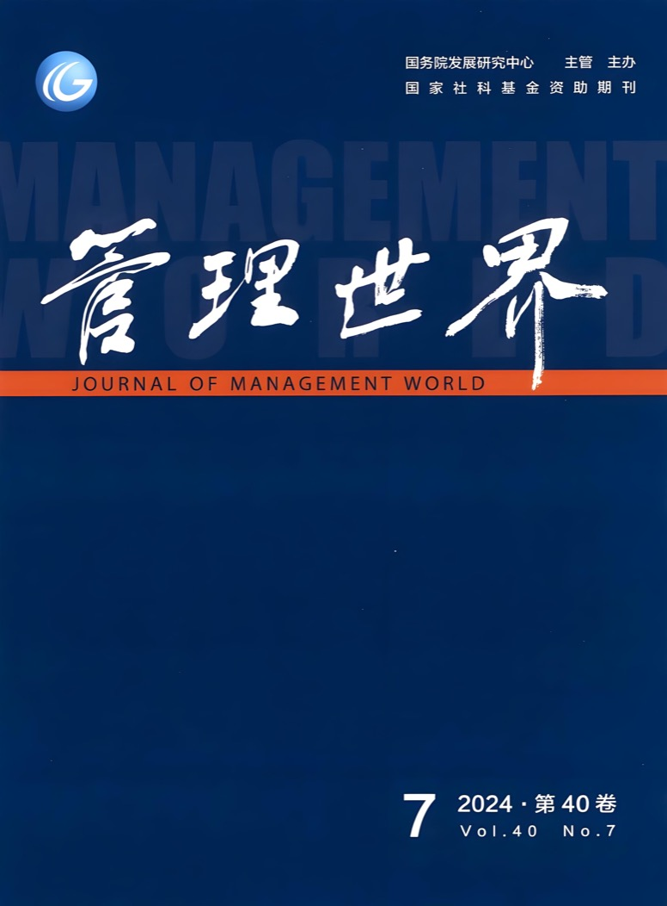

# Awesome Journal Skills

[](https://awesome.re)
[](LICENSE)
[](https://github.com/anthropics/claude-code)

English | [简体中文](README.zh-CN.md)

A curated index of **journal-specific agent skill packs** for social-science manuscript work — selecting topics, identifying causal effects, writing introductions, formatting tables, preparing replication packages, and responding to reviewers.

Each pack is **journal-specific by design**: it encodes the editorial preferences, formatting conventions, identification standards, and review culture of a single target venue. Generic "scientific writing" skill packs miss these constraints.

---

## Why "Journal-Specific" Skills?

Top journals impose constraints that differ materially across venues:

- **AER** desk-rejects on identification design (TWFE, weak IV, naive RDD).
- **《管理世界》** desk-rejects on missing China institutional context.
- **《经济研究》** desk-rejects on missing canonical theory citations.

A one-size-fits-all "economics writing" skill cannot encode these differences. Each pack here is opinionated by venue.

---

## The Skill Packs

| Venue                          | Repository                                                                                  | Discipline                       | Status  |
|--------------------------------|---------------------------------------------------------------------------------------------|---------------------------------|---------|
| **American Economic Review** + AER:Insights + AEJ family | [AER-skills](https://github.com/brycewang-stanford/AER-skills)                              | Economics (top-5)                | v1.0    |
| **《管理世界》** (Management World)        | [management-world-skills](https://github.com/brycewang-stanford/management-world-skills)    | Management + applied economics  | v0.1    |
| **《经济研究》** (Economic Research)        | [Economic-Research-Journal-Skills](https://github.com/brycewang-stanford/Economic-Research-Skills)  | Economics (China-CSSCI top)     | v0.1    |
| **Nature** (academic writing + scientific figures) | [nature-skills](https://github.com/Yuan1z0825/nature-skills) *(third-party, curated)* | Natural sciences (Nature family) | upstream |

<p align="center">
  <a href="Economic-Research-Journal-Skills/"></a>
  &nbsp;&nbsp;&nbsp;&nbsp;
  <a href="Journal-of-Management-World-Skills/"></a>
</p>
<p align="center">
  <sub><b>《经济研究》</b> &nbsp;·&nbsp; <b>《管理世界》</b></sub>
</p>

---

## Repository Layout

This repo embeds each pack as a **git submodule** pinned to its own upstream repository. A scheduled GitHub Action ([`.github/workflows/sync-submodules.yml`](.github/workflows/sync-submodules.yml)) bumps the pins to the latest upstream `main` daily, so this repo mirrors the source packs without manual intervention.

```text
awesome-journal-skills/
├── AER-skills/                 → submodule of brycewang-stanford/AER-skills
├── Economic-Research-Journal-Skills/   → folder (upstream: brycewang-stanford/Economic-Research-Skills)
├── management-world-skills/    → submodule of brycewang-stanford/management-world-skills
├── nature-skills/              → submodule of Yuan1z0825/nature-skills (third-party)
└── .github/workflows/sync-submodules.yml
```

Clone with submodules populated:

```bash
git clone --recurse-submodules https://github.com/brycewang-stanford/awesome-journal-skills.git
# or, if already cloned:
git submodule update --init --recursive
```

Pull latest pack content locally at any time:

```bash
git submodule update --remote --merge
```

---

## How to Use

### Option A — Claude Code Plugin (recommended)

For each pack you want:

```bash
# AER
/plugin marketplace add https://github.com/brycewang-stanford/AER-skills
/plugin install aer-skills

# 管理世界
/plugin marketplace add https://github.com/brycewang-stanford/management-world-skills
/plugin install management-world-skills

# 经济研究
/plugin marketplace add https://github.com/brycewang-stanford/Economic-Research-Skills
/plugin install economic-research-skills

/reload-plugins
```

### Option B — Manual Copy

```bash
git clone https://github.com/brycewang-stanford/AER-skills.git
git clone https://github.com/brycewang-stanford/management-world-skills.git
git clone https://github.com/brycewang-stanford/Economic-Research-Skills.git Economic-Research-Journal-Skills

mkdir -p ~/.claude/skills
cp -R AER-skills/skills/aer-* ~/.claude/skills/
cp -R management-world-skills/skills/mw-* ~/.claude/skills/
cp -R Economic-Research-Journal-Skills/skills/er-* ~/.claude/skills/
```

### First Prompt

```
Use aer-workflow (or mw-workflow / er-workflow) to tell me which skill I should
use next for my manuscript targeted at <journal>.
```

---

## Pack-Selection Cheat Sheet

| Your manuscript looks like…                            | Use this pack                |
|--------------------------------------------------------|------------------------------|
| Causal-identification empirical paper aimed at top-5 econ | `AER-skills`                |
| China-context empirical paper with policy actionability   | `management-world-skills`   |
| China-context paper with theoretical grounding            | `Economic-Research-Journal-Skills`  |

---

## Roadmap

Next-step TODO: build journal-specific packs for the 100 EN + 100 CN venues below. Open an issue to upvote a specific venue, or PR to add one.

Sources: [RePEc / IDEAS aggregate ranking](https://ideas.repec.org/top/top.journals.all.html) (econ), [FT50](https://guides.lib.purdue.edu/ft50) + [UTD24](https://jsom.utdallas.edu/the-utd-top-100-business-school-research-rankings/list-of-journals) + [ABS AJG 2024](https://charteredabs.org/academic-journal-guide/academic-journal-guide-2024) (business); [CSSCI 2023–2024 来源期刊目录](https://rwskc.zust.edu.cn/__local/C/2D/AB/B2AE8C5DC9C1A75618611EE3F00_2F8A1CF6_3DC4D.pdf) + [FMS 高质量期刊 2025 版](https://www.fms-journal.net/news/2720) (中文).

### English — 100 mainstream econ & management journals

#### Economics (50)

1. American Economic Review (AER)
2. Quarterly Journal of Economics (QJE)
3. Journal of Political Economy (JPE)
4. Econometrica
5. Review of Economic Studies (REStud)
6. AER: Insights
7. AEJ: Applied Economics
8. AEJ: Macroeconomics
9. AEJ: Microeconomics
10. AEJ: Economic Policy
11. Journal of Economic Literature (JEL)
12. Journal of Economic Perspectives (JEP)
13. Review of Economics and Statistics (REStat)
14. Journal of Econometrics
15. Journal of Monetary Economics
16. Journal of Economic Growth
17. Journal of Labor Economics
18. Journal of the European Economic Association (JEEA)
19. The Economic Journal (EJ)
20. RAND Journal of Economics
21. Journal of International Economics
22. Journal of Public Economics
23. Journal of Development Economics (JDE)
24. Journal of Economic Theory (JET)
25. Journal of Money, Credit and Banking (JMCB)
26. Review of Economic Dynamics (RED)
27. European Economic Review (EER)
28. Journal of Human Resources (JHR)
29. International Economic Review (IER)
30. Experimental Economics
31. Journal of Applied Econometrics
32. Journal of Business & Economic Statistics (JBES)
33. Journal of Health Economics
34. Journal of Environmental Economics and Management (JEEM)
35. Journal of Urban Economics
36. Games and Economic Behavior (GEB)
37. Journal of Law and Economics
38. Journal of Law, Economics, and Organization (JLEO)
39. World Development
40. World Bank Economic Review
41. IMF Economic Review
42. Annual Review of Economics
43. Brookings Papers on Economic Activity (BPEA)
44. Economic Policy
45. Journal of Risk and Uncertainty (JRU)
46. Quantitative Economics
47. The Econometrics Journal
48. Econometric Theory
49. Journal of Economic Behavior & Organization (JEBO)
50. Journal of Economic Geography

#### Finance (13)

1. Journal of Finance (JF)
2. Journal of Financial Economics (JFE)
3. Review of Financial Studies (RFS)
4. Review of Finance
5. Journal of Financial and Quantitative Analysis (JFQA)
6. Journal of Financial Intermediation (JFI)
7. Journal of Financial Markets (JFM)
8. Journal of Banking & Finance (JBF)
9. Journal of Corporate Finance (JCF)
10. Journal of International Money and Finance (JIMF)
11. Mathematical Finance
12. Journal of Empirical Finance (JEF)
13. Financial Management

#### Management / Strategy / Organization (15)

1. Academy of Management Journal (AMJ)
2. Academy of Management Review (AMR)
3. Academy of Management Annals (AMA)
4. Administrative Science Quarterly (ASQ)
5. Strategic Management Journal (SMJ)
6. Organization Science (OrgSci)
7. Journal of Management (JOM-mgmt)
8. Journal of Management Studies (JMS)
9. Organization Studies (OS)
10. Human Relations
11. Human Resource Management (HRM)
12. Journal of International Business Studies (JIBS)
13. Research Policy
14. Journal of Business Venturing (JBV)
15. Entrepreneurship Theory and Practice (ETP)

#### Marketing & Consumer (6)

1. Journal of Marketing (JM)
2. Journal of Marketing Research (JMR)
3. Marketing Science
4. Journal of Consumer Research (JCR)
5. Journal of Consumer Psychology (JCP)
6. Journal of the Academy of Marketing Science (JAMS)

#### Accounting (6)

1. The Accounting Review (TAR)
2. Journal of Accounting Research (JAR)
3. Journal of Accounting and Economics (JAE)
4. Review of Accounting Studies (RAST)
5. Contemporary Accounting Research (CAR)
6. Accounting, Organizations and Society (AOS)

#### Operations Management & Information Systems (10)

1. Management Science
2. Operations Research (OR)
3. Manufacturing and Service Operations Management (M&SOM)
4. Journal of Operations Management (JOM-ops)
5. Production and Operations Management (POM)
6. MIS Quarterly (MISQ)
7. Information Systems Research (ISR)
8. Journal of Management Information Systems (JMIS)
9. Journal of the Association for Information Systems (JAIS)
10. INFORMS Journal on Computing (IJOC)

### Chinese — 100 mainstream econ & management journals (经管)

#### 经济学 (50)

1. 《经济研究》
2. 《经济学（季刊）》
3. 《中国工业经济》
4. 《世界经济》
5. 《金融研究》
6. 《中国农村经济》
7. 《数量经济技术经济研究》
8. 《经济学动态》
9. 《财经研究》
10. 《财贸经济》
11. 《国际金融研究》
12. 《国际经济评论》
13. 《国际贸易问题》
14. 《经济科学》
15. 《南开经济研究》
16. 《经济理论与经济管理》
17. 《经济评论》
18. 《财经科学》
19. 《财政研究》
20. 《财经问题研究》
21. 《中国农村观察》
22. 《农业经济问题》
23. 《中央财经大学学报》
24. 《上海财经大学学报》
25. 《上海经济研究》
26. 《世界经济研究》
27. 《世界经济文汇》
28. 《当代财经》
29. 《当代经济科学》
30. 《政治经济学评论》
31. 《改革》
32. 《产业经济研究》
33. 《宏观经济研究》
34. 《金融经济学研究》
35. 《现代金融研究》（原《金融论坛》）
36. 《金融评论》
37. 《金融监管研究》
38. 《农业技术经济》
39. 《农村经济》
40. 《南方经济》
41. 《经济问题》
42. 《经济问题探索》
43. 《经济社会体制比较》
44. 《经济纵横》
45. 《经济学家》
46. 《经济与管理研究》
47. 《中国经济问题》
48. 《中南财经政法大学学报》
49. 《劳动经济研究》
50. 《国际经贸探索》

#### 管理学 / 战略 / 公共管理 (30)

1. 《管理世界》
2. 《管理科学学报》
3. 《南开管理评论》
4. 《中国管理科学》
5. 《管理评论》
6. 《管理学报》
7. 《系统工程理论与实践》
8. 《公共管理学报》
9. 《中国软科学》
10. 《科学学研究》
11. 《科研管理》
12. 《管理科学》
13. 《管理工程学报》
14. 《公共管理评论》
15. 《公共管理与政策评论》
16. 《工程管理科技前沿》
17. 《科学管理研究》
18. 《科学决策》
19. 《科学学与科学技术管理》
20. 《中国行政管理》
21. 《治理研究》
22. 《中国科技论坛》
23. 《中国科学院院刊》
24. 《软科学》
25. 《经济管理》
26. 《经济体制改革》
27. 《外国经济与管理》
28. 《科技进步与对策》
29. 《研究与发展管理》
30. 《管理学刊》

#### 会计 / 审计 / 其他经管交叉 (20)

1. 《会计研究》
2. 《会计评论》
3. 《审计研究》
4. 《审计与经济研究》
5. 《会计与经济研究》
6. 《社会保障评论》
7. 《华东经济管理》
8. 《宏观质量研究》
9. 《电子政务》
10. 《组织与管理》
11. 《税务研究》
12. 《现代日本经济》
13. 《亚太经济》
14. 《证券市场导报》
15. 《商业经济与管理》
16. 《现代经济探讨》
17. 《山西财经大学学报》
18. 《现代财经（天津财经大学学报）》
19. 《江西财经大学学报》
20. 《广东财经大学学报》

---

## Contributing

Each pack lives in its own repository. To contribute to a pack, open a PR on that pack's repo. To propose a new pack, open an issue here.

Quality bar for inclusion in this index:

1. Opinionated by venue (not generic)
2. Bilingual zh-CN / en README (for China-relevant venues)
3. At least one `*-workflow` router skill
4. Plugin manifests (`.claude-plugin/plugin.json` + `marketplace.json`)
5. MIT-licensed

---

## Related Projects

Broader-scope agent skill collections (complementary to this journal-specific index):

- [Awesome-Agent-Skills-for-Empirical-Research](https://github.com/brycewang-stanford/Awesome-Agent-Skills-for-Empirical-Research) — curated 23,000+ agent skills across 8 social-science disciplines (maintained by CoPaper.AI / Stanford REAP).
- [academic-research-skills](https://github.com/Imbad0202/academic-research-skills) — generic research → write → review → revise → finalize skill pipeline for Claude Code.

Generic scientific-writing skill packs (different scope from this index):

- [Nature-Paper-Skills](https://github.com/Boom5426/Nature-Paper-Skills)
- [nature-skills](https://github.com/Yuan1z0825/nature-skills) — now curated as a submodule under [`nature-skills/`](nature-skills/).

---

## License

MIT
