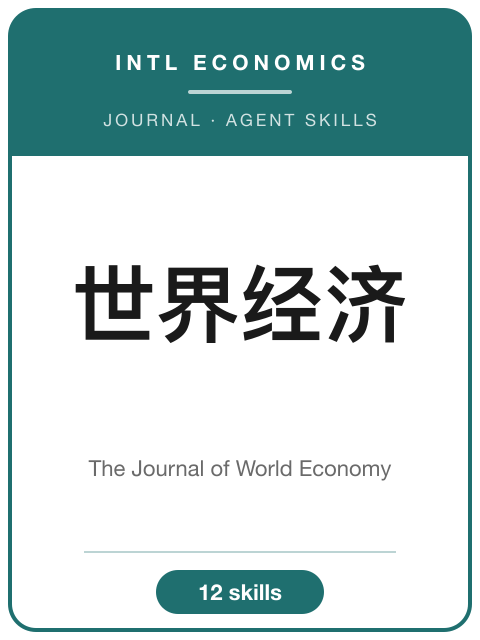
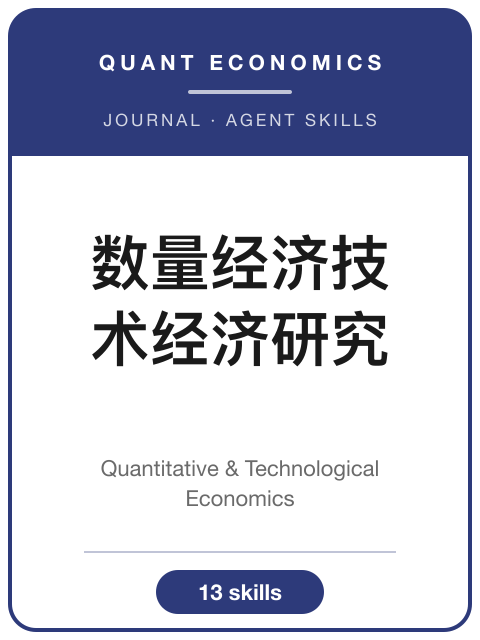
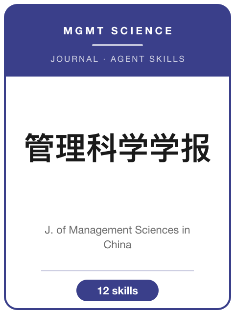

# Awesome Journal Skills (AJS)

[](https://awesome.re)
[](LICENSE)
[](https://github.com/anthropics/claude-code)
[](#skill-pack-一览)

[English](README.md) | 简体中文

<p align="center">
  
  &nbsp;
  
</p>
<p align="center">
  <sub>共收录 <b>843 个 Agent Skill</b>，分布在 <b>44 个精选 Skill 包</b>中——一站式索引。</sub>
</p>

<p align="center">
  <sub><b>先看期刊，再进 Pack。</b>点击任意封面即可进入对应的期刊 Skill 包。</sub>
</p>
<p align="center">
  <a href="Economic-Research-Journal-Skills/"></a>
  <a href="Journal-of-Management-World-Skills/"></a>
  <a href="Social-Sciences-in-China-Skills/"></a>
  <a href="China-Industrial-Economics-Skills/"></a>
  <a href="Journal-of-World-Economy-Skills/"></a>
  <a href="China-Economic-Quarterly-Skills/"></a>
  <a href="Journal-of-Quantitative-and-Technological-Economics-Skills/"></a>
  <a href="Accounting-Research-Skills/"></a>
  <a href="Journal-of-Financial-Research-Skills/"></a>
  <a href="Journal-of-Management-Sciences-in-China-Skills/"></a>
  <a href="Nankai-Business-Review-Skills/"></a>
  <a href="Sociological-Studies-Skills/"></a>
  <a href="https://github.com/brycewang-stanford/AER-skills"></a>
</p>
<p align="center">
  <sub>中文重点社科期刊 + AER —— 风格统一的封面卡。各刊真实封面仍存放在对应 pack 的 <code>assets/</code> 中。</sub>
</p>
<p align="center">
  <a href="English-SocialScience-Journal-Skills/skills/american-economic-review/"></a>
  <a href="English-SocialScience-Journal-Skills/skills/quarterly-journal-of-economics/"></a>
  <a href="English-SocialScience-Journal-Skills/skills/journal-of-political-economy/"></a>
  <a href="English-SocialScience-Journal-Skills/skills/econometrica/"></a>
  <a href="English-SocialScience-Journal-Skills/skills/review-of-economic-studies/"></a>
  <a href="English-SocialScience-Journal-Skills/skills/journal-of-finance/"></a>
  <a href="English-SocialScience-Journal-Skills/skills/journal-of-financial-economics/"></a>
  <a href="English-SocialScience-Journal-Skills/skills/review-of-financial-studies/"></a>
  <a href="English-SocialScience-Journal-Skills/skills/academy-of-management-journal/"></a>
  <a href="English-SocialScience-Journal-Skills/skills/academy-of-management-review/"></a>
  <a href="English-SocialScience-Journal-Skills/skills/administrative-science-quarterly/"></a>
  <a href="English-SocialScience-Journal-Skills/skills/strategic-management-journal/"></a>
  <a href="English-SocialScience-Journal-Skills/skills/journal-of-marketing/"></a>
  <a href="English-SocialScience-Journal-Skills/skills/journal-of-marketing-research/"></a>
  <a href="English-SocialScience-Journal-Skills/skills/marketing-science/"></a>
  <a href="English-SocialScience-Journal-Skills/skills/the-accounting-review/"></a>
  <a href="English-SocialScience-Journal-Skills/skills/journal-of-accounting-research/"></a>
  <a href="English-SocialScience-Journal-Skills/skills/journal-of-accounting-and-economics/"></a>
  <a href="English-SocialScience-Journal-Skills/skills/management-science/"></a>
  <a href="English-SocialScience-Journal-Skills/skills/operations-research/"></a>
  <a href="English-SocialScience-Journal-Skills/skills/mis-quarterly/"></a>
  <a href="English-SocialScience-Journal-Skills/skills/information-systems-research/"></a>
</p>
<p align="center">
  <sub>英文经管重点期刊 —— 来自 <a href="English-SocialScience-Journal-Skills/">English-SocialScience-Journal-Skills</a> 广度合集的统一封面卡（100 本期刊 + 路由）。Top-5、Top-3、FT50、UTD24 等标签用于说明分层；卡片图形不是各刊商标。</sub>
</p>
<p align="center">
  <a href="Science-Skills/"></a>
  <a href="Cell-Skills/"></a>
  <a href="PNAS-Skills/"></a>
  <a href="NEJM-Skills/"></a>
  <a href="Lancet-Skills/"></a>
</p>
<p align="center">
  <sub>自然科学与临床顶刊 —— 自有深度包（每个 12 个技能）。封面卡为示意设计，非各刊商标。</sub>
</p>
<p align="center">
  <a href="nature-skills/"></a>
</p>
<p align="center">
  <sub>其他学科 · <b>Nature</b> &nbsp;<sup>封面插画 © <a href="https://inna-marie.com/2019/08/08/cover-art-nature-journal/">Inna-Marie Strazhnik (2019)</a></sup></sub>
</p>

按**期刊**组织的 Agent Skill 包索引——涵盖选题、定位核心进展、识别策略、表格与图件规范、复制包 / 数据可得性准备、修改回复。覆盖**社会科学中英文顶刊**，以及**自然科学与临床顶刊（Science、Cell、PNAS、NEJM、The Lancet）**——并新增一个 100 本期刊的**英文自然科学广度合集**，横跨生命科学、医学、物理、化学、材料、地球科学、CS/AI 与数学。

每个 pack 都是**针对单一期刊**的方法论沉淀：它编码了某一本期刊的编委偏好、格式规范、识别标准和审稿文化。通用的"科研写作"Skill 包做不到这一点。

<!-- ROOT-JOURNAL-FOLDERS:START -->

## 根目录 200 个期刊文件夹

为了让用户在仓库首页的根目录就能看到完整的社科期刊阵列，现在 200 本广度合集期刊各有一个轻量入口文件夹：100 本中文经管路线图期刊使用拼音目录名，100 本英文经管 / 商科期刊使用英文题名目录名。这些目录只负责导航；真正可安装的 `SKILL.md` 仍保留在对应 bundle 内，因此插件路径和 843 个 skill 的计数不会被重复放大。

### 中文经管路线图 · 100 个拼音目录

|  |  |  |  |
|---|---|---|---|
| [Kuaiji-Yu-Jingji-Yanjiu/](Kuaiji-Yu-Jingji-Yanjiu/)<br><sub>《会计与经济研究》</sub> | [Kuaiji-Yanjiu/](Kuaiji-Yanjiu/)<br><sub>《会计研究》</sub> | [Yatai-Jingji/](Yatai-Jingji/)<br><sub>《亚太经济》</sub> | [Shenji-Yu-Jingji-Yanjiu/](Shenji-Yu-Jingji-Yanjiu/)<br><sub>《审计与经济研究》</sub> |
| [Shenji-Yanjiu/](Shenji-Yanjiu/)<br><sub>《审计研究》</sub> | [Zhongguo-Kexueyuan-Yuankan/](Zhongguo-Kexueyuan-Yuankan/)<br><sub>《中国科学院院刊》</sub> | [Jingji-Guanli/](Jingji-Guanli/)<br><sub>《经济管理》</sub> | [Kuaiji-Pinglun/](Kuaiji-Pinglun/)<br><sub>《会计评论》</sub> |
| [Jingjixue-Jikan/](Jingjixue-Jikan/)<br><sub>《经济学（季刊）》</sub> | [Zhongguo-Jingji-Wenti/](Zhongguo-Jingji-Wenti/)<br><sub>《中国经济问题》</sub> | [Zhongguo-Gongye-Jingji/](Zhongguo-Gongye-Jingji/)<br><sub>《中国工业经济》</sub> | [Gonggong-Guanli-Pinglun/](Gonggong-Guanli-Pinglun/)<br><sub>《公共管理评论》</sub> |
| [Zhongguo-Nongcun-Jingji/](Zhongguo-Nongcun-Jingji/)<br><sub>《中国农村经济》</sub> | [Zhongguo-Nongcun-Guancha/](Zhongguo-Nongcun-Guancha/)<br><sub>《中国农村观察》</sub> | [Zhongguo-Ruan-Kexue/](Zhongguo-Ruan-Kexue/)<br><sub>《中国软科学》</sub> | [Guanli-Xuebao/](Guanli-Xuebao/)<br><sub>《管理学报》</sub> |
| [Zhongguo-Guanli-Kexue/](Zhongguo-Guanli-Kexue/)<br><sub>《中国管理科学》</sub> | [Zhongguo-Xingzheng-Guanli/](Zhongguo-Xingzheng-Guanli/)<br><sub>《中国行政管理》</sub> | [Jinrong-Pinglun/](Jinrong-Pinglun/)<br><sub>《金融评论》</sub> | [Jingji-Shehui-Tizhi-Bijiao/](Jingji-Shehui-Tizhi-Bijiao/)<br><sub>《经济社会体制比较》</sub> |
| [Xiandai-Riben-Jingji/](Xiandai-Riben-Jingji/)<br><sub>《现代日本经济》</sub> | [Dangdai-Caijing/](Dangdai-Caijing/)<br><sub>《当代财经》</sub> | [Dianzi-Zhengwu/](Dianzi-Zhengwu/)<br><sub>《电子政务》</sub> | [Huadong-Jingji-Guanli/](Huadong-Jingji-Guanli/)<br><sub>《华东经济管理》</sub> |
| [Jingji-Zongheng/](Jingji-Zongheng/)<br><sub>《经济纵横》</sub> | [Jingjixue-Dongtai/](Jingjixue-Dongtai/)<br><sub>《经济学动态》</sub> | [Jingji-Wenti/](Jingji-Wenti/)<br><sub>《经济问题》</sub> | [Jingji-Yanjiu/](Jingji-Yanjiu/)<br><sub>《经济研究》</sub> |
| [Jingji-Pinglun/](Jingji-Pinglun/)<br><sub>《经济评论》</sub> | [Jingji-Kexue/](Jingji-Kexue/)<br><sub>《经济科学》</sub> | [Jingji-Lilun-Yu-Jingji-Guanli/](Jingji-Lilun-Yu-Jingji-Guanli/)<br><sub>《经济理论与经济管理》</sub> | [Jingjixuejia/](Jingjixuejia/)<br><sub>《经济学家》</sub> |
| [Caijing-Kexue/](Caijing-Kexue/)<br><sub>《财经科学》</sub> | [Caimao-Jingji/](Caimao-Jingji/)<br><sub>《财贸经济》</sub> | [Jinrong-Jianguan-Yanjiu/](Jinrong-Jianguan-Yanjiu/)<br><sub>《金融监管研究》</sub> | [Waiguo-Jingji-Yu-Guanli/](Waiguo-Jingji-Yu-Guanli/)<br><sub>《外国经济与管理》</sub> |
| [Zhongguo-Keji-Luntan/](Zhongguo-Keji-Luntan/)<br><sub>《中国科技论坛》</sub> | [Gongcheng-Guanli-Keji-Qianyan/](Gongcheng-Guanli-Keji-Qianyan/)<br><sub>《工程管理科技前沿》</sub> | [Zhili-Yanjiu/](Zhili-Yanjiu/)<br><sub>《治理研究》</sub> | [Chanye-Jingji-Yanjiu/](Chanye-Jingji-Yanjiu/)<br><sub>《产业经济研究》</sub> |
| [Jingji-Wenti-Tansuo/](Jingji-Wenti-Tansuo/)<br><sub>《经济问题探索》</sub> | [Guoji-Jingji-Pinglun/](Guoji-Jingji-Pinglun/)<br><sub>《国际经济评论》</sub> | [Guoji-Jingmao-Tansuo/](Guoji-Jingmao-Tansuo/)<br><sub>《国际经贸探索》</sub> | [Nongye-Jingji-Wenti/](Nongye-Jingji-Wenti/)<br><sub>《农业经济问题》</sub> |
| [Nongye-Jishu-Jingji/](Nongye-Jishu-Jingji/)<br><sub>《农业技术经济》</sub> | [Shangye-Jingji-Yu-Guanli/](Shangye-Jingji-Yu-Guanli/)<br><sub>《商业经济与管理》</sub> | [Zhongyang-Caijing-Daxue-Xuebao/](Zhongyang-Caijing-Daxue-Xuebao/)<br><sub>《中央财经大学学报》</sub> | [Caijing-Yanjiu/](Caijing-Yanjiu/)<br><sub>《财经研究》</sub> |
| [Jinrong-Yanjiu/](Jinrong-Yanjiu/)<br><sub>《金融研究》</sub> | [Guangdong-Caijing-Daxue-Xuebao/](Guangdong-Caijing-Daxue-Xuebao/)<br><sub>《广东财经大学学报》</sub> | [Guanli-Gongcheng-Xuebao/](Guanli-Gongcheng-Xuebao/)<br><sub>《管理工程学报》</sub> | [Guoji-Maoyi-Wenti/](Guoji-Maoyi-Wenti/)<br><sub>《国际贸易问题》</sub> |
| [Jiangxi-Caijing-Daxue-Xuebao/](Jiangxi-Caijing-Daxue-Xuebao/)<br><sub>《江西财经大学学报》</sub> | [Hongguan-Zhiliang-Yanjiu/](Hongguan-Zhiliang-Yanjiu/)<br><sub>《宏观质量研究》</sub> | [Guanli-Xuekan/](Guanli-Xuekan/)<br><sub>《管理学刊》</sub> | [Guanli-Kexue-Xuebao/](Guanli-Kexue-Xuebao/)<br><sub>《管理科学学报》</sub> |
| [Gonggong-Guanli-Xuebao/](Gonggong-Guanli-Xuebao/)<br><sub>《公共管理学报》</sub> | [Shuliang-Jingji-Jishu-Jingji-Yanjiu/](Shuliang-Jingji-Jishu-Jingji-Yanjiu/)<br><sub>《数量经济技术经济研究》</sub> | [Shanghai-Caijing-Daxue-Xuebao/](Shanghai-Caijing-Daxue-Xuebao/)<br><sub>《上海财经大学学报》</sub> | [Shanxi-Caijing-Daxue-Xuebao/](Shanxi-Caijing-Daxue-Xuebao/)<br><sub>《山西财经大学学报》</sub> |
| [Shijie-Jingji/](Shijie-Jingji/)<br><sub>《世界经济》</sub> | [Zhongnan-Caijing-Zhengfa-Daxue-Xuebao/](Zhongnan-Caijing-Zhengfa-Daxue-Xuebao/)<br><sub>《中南财经政法大学学报》</sub> | [Hongguan-Jingji-Yanjiu/](Hongguan-Jingji-Yanjiu/)<br><sub>《宏观经济研究》</sub> | [Guanli-Pinglun/](Guanli-Pinglun/)<br><sub>《管理评论》</sub> |
| [Guanli-Kexue/](Guanli-Kexue/)<br><sub>《管理科学》</sub> | [Guanli-Shijie/](Guanli-Shijie/)<br><sub>《管理世界》</sub> | [Xiandai-Jingji-Tantao/](Xiandai-Jingji-Tantao/)<br><sub>《现代经济探讨》</sub> | [Dangdai-Jingji-Kexue/](Dangdai-Jingji-Kexue/)<br><sub>《当代经济科学》</sub> |
| [Xiandai-Caijing-Tianjin-Caijing-Daxue-Xuebao/](Xiandai-Caijing-Tianjin-Caijing-Daxue-Xuebao/)<br><sub>《现代财经（天津财经大学学报）》</sub> | [Xiandai-Jinrong-Yanjiu/](Xiandai-Jinrong-Yanjiu/)<br><sub>《现代金融研究》</sub> | [Nankai-Guanli-Pinglun/](Nankai-Guanli-Pinglun/)<br><sub>《南开管理评论》</sub> | [Nankai-Jingji-Yanjiu/](Nankai-Jingji-Yanjiu/)<br><sub>《南开经济研究》</sub> |
| [Zuzhi-Yu-Guanli/](Zuzhi-Yu-Guanli/)<br><sub>《组织与管理》</sub> | [Gonggong-Guanli-Yu-Zhengce-Pinglun/](Gonggong-Guanli-Yu-Zhengce-Pinglun/)<br><sub>《公共管理与政策评论》</sub> | [Caizheng-Yanjiu/](Caizheng-Yanjiu/)<br><sub>《财政研究》</sub> | [Gaige/](Gaige/)<br><sub>《改革》</sub> |
| [Jingji-Tizhi-Gaige/](Jingji-Tizhi-Gaige/)<br><sub>《经济体制改革》</sub> | [Yanjiu-Yu-Fazhan-Guanli/](Yanjiu-Yu-Fazhan-Guanli/)<br><sub>《研究与发展管理》</sub> | [Jingji-Yu-Guanli-Yanjiu/](Jingji-Yu-Guanli-Yanjiu/)<br><sub>《经济与管理研究》</sub> | [Caijing-Wenti-Yanjiu/](Caijing-Wenti-Yanjiu/)<br><sub>《财经问题研究》</sub> |
| [Zhengzhi-Jingjixue-Pinglun/](Zhengzhi-Jingjixue-Pinglun/)<br><sub>《政治经济学评论》</sub> | [Nongcun-Jingji/](Nongcun-Jingji/)<br><sub>《农村经济》</sub> | [Keji-Jinbu-Yu-Duice/](Keji-Jinbu-Yu-Duice/)<br><sub>《科技进步与对策》</sub> | [Kexuexue-Yu-Kexue-Jishu-Guanli/](Kexuexue-Yu-Kexue-Jishu-Guanli/)<br><sub>《科学学与科学技术管理》</sub> |
| [Keyan-Guanli/](Keyan-Guanli/)<br><sub>《科研管理》</sub> | [Kexue-Juece/](Kexue-Juece/)<br><sub>《科学决策》</sub> | [Kexue-Guanli-Yanjiu/](Kexue-Guanli-Yanjiu/)<br><sub>《科学管理研究》</sub> | [Zhengquan-Shichang-Daobao/](Zhengquan-Shichang-Daobao/)<br><sub>《证券市场导报》</sub> |
| [Shanghai-Jingji-Yanjiu/](Shanghai-Jingji-Yanjiu/)<br><sub>《上海经济研究》</sub> | [Shehui-Baozhang-Pinglun/](Shehui-Baozhang-Pinglun/)<br><sub>《社会保障评论》</sub> | [Ruan-Kexue/](Ruan-Kexue/)<br><sub>《软科学》</sub> | [Nanfang-Jingji/](Nanfang-Jingji/)<br><sub>《南方经济》</sub> |
| [Laodong-Jingji-Yanjiu/](Laodong-Jingji-Yanjiu/)<br><sub>《劳动经济研究》</sub> | [Kexuexue-Yanjiu/](Kexuexue-Yanjiu/)<br><sub>《科学学研究》</sub> | [Jinrong-Jingjixue-Yanjiu/](Jinrong-Jingjixue-Yanjiu/)<br><sub>《金融经济学研究》</sub> | [Guoji-Jinrong-Yanjiu/](Guoji-Jinrong-Yanjiu/)<br><sub>《国际金融研究》</sub> |
| [Xitong-Gongcheng-Lilun-Yu-Shijian/](Xitong-Gongcheng-Lilun-Yu-Shijian/)<br><sub>《系统工程理论与实践》</sub> | [Shuiwu-Yanjiu/](Shuiwu-Yanjiu/)<br><sub>《税务研究》</sub> | [Shijie-Jingji-Wenhui/](Shijie-Jingji-Wenhui/)<br><sub>《世界经济文汇》</sub> | [Shijie-Jingji-Yanjiu/](Shijie-Jingji-Yanjiu/)<br><sub>《世界经济研究》</sub> |

### 英文经管 / 商科 · 100 个目录

|  |  |  |  |
|---|---|---|---|
| [American-Economic-Review/](American-Economic-Review/)<br><sub>American Economic Review</sub> | [Quarterly-Journal-of-Economics/](Quarterly-Journal-of-Economics/)<br><sub>Quarterly Journal of Economics</sub> | [Journal-of-Political-Economy/](Journal-of-Political-Economy/)<br><sub>Journal of Political Economy</sub> | [Econometrica/](Econometrica/)<br><sub>Econometrica</sub> |
| [Review-of-Economic-Studies/](Review-of-Economic-Studies/)<br><sub>Review of Economic Studies</sub> | [AER-Insights/](AER-Insights/)<br><sub>AER: Insights</sub> | [AEJ-Applied-Economics/](AEJ-Applied-Economics/)<br><sub>AEJ: Applied Economics</sub> | [AEJ-Macroeconomics/](AEJ-Macroeconomics/)<br><sub>AEJ: Macroeconomics</sub> |
| [AEJ-Microeconomics/](AEJ-Microeconomics/)<br><sub>AEJ: Microeconomics</sub> | [AEJ-Economic-Policy/](AEJ-Economic-Policy/)<br><sub>AEJ: Economic Policy</sub> | [Journal-of-Economic-Literature/](Journal-of-Economic-Literature/)<br><sub>Journal of Economic Literature</sub> | [Journal-of-Economic-Perspectives/](Journal-of-Economic-Perspectives/)<br><sub>Journal of Economic Perspectives</sub> |
| [Review-of-Economics-and-Statistics/](Review-of-Economics-and-Statistics/)<br><sub>Review of Economics and Statistics</sub> | [Journal-of-Econometrics/](Journal-of-Econometrics/)<br><sub>Journal of Econometrics</sub> | [Journal-of-Monetary-Economics/](Journal-of-Monetary-Economics/)<br><sub>Journal of Monetary Economics</sub> | [Journal-of-Economic-Growth/](Journal-of-Economic-Growth/)<br><sub>Journal of Economic Growth</sub> |
| [Journal-of-Labor-Economics/](Journal-of-Labor-Economics/)<br><sub>Journal of Labor Economics</sub> | [Journal-of-the-European-Economic-Association/](Journal-of-the-European-Economic-Association/)<br><sub>Journal of the European Economic Association</sub> | [The-Economic-Journal/](The-Economic-Journal/)<br><sub>The Economic Journal</sub> | [RAND-Journal-of-Economics/](RAND-Journal-of-Economics/)<br><sub>RAND Journal of Economics</sub> |
| [Journal-of-International-Economics/](Journal-of-International-Economics/)<br><sub>Journal of International Economics</sub> | [Journal-of-Public-Economics/](Journal-of-Public-Economics/)<br><sub>Journal of Public Economics</sub> | [Journal-of-Development-Economics/](Journal-of-Development-Economics/)<br><sub>Journal of Development Economics</sub> | [Journal-of-Economic-Theory/](Journal-of-Economic-Theory/)<br><sub>Journal of Economic Theory</sub> |
| [Journal-of-Money-Credit-and-Banking/](Journal-of-Money-Credit-and-Banking/)<br><sub>Journal of Money, Credit and Banking</sub> | [Review-of-Economic-Dynamics/](Review-of-Economic-Dynamics/)<br><sub>Review of Economic Dynamics</sub> | [European-Economic-Review/](European-Economic-Review/)<br><sub>European Economic Review</sub> | [Journal-of-Human-Resources/](Journal-of-Human-Resources/)<br><sub>Journal of Human Resources</sub> |
| [International-Economic-Review/](International-Economic-Review/)<br><sub>International Economic Review</sub> | [Experimental-Economics/](Experimental-Economics/)<br><sub>Experimental Economics</sub> | [Journal-of-Applied-Econometrics/](Journal-of-Applied-Econometrics/)<br><sub>Journal of Applied Econometrics</sub> | [Journal-of-Business-and-Economic-Statistics/](Journal-of-Business-and-Economic-Statistics/)<br><sub>Journal of Business & Economic Statistics</sub> |
| [Journal-of-Health-Economics/](Journal-of-Health-Economics/)<br><sub>Journal of Health Economics</sub> | [Journal-of-Environmental-Economics-and-Management/](Journal-of-Environmental-Economics-and-Management/)<br><sub>Journal of Environmental Economics and Management</sub> | [Journal-of-Urban-Economics/](Journal-of-Urban-Economics/)<br><sub>Journal of Urban Economics</sub> | [Games-and-Economic-Behavior/](Games-and-Economic-Behavior/)<br><sub>Games and Economic Behavior</sub> |
| [Journal-of-Law-and-Economics/](Journal-of-Law-and-Economics/)<br><sub>Journal of Law and Economics</sub> | [Journal-of-Law-Economics-and-Organization/](Journal-of-Law-Economics-and-Organization/)<br><sub>Journal of Law, Economics, and Organization</sub> | [World-Development/](World-Development/)<br><sub>World Development</sub> | [World-Bank-Economic-Review/](World-Bank-Economic-Review/)<br><sub>World Bank Economic Review</sub> |
| [IMF-Economic-Review/](IMF-Economic-Review/)<br><sub>IMF Economic Review</sub> | [Annual-Review-of-Economics/](Annual-Review-of-Economics/)<br><sub>Annual Review of Economics</sub> | [Brookings-Papers-on-Economic-Activity/](Brookings-Papers-on-Economic-Activity/)<br><sub>Brookings Papers on Economic Activity</sub> | [Economic-Policy/](Economic-Policy/)<br><sub>Economic Policy</sub> |
| [Journal-of-Risk-and-Uncertainty/](Journal-of-Risk-and-Uncertainty/)<br><sub>Journal of Risk and Uncertainty</sub> | [Quantitative-Economics/](Quantitative-Economics/)<br><sub>Quantitative Economics</sub> | [The-Econometrics-Journal/](The-Econometrics-Journal/)<br><sub>The Econometrics Journal</sub> | [Econometric-Theory/](Econometric-Theory/)<br><sub>Econometric Theory</sub> |
| [Journal-of-Economic-Behavior-and-Organization/](Journal-of-Economic-Behavior-and-Organization/)<br><sub>Journal of Economic Behavior & Organization</sub> | [Journal-of-Economic-Geography/](Journal-of-Economic-Geography/)<br><sub>Journal of Economic Geography</sub> | [Journal-of-Finance/](Journal-of-Finance/)<br><sub>Journal of Finance</sub> | [Journal-of-Financial-Economics/](Journal-of-Financial-Economics/)<br><sub>Journal of Financial Economics</sub> |
| [Review-of-Financial-Studies/](Review-of-Financial-Studies/)<br><sub>Review of Financial Studies</sub> | [Review-of-Finance/](Review-of-Finance/)<br><sub>Review of Finance</sub> | [Journal-of-Financial-and-Quantitative-Analysis/](Journal-of-Financial-and-Quantitative-Analysis/)<br><sub>Journal of Financial and Quantitative Analysis</sub> | [Journal-of-Financial-Intermediation/](Journal-of-Financial-Intermediation/)<br><sub>Journal of Financial Intermediation</sub> |
| [Journal-of-Financial-Markets/](Journal-of-Financial-Markets/)<br><sub>Journal of Financial Markets</sub> | [Journal-of-Banking-and-Finance/](Journal-of-Banking-and-Finance/)<br><sub>Journal of Banking & Finance</sub> | [Journal-of-Corporate-Finance/](Journal-of-Corporate-Finance/)<br><sub>Journal of Corporate Finance</sub> | [Journal-of-International-Money-and-Finance/](Journal-of-International-Money-and-Finance/)<br><sub>Journal of International Money and Finance</sub> |
| [Mathematical-Finance/](Mathematical-Finance/)<br><sub>Mathematical Finance</sub> | [Journal-of-Empirical-Finance/](Journal-of-Empirical-Finance/)<br><sub>Journal of Empirical Finance</sub> | [Financial-Management/](Financial-Management/)<br><sub>Financial Management</sub> | [Academy-of-Management-Journal/](Academy-of-Management-Journal/)<br><sub>Academy of Management Journal</sub> |
| [Academy-of-Management-Review/](Academy-of-Management-Review/)<br><sub>Academy of Management Review</sub> | [Academy-of-Management-Annals/](Academy-of-Management-Annals/)<br><sub>Academy of Management Annals</sub> | [Administrative-Science-Quarterly/](Administrative-Science-Quarterly/)<br><sub>Administrative Science Quarterly</sub> | [Strategic-Management-Journal/](Strategic-Management-Journal/)<br><sub>Strategic Management Journal</sub> |
| [Organization-Science/](Organization-Science/)<br><sub>Organization Science</sub> | [Journal-of-Management/](Journal-of-Management/)<br><sub>Journal of Management</sub> | [Journal-of-Management-Studies/](Journal-of-Management-Studies/)<br><sub>Journal of Management Studies</sub> | [Organization-Studies/](Organization-Studies/)<br><sub>Organization Studies</sub> |
| [Human-Relations/](Human-Relations/)<br><sub>Human Relations</sub> | [Human-Resource-Management/](Human-Resource-Management/)<br><sub>Human Resource Management</sub> | [Journal-of-International-Business-Studies/](Journal-of-International-Business-Studies/)<br><sub>Journal of International Business Studies</sub> | [Research-Policy/](Research-Policy/)<br><sub>Research Policy</sub> |
| [Journal-of-Business-Venturing/](Journal-of-Business-Venturing/)<br><sub>Journal of Business Venturing</sub> | [Entrepreneurship-Theory-and-Practice/](Entrepreneurship-Theory-and-Practice/)<br><sub>Entrepreneurship Theory and Practice</sub> | [Journal-of-Marketing/](Journal-of-Marketing/)<br><sub>Journal of Marketing</sub> | [Journal-of-Marketing-Research/](Journal-of-Marketing-Research/)<br><sub>Journal of Marketing Research</sub> |
| [Marketing-Science/](Marketing-Science/)<br><sub>Marketing Science</sub> | [Journal-of-Consumer-Research/](Journal-of-Consumer-Research/)<br><sub>Journal of Consumer Research</sub> | [Journal-of-Consumer-Psychology/](Journal-of-Consumer-Psychology/)<br><sub>Journal of Consumer Psychology</sub> | [Journal-of-the-Academy-of-Marketing-Science/](Journal-of-the-Academy-of-Marketing-Science/)<br><sub>Journal of the Academy of Marketing Science</sub> |
| [The-Accounting-Review/](The-Accounting-Review/)<br><sub>The Accounting Review</sub> | [Journal-of-Accounting-Research/](Journal-of-Accounting-Research/)<br><sub>Journal of Accounting Research</sub> | [Journal-of-Accounting-and-Economics/](Journal-of-Accounting-and-Economics/)<br><sub>Journal of Accounting and Economics</sub> | [Review-of-Accounting-Studies/](Review-of-Accounting-Studies/)<br><sub>Review of Accounting Studies</sub> |
| [Contemporary-Accounting-Research/](Contemporary-Accounting-Research/)<br><sub>Contemporary Accounting Research</sub> | [Accounting-Organizations-and-Society/](Accounting-Organizations-and-Society/)<br><sub>Accounting, Organizations and Society</sub> | [Management-Science/](Management-Science/)<br><sub>Management Science</sub> | [Operations-Research/](Operations-Research/)<br><sub>Operations Research</sub> |
| [Manufacturing-and-Service-Operations-Management/](Manufacturing-and-Service-Operations-Management/)<br><sub>Manufacturing & Service Operations Management</sub> | [Journal-of-Operations-Management/](Journal-of-Operations-Management/)<br><sub>Journal of Operations Management</sub> | [Production-and-Operations-Management/](Production-and-Operations-Management/)<br><sub>Production and Operations Management</sub> | [MIS-Quarterly/](MIS-Quarterly/)<br><sub>MIS Quarterly</sub> |
| [Information-Systems-Research/](Information-Systems-Research/)<br><sub>Information Systems Research</sub> | [Journal-of-Management-Information-Systems/](Journal-of-Management-Information-Systems/)<br><sub>Journal of Management Information Systems</sub> | [Journal-of-the-Association-for-Information-Systems/](Journal-of-the-Association-for-Information-Systems/)<br><sub>Journal of the Association for Information Systems</sub> | [INFORMS-Journal-on-Computing/](INFORMS-Journal-on-Computing/)<br><sub>INFORMS Journal on Computing</sub> |

<!-- ROOT-JOURNAL-FOLDERS:END -->

---

## 为什么要"按期刊"做 Skills？

不同顶刊对手稿的约束**显著不同**：

- **AER** 退稿点常在识别策略（TWFE、弱 IV、naive RDD）
- **《管理世界》** 退稿点常在缺中国制度背景
- **《经济研究》** 退稿点常在缺经典理论文献

一套"经济学写作"Skill 不可能同时编码这些差异。本索引下的每个 pack 都是按期刊定制的。

---

## Skill Pack 一览

> **收录范围。** 本索引聚焦**社会科学中英文顶刊**，以及**自然科学、临床与物理科学英文顶刊**。每个重点期刊都是一个**深度包**（单刊全流程，12 步）；三个**广度合集**则为每本期刊各提供一个“选刊定位 + 写作风格”技能——[Chinese-SocialScience-Journal-Skills](Chinese-SocialScience-Journal-Skills/) 覆盖约 100 本中文经管路线图期刊，[English-SocialScience-Journal-Skills](English-SocialScience-Journal-Skills/) 覆盖 100 本英文主流经济学/金融/管理/会计/营销/运营/信息系统期刊（经济学全部 Top-5、金融 Top-3、AOM/SMS 顶刊、FT50/UTD24/ABS 4★），[English-NaturalScience-Journal-Skills](English-NaturalScience-Journal-Skills/) 覆盖 100 本英文主流自然科学/临床/物理/形式科学期刊（三大通刊、Cell Press 与 Nature 子刊家族、Physical Review 家族、ACS/RSC 化学旗舰、四大综合医学刊与各临床学会旗舰，以及纯数学最高级别期刊）。12 本重点中文期刊、英文侧的 AER、以及 5 本自然科学旗舰（Science、Cell、PNAS、NEJM、The Lancet），有意同时以两种形态收录。自然科学另以**自有深度包**形态提供，与收录的第三方 Nature 包并列。

### 社会科学 · 中文顶刊 —— 深度独立包

| 封面 | 期刊 | Pack | 学科 | 技能数 |
|:----:|------|------|------|-------:|
| <a href="Economic-Research-Journal-Skills/"></a> | **《经济研究》** | [Economic-Research-Journal-Skills/](Economic-Research-Journal-Skills/) | 经济学（中国 CSSCI 顶级） | 12 |
| <a href="Journal-of-Management-World-Skills/"></a> | **《管理世界》** | [Journal-of-Management-World-Skills/](Journal-of-Management-World-Skills/) | 管理学 + 应用经济 | 11 |
| <a href="Social-Sciences-in-China-Skills/"></a> | **《中国社会科学》** | [Social-Sciences-in-China-Skills/](Social-Sciences-in-China-Skills/) | 综合社科 | 11 |
| <a href="China-Industrial-Economics-Skills/"></a> | **《中国工业经济》** | [China-Industrial-Economics-Skills/](China-Industrial-Economics-Skills/) | 产业经济 | 13 |
| <a href="Journal-of-Quantitative-and-Technological-Economics-Skills/"></a> | **《数量经济技术经济研究》** | [Journal-of-Quantitative-and-Technological-Economics-Skills/](Journal-of-Quantitative-and-Technological-Economics-Skills/) | 数量经济 | 13 |
| <a href="Accounting-Research-Skills/"></a> | **《会计研究》** | [Accounting-Research-Skills/](Accounting-Research-Skills/) | 会计 | 13 |
| <a href="China-Economic-Quarterly-Skills/"></a> | **《经济学(季刊)》** | [China-Economic-Quarterly-Skills/](China-Economic-Quarterly-Skills/) | 经济学 | 12 |
| <a href="Journal-of-Financial-Research-Skills/"></a> | **《金融研究》** | [Journal-of-Financial-Research-Skills/](Journal-of-Financial-Research-Skills/) | 金融 | 12 |
| <a href="Journal-of-World-Economy-Skills/"></a> | **《世界经济》** | [Journal-of-World-Economy-Skills/](Journal-of-World-Economy-Skills/) | 国际经济 | 12 |
| <a href="Journal-of-Management-Sciences-in-China-Skills/"></a> | **《管理科学学报》** | [Journal-of-Management-Sciences-in-China-Skills/](Journal-of-Management-Sciences-in-China-Skills/) | 管理科学 | 12 |
| <a href="Nankai-Business-Review-Skills/"></a> | **《南开管理评论》** | [Nankai-Business-Review-Skills/](Nankai-Business-Review-Skills/) | 管理学 | 12 |
| <a href="Sociological-Studies-Skills/"></a> | **《社会学研究》** | [Sociological-Studies-Skills/](Sociological-Studies-Skills/) | 社会学 | 12 |
| <a href="China-Rural-Economy-Skills/"></a> | **《中国农村经济》** China Rural Economy | [China-Rural-Economy-Skills/](China-Rural-Economy-Skills/) | 农业与农村经济 | 12 |
| <a href="Journal-of-Finance-and-Economics-Skills/"></a> | **《财经研究》** Journal of Finance and Economics | [Journal-of-Finance-and-Economics-Skills/](Journal-of-Finance-and-Economics-Skills/) | 综合性经济与财经 | 12 |
| <a href="Chinese-Public-Administration-Skills/"></a> | **《中国行政管理》** Chinese Public Administration | [Chinese-Public-Administration-Skills/](Chinese-Public-Administration-Skills/) | 公共管理与治理 | 12 |

### 社会科学 · 中文顶刊 —— 广度合集

| 合集 | Pack | 覆盖 | 技能数 |
|------|------|------|-------:|
| **约 100 本中文经管路线图期刊** | [Chinese-SocialScience-Journal-Skills/](Chinese-SocialScience-Journal-Skills/) | 一刊一个 router 技能 | 103 |

<!-- COVER-GALLERY:cn-soc:START -->
<p align="center"><sub>📚 <b>全部 102 本中文社科期刊封面</b> &mdash; 按学科分组</sub></p>

<p align="center">
  <a href="Chinese-SocialScience-Journal-Skills/skills/economic-research/"></a>
  <a href="Chinese-SocialScience-Journal-Skills/skills/china-industrial-economics/"></a>
  <a href="Chinese-SocialScience-Journal-Skills/skills/journal-of-world-economy/"></a>
  <a href="Chinese-SocialScience-Journal-Skills/skills/china-economic-quarterly/"></a>
  <a href="Chinese-SocialScience-Journal-Skills/skills/asia-pacific-economic-review/"></a>
  <a href="Chinese-SocialScience-Journal-Skills/skills/china-economic-studies/"></a>
  <a href="Chinese-SocialScience-Journal-Skills/skills/china-rural-economy/"></a>
  <a href="Chinese-SocialScience-Journal-Skills/skills/china-rural-survey/"></a>
  <a href="Chinese-SocialScience-Journal-Skills/skills/comparative-economic-and-social-systems/"></a>
  <a href="Chinese-SocialScience-Journal-Skills/skills/contemporary-economy-of-japan/"></a>
  <a href="Chinese-SocialScience-Journal-Skills/skills/contemporary-finance-and-economics/"></a>
  <a href="Chinese-SocialScience-Journal-Skills/skills/east-china-economic-management/"></a>
  <a href="Chinese-SocialScience-Journal-Skills/skills/economic-aspects/"></a>
  <a href="Chinese-SocialScience-Journal-Skills/skills/economic-perspectives/"></a>
  <a href="Chinese-SocialScience-Journal-Skills/skills/economic-problems/"></a>
  <a href="Chinese-SocialScience-Journal-Skills/skills/economic-review-cn/"></a>
  <a href="Chinese-SocialScience-Journal-Skills/skills/economic-science/"></a>
  <a href="Chinese-SocialScience-Journal-Skills/skills/economic-theory-and-business-management/"></a>
  <a href="Chinese-SocialScience-Journal-Skills/skills/economist-cn/"></a>
  <a href="Chinese-SocialScience-Journal-Skills/skills/finance-and-economics/"></a>
  <a href="Chinese-SocialScience-Journal-Skills/skills/finance-and-trade-economics/"></a>
  <a href="Chinese-SocialScience-Journal-Skills/skills/industrial-economics-research/"></a>
  <a href="Chinese-SocialScience-Journal-Skills/skills/inquiry-into-economic-issues/"></a>
  <a href="Chinese-SocialScience-Journal-Skills/skills/international-economic-review-cn/"></a>
  <a href="Chinese-SocialScience-Journal-Skills/skills/international-economics-and-trade-research/"></a>
  <a href="Chinese-SocialScience-Journal-Skills/skills/issues-in-agricultural-economy/"></a>
  <a href="Chinese-SocialScience-Journal-Skills/skills/journal-of-agrotechnical-economics/"></a>
  <a href="Chinese-SocialScience-Journal-Skills/skills/journal-of-business-economics/"></a>
  <a href="Chinese-SocialScience-Journal-Skills/skills/journal-of-central-university-of-finance-and-economics/"></a>
  <a href="Chinese-SocialScience-Journal-Skills/skills/journal-of-finance-and-economics/"></a>
  <a href="Chinese-SocialScience-Journal-Skills/skills/journal-of-guangdong-university-of-finance-and-economics/"></a>
  <a href="Chinese-SocialScience-Journal-Skills/skills/journal-of-international-trade/"></a>
  <a href="Chinese-SocialScience-Journal-Skills/skills/journal-of-jiangxi-university-of-finance-and-economics/"></a>
  <a href="Chinese-SocialScience-Journal-Skills/skills/journal-of-macro-quality-research/"></a>
  <a href="Chinese-SocialScience-Journal-Skills/skills/journal-of-shanghai-university-of-finance-and-economics/"></a>
  <a href="Chinese-SocialScience-Journal-Skills/skills/journal-of-shanxi-university-of-finance-and-economics/"></a>
  <a href="Chinese-SocialScience-Journal-Skills/skills/journal-of-zhongnan-university-of-economics-and-law/"></a>
  <a href="Chinese-SocialScience-Journal-Skills/skills/macroeconomics/"></a>
  <a href="Chinese-SocialScience-Journal-Skills/skills/modern-economic-research/"></a>
  <a href="Chinese-SocialScience-Journal-Skills/skills/modern-economic-science/"></a>
  <a href="Chinese-SocialScience-Journal-Skills/skills/modern-finance-and-economics/"></a>
  <a href="Chinese-SocialScience-Journal-Skills/skills/nankai-economic-studies/"></a>
  <a href="Chinese-SocialScience-Journal-Skills/skills/public-finance-research/"></a>
  <a href="Chinese-SocialScience-Journal-Skills/skills/reform/"></a>
  <a href="Chinese-SocialScience-Journal-Skills/skills/reform-of-economic-system/"></a>
  <a href="Chinese-SocialScience-Journal-Skills/skills/research-on-economics-and-management/"></a>
  <a href="Chinese-SocialScience-Journal-Skills/skills/research-on-financial-and-economic-issues/"></a>
  <a href="Chinese-SocialScience-Journal-Skills/skills/review-of-political-economy/"></a>
  <a href="Chinese-SocialScience-Journal-Skills/skills/rural-economy/"></a>
  <a href="Chinese-SocialScience-Journal-Skills/skills/shanghai-journal-of-economics/"></a>
  <a href="Chinese-SocialScience-Journal-Skills/skills/south-china-journal-of-economics/"></a>
  <a href="Chinese-SocialScience-Journal-Skills/skills/studies-in-labor-economics/"></a>
  <a href="Chinese-SocialScience-Journal-Skills/skills/world-economic-papers/"></a>
  <a href="Chinese-SocialScience-Journal-Skills/skills/world-economic-studies/"></a>
  <a href="Chinese-SocialScience-Journal-Skills/skills/journal-of-financial-research/"></a>
  <a href="Chinese-SocialScience-Journal-Skills/skills/chinese-review-of-financial-studies/"></a>
  <a href="Chinese-SocialScience-Journal-Skills/skills/financial-regulation-research/"></a>
  <a href="Chinese-SocialScience-Journal-Skills/skills/modern-financial-research/"></a>
  <a href="Chinese-SocialScience-Journal-Skills/skills/securities-market-herald/"></a>
  <a href="Chinese-SocialScience-Journal-Skills/skills/studies-of-financial-economics/"></a>
  <a href="Chinese-SocialScience-Journal-Skills/skills/studies-of-international-finance/"></a>
  <a href="Chinese-SocialScience-Journal-Skills/skills/management-world/"></a>
  <a href="Chinese-SocialScience-Journal-Skills/skills/nankai-business-review/"></a>
  <a href="Chinese-SocialScience-Journal-Skills/skills/journal-of-management-sciences-china/"></a>
  <a href="Chinese-SocialScience-Journal-Skills/skills/business-management-journal/"></a>
  <a href="Chinese-SocialScience-Journal-Skills/skills/chinese-journal-of-management/"></a>
  <a href="Chinese-SocialScience-Journal-Skills/skills/chinese-journal-of-management-science/"></a>
  <a href="Chinese-SocialScience-Journal-Skills/skills/foreign-economics-and-management/"></a>
  <a href="Chinese-SocialScience-Journal-Skills/skills/frontiers-of-engineering-management-science-and-technology/"></a>
  <a href="Chinese-SocialScience-Journal-Skills/skills/journal-of-industrial-engineering-and-engineering-management/"></a>
  <a href="Chinese-SocialScience-Journal-Skills/skills/journal-of-management/"></a>
  <a href="Chinese-SocialScience-Journal-Skills/skills/management-review/"></a>
  <a href="Chinese-SocialScience-Journal-Skills/skills/management-science-cn/"></a>
  <a href="Chinese-SocialScience-Journal-Skills/skills/organization-and-management/"></a>
  <a href="Chinese-SocialScience-Journal-Skills/skills/accounting-research/"></a>
  <a href="Chinese-SocialScience-Journal-Skills/skills/accounting-and-economics-research/"></a>
  <a href="Chinese-SocialScience-Journal-Skills/skills/auditing-and-economics-research/"></a>
  <a href="Chinese-SocialScience-Journal-Skills/skills/auditing-research/"></a>
  <a href="Chinese-SocialScience-Journal-Skills/skills/china-accounting-review/"></a>
  <a href="Chinese-SocialScience-Journal-Skills/skills/tax-research/"></a>
  <a href="Chinese-SocialScience-Journal-Skills/skills/journal-of-quantitative-technological-economics/"></a>
  <a href="Chinese-SocialScience-Journal-Skills/skills/bulletin-of-chinese-academy-of-sciences/"></a>
  <a href="Chinese-SocialScience-Journal-Skills/skills/china-soft-science/"></a>
  <a href="Chinese-SocialScience-Journal-Skills/skills/forum-on-science-and-technology-in-china/"></a>
  <a href="Chinese-SocialScience-Journal-Skills/skills/research-and-development-management/"></a>
  <a href="Chinese-SocialScience-Journal-Skills/skills/science-and-technology-progress-and-policy/"></a>
  <a href="Chinese-SocialScience-Journal-Skills/skills/science-of-science-and-management-of-st/"></a>
  <a href="Chinese-SocialScience-Journal-Skills/skills/science-research-management/"></a>
  <a href="Chinese-SocialScience-Journal-Skills/skills/scientific-decision-making/"></a>
  <a href="Chinese-SocialScience-Journal-Skills/skills/scientific-management-research/"></a>
  <a href="Chinese-SocialScience-Journal-Skills/skills/soft-science/"></a>
  <a href="Chinese-SocialScience-Journal-Skills/skills/studies-in-science-of-science/"></a>
  <a href="Chinese-SocialScience-Journal-Skills/skills/systems-engineering-theory-and-practice/"></a>
  <a href="Chinese-SocialScience-Journal-Skills/skills/china-public-administration-review/"></a>
  <a href="Chinese-SocialScience-Journal-Skills/skills/chinese-public-administration/"></a>
  <a href="Chinese-SocialScience-Journal-Skills/skills/e-government/"></a>
  <a href="Chinese-SocialScience-Journal-Skills/skills/governance-studies/"></a>
  <a href="Chinese-SocialScience-Journal-Skills/skills/journal-of-public-management/"></a>
  <a href="Chinese-SocialScience-Journal-Skills/skills/public-administration-and-policy-review/"></a>
  <a href="Chinese-SocialScience-Journal-Skills/skills/social-sciences-in-china/"></a>
  <a href="Chinese-SocialScience-Journal-Skills/skills/sociological-studies/"></a>
  <a href="Chinese-SocialScience-Journal-Skills/skills/social-security-studies/"></a>
</p>
<!-- COVER-GALLERY:cn-soc:END -->

### 社会科学 · 英文顶刊 —— 深度独立包

| 封面 | 期刊 | Pack | 学科 | 技能数 |
|:----:|------|------|------|-------:|
| <a href="https://github.com/brycewang-stanford/AER-skills"></a> | **American Economic Review** + AER:Insights + AEJ 系列 | [AER-skills](https://github.com/brycewang-stanford/AER-skills) | 经济学（Top-5） | 9 |
| <a href="Quarterly-Journal-of-Economics-Skills/"></a> | **Quarterly Journal of Economics** (QJE) | [Quarterly-Journal-of-Economics-Skills/](Quarterly-Journal-of-Economics-Skills/) | 经济学（Top-5） | 12 |
| <a href="Journal-of-Political-Economy-Skills/"></a> | **Journal of Political Economy** (JPE) | [Journal-of-Political-Economy-Skills/](Journal-of-Political-Economy-Skills/) | 经济学（Top-5） | 12 |
| <a href="Econometrica-Skills/"></a> | **Econometrica** | [Econometrica-Skills/](Econometrica-Skills/) | 计量与经济理论（Top-5） | 12 |
| <a href="Review-of-Economic-Studies-Skills/"></a> | **The Review of Economic Studies** (REStud) | [Review-of-Economic-Studies-Skills/](Review-of-Economic-Studies-Skills/) | 经济学（Top-5） | 12 |
| <a href="Journal-of-Finance-Skills/"></a> | **The Journal of Finance** (JF) | [Journal-of-Finance-Skills/](Journal-of-Finance-Skills/) | 金融（Top-3） | 12 |
| <a href="Journal-of-Financial-Economics-Skills/"></a> | **Journal of Financial Economics** (JFE) | [Journal-of-Financial-Economics-Skills/](Journal-of-Financial-Economics-Skills/) | 金融（Top-3） | 12 |
| <a href="Review-of-Financial-Studies-Skills/"></a> | **The Review of Financial Studies** (RFS) | [Review-of-Financial-Studies-Skills/](Review-of-Financial-Studies-Skills/) | 金融（Top-3） | 12 |
| <a href="Academy-of-Management-Journal-Skills/"></a> | **Academy of Management Journal** (AMJ) | [Academy-of-Management-Journal-Skills/](Academy-of-Management-Journal-Skills/) | 管理学（实证） | 12 |
| <a href="Academy-of-Management-Review-Skills/"></a> | **Academy of Management Review** (AMR) | [Academy-of-Management-Review-Skills/](Academy-of-Management-Review-Skills/) | 管理学理论 | 12 |
| <a href="Administrative-Science-Quarterly-Skills/"></a> | **Administrative Science Quarterly** (ASQ) | [Administrative-Science-Quarterly-Skills/](Administrative-Science-Quarterly-Skills/) | 组织理论 | 12 |
| <a href="Strategic-Management-Journal-Skills/"></a> | **Strategic Management Journal** (SMJ) | [Strategic-Management-Journal-Skills/](Strategic-Management-Journal-Skills/) | 战略管理 | 12 |

### 社会科学 · 英文顶刊 —— 广度合集

| 合集 | Pack | 覆盖 | 技能数 |
|------|------|------|-------:|
| **100 本英文经管路线图期刊** | [English-SocialScience-Journal-Skills/](English-SocialScience-Journal-Skills/) | 一刊一个“选刊定位 + 写作风格”技能 + `en-journal-workflow` 路由 | 101 |

该合集覆盖下方完整英文路线图：经济学 50 · 金融 13 · 管理/战略/组织 15 · 营销 6 · 会计 6 · 运营与信息系统 10。与中文广度合集一致，每个 profile 都是“选刊 / 改写框架”工具，并把易变事实（影响因子、版面费、字数限制）交由单刊“官方核验清单”在投稿前重新核对。

<!-- COVER-GALLERY:en-soc:START -->
<p align="center"><sub>📚 <b>全部 100 本英文社科期刊封面</b> &mdash; 按学科分组</sub></p>

<p align="center">
  <a href="English-SocialScience-Journal-Skills/skills/american-economic-review/"></a>
  <a href="English-SocialScience-Journal-Skills/skills/quarterly-journal-of-economics/"></a>
  <a href="English-SocialScience-Journal-Skills/skills/journal-of-political-economy/"></a>
  <a href="English-SocialScience-Journal-Skills/skills/econometrica/"></a>
  <a href="English-SocialScience-Journal-Skills/skills/review-of-economic-studies/"></a>
  <a href="English-SocialScience-Journal-Skills/skills/aer-insights/"></a>
  <a href="English-SocialScience-Journal-Skills/skills/aej-applied-economics/"></a>
  <a href="English-SocialScience-Journal-Skills/skills/aej-macroeconomics/"></a>
  <a href="English-SocialScience-Journal-Skills/skills/aej-microeconomics/"></a>
  <a href="English-SocialScience-Journal-Skills/skills/aej-economic-policy/"></a>
  <a href="English-SocialScience-Journal-Skills/skills/journal-of-economic-literature/"></a>
  <a href="English-SocialScience-Journal-Skills/skills/journal-of-economic-perspectives/"></a>
  <a href="English-SocialScience-Journal-Skills/skills/review-of-economics-and-statistics/"></a>
  <a href="English-SocialScience-Journal-Skills/skills/journal-of-econometrics/"></a>
  <a href="English-SocialScience-Journal-Skills/skills/journal-of-monetary-economics/"></a>
  <a href="English-SocialScience-Journal-Skills/skills/journal-of-economic-growth/"></a>
  <a href="English-SocialScience-Journal-Skills/skills/journal-of-labor-economics/"></a>
  <a href="English-SocialScience-Journal-Skills/skills/journal-of-the-european-economic-association/"></a>
  <a href="English-SocialScience-Journal-Skills/skills/the-economic-journal/"></a>
  <a href="English-SocialScience-Journal-Skills/skills/rand-journal-of-economics/"></a>
  <a href="English-SocialScience-Journal-Skills/skills/journal-of-international-economics/"></a>
  <a href="English-SocialScience-Journal-Skills/skills/journal-of-public-economics/"></a>
  <a href="English-SocialScience-Journal-Skills/skills/journal-of-development-economics/"></a>
  <a href="English-SocialScience-Journal-Skills/skills/journal-of-economic-theory/"></a>
  <a href="English-SocialScience-Journal-Skills/skills/journal-of-money-credit-and-banking/"></a>
  <a href="English-SocialScience-Journal-Skills/skills/review-of-economic-dynamics/"></a>
  <a href="English-SocialScience-Journal-Skills/skills/european-economic-review/"></a>
  <a href="English-SocialScience-Journal-Skills/skills/journal-of-human-resources/"></a>
  <a href="English-SocialScience-Journal-Skills/skills/international-economic-review/"></a>
  <a href="English-SocialScience-Journal-Skills/skills/experimental-economics/"></a>
  <a href="English-SocialScience-Journal-Skills/skills/journal-of-applied-econometrics/"></a>
  <a href="English-SocialScience-Journal-Skills/skills/journal-of-business-and-economic-statistics/"></a>
  <a href="English-SocialScience-Journal-Skills/skills/journal-of-health-economics/"></a>
  <a href="English-SocialScience-Journal-Skills/skills/journal-of-environmental-economics-and-management/"></a>
  <a href="English-SocialScience-Journal-Skills/skills/journal-of-urban-economics/"></a>
  <a href="English-SocialScience-Journal-Skills/skills/games-and-economic-behavior/"></a>
  <a href="English-SocialScience-Journal-Skills/skills/journal-of-law-and-economics/"></a>
  <a href="English-SocialScience-Journal-Skills/skills/journal-of-law-economics-and-organization/"></a>
  <a href="English-SocialScience-Journal-Skills/skills/world-development/"></a>
  <a href="English-SocialScience-Journal-Skills/skills/world-bank-economic-review/"></a>
  <a href="English-SocialScience-Journal-Skills/skills/imf-economic-review/"></a>
  <a href="English-SocialScience-Journal-Skills/skills/annual-review-of-economics/"></a>
  <a href="English-SocialScience-Journal-Skills/skills/brookings-papers-on-economic-activity/"></a>
  <a href="English-SocialScience-Journal-Skills/skills/economic-policy/"></a>
  <a href="English-SocialScience-Journal-Skills/skills/journal-of-risk-and-uncertainty/"></a>
  <a href="English-SocialScience-Journal-Skills/skills/quantitative-economics/"></a>
  <a href="English-SocialScience-Journal-Skills/skills/the-econometrics-journal/"></a>
  <a href="English-SocialScience-Journal-Skills/skills/econometric-theory/"></a>
  <a href="English-SocialScience-Journal-Skills/skills/journal-of-economic-behavior-and-organization/"></a>
  <a href="English-SocialScience-Journal-Skills/skills/journal-of-economic-geography/"></a>
  <a href="English-SocialScience-Journal-Skills/skills/journal-of-finance/"></a>
  <a href="English-SocialScience-Journal-Skills/skills/journal-of-financial-economics/"></a>
  <a href="English-SocialScience-Journal-Skills/skills/review-of-financial-studies/"></a>
  <a href="English-SocialScience-Journal-Skills/skills/review-of-finance/"></a>
  <a href="English-SocialScience-Journal-Skills/skills/journal-of-financial-and-quantitative-analysis/"></a>
  <a href="English-SocialScience-Journal-Skills/skills/journal-of-financial-intermediation/"></a>
  <a href="English-SocialScience-Journal-Skills/skills/journal-of-financial-markets/"></a>
  <a href="English-SocialScience-Journal-Skills/skills/journal-of-banking-and-finance/"></a>
  <a href="English-SocialScience-Journal-Skills/skills/journal-of-corporate-finance/"></a>
  <a href="English-SocialScience-Journal-Skills/skills/journal-of-international-money-and-finance/"></a>
  <a href="English-SocialScience-Journal-Skills/skills/mathematical-finance/"></a>
  <a href="English-SocialScience-Journal-Skills/skills/journal-of-empirical-finance/"></a>
  <a href="English-SocialScience-Journal-Skills/skills/financial-management/"></a>
  <a href="English-SocialScience-Journal-Skills/skills/academy-of-management-journal/"></a>
  <a href="English-SocialScience-Journal-Skills/skills/academy-of-management-review/"></a>
  <a href="English-SocialScience-Journal-Skills/skills/academy-of-management-annals/"></a>
  <a href="English-SocialScience-Journal-Skills/skills/administrative-science-quarterly/"></a>
  <a href="English-SocialScience-Journal-Skills/skills/strategic-management-journal/"></a>
  <a href="English-SocialScience-Journal-Skills/skills/organization-science/"></a>
  <a href="English-SocialScience-Journal-Skills/skills/journal-of-management-en/"></a>
  <a href="English-SocialScience-Journal-Skills/skills/journal-of-management-studies/"></a>
  <a href="English-SocialScience-Journal-Skills/skills/organization-studies/"></a>
  <a href="English-SocialScience-Journal-Skills/skills/human-relations/"></a>
  <a href="English-SocialScience-Journal-Skills/skills/human-resource-management/"></a>
  <a href="English-SocialScience-Journal-Skills/skills/journal-of-international-business-studies/"></a>
  <a href="English-SocialScience-Journal-Skills/skills/research-policy/"></a>
  <a href="English-SocialScience-Journal-Skills/skills/journal-of-business-venturing/"></a>
  <a href="English-SocialScience-Journal-Skills/skills/entrepreneurship-theory-and-practice/"></a>
  <a href="English-SocialScience-Journal-Skills/skills/journal-of-marketing/"></a>
  <a href="English-SocialScience-Journal-Skills/skills/journal-of-marketing-research/"></a>
  <a href="English-SocialScience-Journal-Skills/skills/marketing-science/"></a>
  <a href="English-SocialScience-Journal-Skills/skills/journal-of-consumer-research/"></a>
  <a href="English-SocialScience-Journal-Skills/skills/journal-of-consumer-psychology/"></a>
  <a href="English-SocialScience-Journal-Skills/skills/journal-of-the-academy-of-marketing-science/"></a>
  <a href="English-SocialScience-Journal-Skills/skills/the-accounting-review/"></a>
  <a href="English-SocialScience-Journal-Skills/skills/journal-of-accounting-research/"></a>
  <a href="English-SocialScience-Journal-Skills/skills/journal-of-accounting-and-economics/"></a>
  <a href="English-SocialScience-Journal-Skills/skills/review-of-accounting-studies/"></a>
  <a href="English-SocialScience-Journal-Skills/skills/contemporary-accounting-research/"></a>
  <a href="English-SocialScience-Journal-Skills/skills/accounting-organizations-and-society/"></a>
  <a href="English-SocialScience-Journal-Skills/skills/management-science/"></a>
  <a href="English-SocialScience-Journal-Skills/skills/operations-research/"></a>
  <a href="English-SocialScience-Journal-Skills/skills/manufacturing-and-service-operations-management/"></a>
  <a href="English-SocialScience-Journal-Skills/skills/journal-of-operations-management/"></a>
  <a href="English-SocialScience-Journal-Skills/skills/production-and-operations-management/"></a>
  <a href="English-SocialScience-Journal-Skills/skills/mis-quarterly/"></a>
  <a href="English-SocialScience-Journal-Skills/skills/information-systems-research/"></a>
  <a href="English-SocialScience-Journal-Skills/skills/journal-of-management-information-systems/"></a>
  <a href="English-SocialScience-Journal-Skills/skills/journal-of-the-association-for-information-systems/"></a>
  <a href="English-SocialScience-Journal-Skills/skills/informs-journal-on-computing/"></a>
</p>
<!-- COVER-GALLERY:en-soc:END -->

### 自然科学 · 英文顶刊 —— 深度独立包

| 封面 | 期刊 | Pack | 学科 | 技能数 |
|:----:|------|------|------|-------:|
| <a href="Science-Skills/"></a> | **Science**（AAAS） | [Science-Skills/](Science-Skills/) | 综合（自然科学） | 12 |
| <a href="Cell-Skills/"></a> | **Cell**（Cell Press） | [Cell-Skills/](Cell-Skills/) | 生命科学 / 分子生物 | 12 |
| <a href="PNAS-Skills/"></a> | **PNAS** | [PNAS-Skills/](PNAS-Skills/) | 综合（生物 / 物理 / 社科） | 12 |
| <a href="NEJM-Skills/"></a> | **NEJM** 新英格兰医学杂志 | [NEJM-Skills/](NEJM-Skills/) | 临床医学 | 12 |
| <a href="Lancet-Skills/"></a> | **The Lancet** 柳叶刀 | [Lancet-Skills/](Lancet-Skills/) | 临床医学 / 全球健康 | 12 |
| <a href="JAMA-Skills/"></a> | **JAMA** 美国医学会杂志 | [JAMA-Skills/](JAMA-Skills/) | 临床医学 | 12 |
| <a href="Cancer-Cell-Skills/"></a> | **Cancer Cell**（Cell Press） | [Cancer-Cell-Skills/](Cancer-Cell-Skills/) | 肿瘤 / 分子生物学 | 12 |
| <a href="Physical-Review-Letters-Skills/"></a> | **Physical Review Letters** (PRL) | [Physical-Review-Letters-Skills/](Physical-Review-Letters-Skills/) | 物理（快报） | 12 |
| <a href="Journal-of-the-American-Chemical-Society-Skills/"></a> | **J. of the American Chemical Society** (JACS) | [Journal-of-the-American-Chemical-Society-Skills/](Journal-of-the-American-Chemical-Society-Skills/) | 化学 | 12 |
| <a href="Annals-of-Mathematics-Skills/"></a> | **Annals of Mathematics** | [Annals-of-Mathematics-Skills/](Annals-of-Mathematics-Skills/) | 纯数学 | 12 |

每个自然科学包都按刊定制：Science 编码"一句话总结"与广泛意义初筛；Cell 编码 STAR Methods + Key Resources Table 以及 Highlights/eTOC/图形摘要三件套；PNAS 编码 ≤120 词的 Significance Statement 与 Direct/Contributed 投稿通道；NEJM 与 The Lancet 编码试验注册、CONSORT/STROBE/PRISMA 报告规范、结构化临床摘要、ICMJE 伦理与利益声明，以及（柳叶刀的）*Research in context* 面板。

### 自然科学 · 英文顶刊 —— 广度合集

| 合集 | Pack | 覆盖 | 技能数 |
|------|------|------|-------:|
| **100 本英文自然科学 / 临床 / 物理 / 形式科学期刊** | [English-NaturalScience-Journal-Skills/](English-NaturalScience-Journal-Skills/) | 一刊一个“选刊定位 + 写作风格”技能 + `en-natsci-journal-workflow` 路由 | 101 |

这是英文经管广度合集的自然科学姊妹包——“另一个 100”：综合/多学科 7 · 细胞/分子/基因组生物学 16 · 生态/演化/植物 5 · 免疫/微生物/实验医学 4 · 开放获取与基因组学 3 · 神经科学与行为 4 · 临床综合 7 · 临床专科 11 · 转化与肿瘤 4 · 物理 9 · 天文 3 · 化学 10 · 材料与能源 5 · 地球/环境/气候 5 · CS/AI/工程 4 · 数学 3。与其它广度合集一致，每个 profile 都把易变事实（影响因子、版面费、字数/图数限制）交由单刊“官方核验清单”在投稿前重新核对；临床类还需核对适用报告规范（CONSORT/PRISMA/STROBE/ARRIVE）。

<!-- COVER-GALLERY:en-nat:START -->
<p align="center"><sub>📚 <b>全部 100 本英文自然科学期刊封面</b> &mdash; 按学科分组</sub></p>

<p align="center">
  <a href="English-NaturalScience-Journal-Skills/skills/nature/"></a>
  <a href="English-NaturalScience-Journal-Skills/skills/science/"></a>
  <a href="English-NaturalScience-Journal-Skills/skills/pnas/"></a>
  <a href="English-NaturalScience-Journal-Skills/skills/science-advances/"></a>
  <a href="English-NaturalScience-Journal-Skills/skills/nature-communications/"></a>
  <a href="English-NaturalScience-Journal-Skills/skills/national-science-review/"></a>
  <a href="English-NaturalScience-Journal-Skills/skills/the-innovation/"></a>
  <a href="English-NaturalScience-Journal-Skills/skills/cell/"></a>
  <a href="English-NaturalScience-Journal-Skills/skills/molecular-cell/"></a>
  <a href="English-NaturalScience-Journal-Skills/skills/developmental-cell/"></a>
  <a href="English-NaturalScience-Journal-Skills/skills/cell-stem-cell/"></a>
  <a href="English-NaturalScience-Journal-Skills/skills/current-biology/"></a>
  <a href="English-NaturalScience-Journal-Skills/skills/nature-cell-biology/"></a>
  <a href="English-NaturalScience-Journal-Skills/skills/nature-genetics/"></a>
  <a href="English-NaturalScience-Journal-Skills/skills/nature-methods/"></a>
  <a href="English-NaturalScience-Journal-Skills/skills/nature-biotechnology/"></a>
  <a href="English-NaturalScience-Journal-Skills/skills/nature-structural-and-molecular-biology/"></a>
  <a href="English-NaturalScience-Journal-Skills/skills/the-embo-journal/"></a>
  <a href="English-NaturalScience-Journal-Skills/skills/genome-biology/"></a>
  <a href="English-NaturalScience-Journal-Skills/skills/nucleic-acids-research/"></a>
  <a href="English-NaturalScience-Journal-Skills/skills/the-plant-cell/"></a>
  <a href="English-NaturalScience-Journal-Skills/skills/plos-biology/"></a>
  <a href="English-NaturalScience-Journal-Skills/skills/elife/"></a>
  <a href="English-NaturalScience-Journal-Skills/skills/cell-metabolism/"></a>
  <a href="English-NaturalScience-Journal-Skills/skills/ecology-letters/"></a>
  <a href="English-NaturalScience-Journal-Skills/skills/nature-ecology-and-evolution/"></a>
  <a href="English-NaturalScience-Journal-Skills/skills/molecular-biology-and-evolution/"></a>
  <a href="English-NaturalScience-Journal-Skills/skills/immunity/"></a>
  <a href="English-NaturalScience-Journal-Skills/skills/nature-immunology/"></a>
  <a href="English-NaturalScience-Journal-Skills/skills/nature-microbiology/"></a>
  <a href="English-NaturalScience-Journal-Skills/skills/cell-host-and-microbe/"></a>
  <a href="English-NaturalScience-Journal-Skills/skills/journal-of-experimental-medicine/"></a>
  <a href="English-NaturalScience-Journal-Skills/skills/science-immunology/"></a>
  <a href="English-NaturalScience-Journal-Skills/skills/neuron/"></a>
  <a href="English-NaturalScience-Journal-Skills/skills/nature-neuroscience/"></a>
  <a href="English-NaturalScience-Journal-Skills/skills/trends-in-cognitive-sciences/"></a>
  <a href="English-NaturalScience-Journal-Skills/skills/molecular-psychiatry/"></a>
  <a href="English-NaturalScience-Journal-Skills/skills/nature-human-behaviour/"></a>
  <a href="English-NaturalScience-Journal-Skills/skills/nejm/"></a>
  <a href="English-NaturalScience-Journal-Skills/skills/the-lancet/"></a>
  <a href="English-NaturalScience-Journal-Skills/skills/jama/"></a>
  <a href="English-NaturalScience-Journal-Skills/skills/the-bmj/"></a>
  <a href="English-NaturalScience-Journal-Skills/skills/annals-of-internal-medicine/"></a>
  <a href="English-NaturalScience-Journal-Skills/skills/plos-medicine/"></a>
  <a href="English-NaturalScience-Journal-Skills/skills/nature-medicine/"></a>
  <a href="English-NaturalScience-Journal-Skills/skills/science-translational-medicine/"></a>
  <a href="English-NaturalScience-Journal-Skills/skills/circulation/"></a>
  <a href="English-NaturalScience-Journal-Skills/skills/european-heart-journal/"></a>
  <a href="English-NaturalScience-Journal-Skills/skills/journal-of-the-american-college-of-cardiology/"></a>
  <a href="English-NaturalScience-Journal-Skills/skills/gastroenterology/"></a>
  <a href="English-NaturalScience-Journal-Skills/skills/gut/"></a>
  <a href="English-NaturalScience-Journal-Skills/skills/blood/"></a>
  <a href="English-NaturalScience-Journal-Skills/skills/diabetes-care/"></a>
  <a href="English-NaturalScience-Journal-Skills/skills/the-lancet-infectious-diseases/"></a>
  <a href="English-NaturalScience-Journal-Skills/skills/the-lancet-neurology/"></a>
  <a href="English-NaturalScience-Journal-Skills/skills/journal-of-clinical-investigation/"></a>
  <a href="English-NaturalScience-Journal-Skills/skills/cancer-cell/"></a>
  <a href="English-NaturalScience-Journal-Skills/skills/cancer-discovery/"></a>
  <a href="English-NaturalScience-Journal-Skills/skills/journal-of-clinical-oncology/"></a>
  <a href="English-NaturalScience-Journal-Skills/skills/ca-a-cancer-journal-for-clinicians/"></a>
  <a href="English-NaturalScience-Journal-Skills/skills/the-lancet-oncology/"></a>
  <a href="English-NaturalScience-Journal-Skills/skills/physical-review-letters/"></a>
  <a href="English-NaturalScience-Journal-Skills/skills/physical-review-b/"></a>
  <a href="English-NaturalScience-Journal-Skills/skills/physical-review-d/"></a>
  <a href="English-NaturalScience-Journal-Skills/skills/physical-review-x/"></a>
  <a href="English-NaturalScience-Journal-Skills/skills/reviews-of-modern-physics/"></a>
  <a href="English-NaturalScience-Journal-Skills/skills/reports-on-progress-in-physics/"></a>
  <a href="English-NaturalScience-Journal-Skills/skills/nature-physics/"></a>
  <a href="English-NaturalScience-Journal-Skills/skills/nature-photonics/"></a>
  <a href="English-NaturalScience-Journal-Skills/skills/prx-quantum/"></a>
  <a href="English-NaturalScience-Journal-Skills/skills/the-astrophysical-journal/"></a>
  <a href="English-NaturalScience-Journal-Skills/skills/monthly-notices-of-the-royal-astronomical-society/"></a>
  <a href="English-NaturalScience-Journal-Skills/skills/nature-astronomy/"></a>
  <a href="English-NaturalScience-Journal-Skills/skills/journal-of-the-american-chemical-society/"></a>
  <a href="English-NaturalScience-Journal-Skills/skills/angewandte-chemie-international-edition/"></a>
  <a href="English-NaturalScience-Journal-Skills/skills/chemical-reviews/"></a>
  <a href="English-NaturalScience-Journal-Skills/skills/chemical-society-reviews/"></a>
  <a href="English-NaturalScience-Journal-Skills/skills/accounts-of-chemical-research/"></a>
  <a href="English-NaturalScience-Journal-Skills/skills/nature-chemistry/"></a>
  <a href="English-NaturalScience-Journal-Skills/skills/nature-catalysis/"></a>
  <a href="English-NaturalScience-Journal-Skills/skills/chem/"></a>
  <a href="English-NaturalScience-Journal-Skills/skills/acs-nano/"></a>
  <a href="English-NaturalScience-Journal-Skills/skills/advanced-materials/"></a>
  <a href="English-NaturalScience-Journal-Skills/skills/nature-materials/"></a>
  <a href="English-NaturalScience-Journal-Skills/skills/nature-nanotechnology/"></a>
  <a href="English-NaturalScience-Journal-Skills/skills/energy-and-environmental-science/"></a>
  <a href="English-NaturalScience-Journal-Skills/skills/joule/"></a>
  <a href="English-NaturalScience-Journal-Skills/skills/nature-energy/"></a>
  <a href="English-NaturalScience-Journal-Skills/skills/nature-geoscience/"></a>
  <a href="English-NaturalScience-Journal-Skills/skills/nature-climate-change/"></a>
  <a href="English-NaturalScience-Journal-Skills/skills/nature-sustainability/"></a>
  <a href="English-NaturalScience-Journal-Skills/skills/one-earth/"></a>
  <a href="English-NaturalScience-Journal-Skills/skills/environmental-science-and-technology/"></a>
  <a href="English-NaturalScience-Journal-Skills/skills/ieee-transactions-on-pattern-analysis-and-machine-intelligence/"></a>
  <a href="English-NaturalScience-Journal-Skills/skills/journal-of-machine-learning-research/"></a>
  <a href="English-NaturalScience-Journal-Skills/skills/nature-machine-intelligence/"></a>
  <a href="English-NaturalScience-Journal-Skills/skills/science-robotics/"></a>
  <a href="English-NaturalScience-Journal-Skills/skills/annals-of-mathematics/"></a>
  <a href="English-NaturalScience-Journal-Skills/skills/inventiones-mathematicae/"></a>
  <a href="English-NaturalScience-Journal-Skills/skills/journal-of-the-american-mathematical-society/"></a>
</p>
<!-- COVER-GALLERY:en-nat:END -->

### 自然科学 · 英文顶刊 —— 第三方收录

| 期刊 | 仓库 | 学科 | 状态 |
|------|------|------|------|
| **Nature**（学术表达 + 科研绘图） | [nature-skills](https://github.com/Yuan1z0825/nature-skills) | 自然科学（Nature 系） | upstream |
| **Nature 风格手稿**（起草 · 修改 · 审计 · 重投） | [Nature-Paper-Skills](https://github.com/Boom5426/Nature-Paper-Skills) | 自然科学（Nature 系） | upstream |

### 通用研究工具 —— 第三方收录

| Pack | 仓库 | 范围 | 状态 |
|------|------|------|------|
| **Claude Scholar** | [claude-scholar](https://github.com/Galaxy-Dawn/claude-scholar) | 选题 → 写作 → 发表（Claude Code / OpenCode / Codex） | upstream |
| **Codex/Claude 学术 Skills** | [codex-claude-academic-skills](https://github.com/zLanqing/codex-claude-academic-skills) | 阅读 · 写作 · 科学计算 | upstream |

<sub><b>计数口径。</b> 首页 <b>843</b> = 仓库内全部 <code>SKILL.md</code> 减去 9 个 Nature 插件镜像重复文件。三个广度合集与深度独立包均计入，因此同时双形态收录的期刊（既有广度 profile，又有深度包）会被计两次。对账：181（15 个中文深度包）+ 132（11 个英文社科深度包）+ 120（10 个自然科学深度包）+ 103（中文合集）+ 101（英文经管合集：100 本期刊 + 1 路由）+ 101（英文自然科学合集：100 本期刊 + 1 路由）+ 9（AER）+ 27（Nature 系）+ 69（通用工具）= 843。</sub>

---

## 仓库结构

本仓库由两类 pack 组成：**仓库内目录包**（中文重点期刊深度包与广度合集，在本仓库内编写维护）与 **git submodule**（AER 及第三方包，指向各自上游）。每天通过 GitHub Actions（[`.github/workflows/sync-submodules.yml`](.github/workflows/sync-submodules.yml)）自动把 submodule 指针 bump 到上游 `main` 最新提交。

根目录还额外提供 **200 个轻量期刊入口文件夹**，用于首页浏览冲击力：100 本中文经管路线图期刊使用拼音目录名（`Jingji-Yanjiu/`、`Guanli-Shijie/` 等），100 本英文经管 / 商科期刊使用英文题名目录名（`American-Economic-Review/`、`Journal-of-Finance/` 等）。这些目录只放导航 README；真正可安装的 `SKILL.md` 仍保留在下方 canonical bundle 路径里。

```text
awesome-journal-skills/
│   # 根目录期刊入口（navigation alias，不含 SKILL.md）
├── Jingji-Yanjiu/                 → 《经济研究》根目录入口
├── Guanli-Shijie/                 → 《管理世界》根目录入口
├── American-Economic-Review/      → American Economic Review 根目录入口
├── Journal-of-Finance/            → Journal of Finance 根目录入口
├── ...                            → 其余 196 个根目录期刊入口
│   # 仓库内目录包（first-party，在本仓库内编写维护）
├── Economic-Research-Journal-Skills/      → 《经济研究》（12 skills）
├── Journal-of-Management-World-Skills/    → 《管理世界》（11 skills）
├── Social-Sciences-in-China-Skills/       → 《中国社会科学》（11 skills）
├── China-Economic-Quarterly-Skills/       → 《经济学(季刊)》（12 skills）
├── Journal-of-World-Economy-Skills/       → 《世界经济》（12 skills）
├── Journal-of-Financial-Research-Skills/  → 《金融研究》（12 skills）
├── China-Industrial-Economics-Skills/     → 《中国工业经济》（13 skills）
├── Journal-of-Management-Sciences-in-China-Skills/  → 《管理科学学报》（12 skills）
├── Nankai-Business-Review-Skills/         → 《南开管理评论》（12 skills）
├── Accounting-Research-Skills/            → 《会计研究》（13 skills）
├── Sociological-Studies-Skills/           → 《社会学研究》（12 skills）
├── Journal-of-Quantitative-and-Technological-Economics-Skills/  → 《数量经济技术经济研究》（13 skills）
├── China-Rural-Economy-Skills/            → 《中国农村经济》（12 skills）
├── Journal-of-Finance-and-Economics-Skills/  → 《财经研究》（12 skills）
├── Chinese-Public-Administration-Skills/  → 《中国行政管理》（12 skills）
│   # 英文社科深度包（本仓库内编写维护）
├── Quarterly-Journal-of-Economics-Skills/ → Quarterly Journal of Economics（12 skills）
├── Journal-of-Political-Economy-Skills/   → Journal of Political Economy（12 skills）
├── Econometrica-Skills/                   → Econometrica（12 skills）
├── Review-of-Economic-Studies-Skills/     → Review of Economic Studies（12 skills）
├── Journal-of-Finance-Skills/             → The Journal of Finance（12 skills）
├── Journal-of-Financial-Economics-Skills/ → Journal of Financial Economics（12 skills）
├── Review-of-Financial-Studies-Skills/    → The Review of Financial Studies（12 skills）
├── Academy-of-Management-Journal-Skills/  → Academy of Management Journal（12 skills）
├── Academy-of-Management-Review-Skills/   → Academy of Management Review（12 skills）
├── Administrative-Science-Quarterly-Skills/  → Administrative Science Quarterly（12 skills）
├── Strategic-Management-Journal-Skills/   → Strategic Management Journal（12 skills）
├── Chinese-SocialScience-Journal-Skills/  → 中文广度合集，约 100 本期刊 router（103 skills）
├── English-SocialScience-Journal-Skills/  → 英文经管广度合集，100 本期刊 fit 技能 + 路由（101 skills）
├── English-NaturalScience-Journal-Skills/ → 英文自然科学广度合集，100 本期刊 fit 技能 + 路由（101 skills）
│   # 自然科学与临床深度包（本仓库内编写维护）
├── Science-Skills/                → Science（AAAS）（12 skills）
├── Cell-Skills/                   → Cell（Cell Press）（12 skills）
├── PNAS-Skills/                   → PNAS（12 skills）
├── NEJM-Skills/                   → 新英格兰医学杂志（12 skills）
├── Lancet-Skills/                 → 柳叶刀 The Lancet（12 skills）
├── JAMA-Skills/                   → JAMA 美国医学会杂志（12 skills）
├── Cancer-Cell-Skills/            → Cancer Cell（12 skills）
├── Physical-Review-Letters-Skills/  → Physical Review Letters（12 skills）
├── Journal-of-the-American-Chemical-Society-Skills/  → JACS（12 skills）
├── Annals-of-Mathematics-Skills/  → Annals of Mathematics（12 skills）
│   # git submodule（指向上游，每日自动同步）
├── AER-skills/                    → submodule: brycewang-stanford/AER-skills
├── nature-skills/                 → submodule: Yuan1z0825/nature-skills（第三方收录）
├── nature-paper-skills/           → submodule: Boom5426/Nature-Paper-Skills（第三方收录）
├── claude-scholar/                → submodule: Galaxy-Dawn/claude-scholar（第三方收录）
├── codex-claude-academic-skills/  → submodule: zLanqing/codex-claude-academic-skills（第三方收录）
└── .github/workflows/sync-submodules.yml
```

带 submodule 克隆：

```bash
git clone --recurse-submodules https://github.com/brycewang-stanford/awesome-journal-skills.git
# 若已克隆：
git submodule update --init --recursive
```

随时手动拉取最新 pack 内容：

```bash
git submodule update --remote --merge
```

---

## 如何使用

### 方式 A —— Claude Code 插件（推荐）

按需安装：

```bash
# AER
/plugin marketplace add https://github.com/brycewang-stanford/AER-skills
/plugin install aer-skills

# 管理世界
/plugin marketplace add https://github.com/brycewang-stanford/management-world-skills
/plugin install management-world-skills

# 经济研究
/plugin marketplace add https://github.com/brycewang-stanford/Economic-Research-Skills
/plugin install economic-research-skills

/reload-plugins
```

### 方式 B —— 手动拷贝

```bash
git clone https://github.com/brycewang-stanford/AER-skills.git
git clone https://github.com/brycewang-stanford/management-world-skills.git
git clone https://github.com/brycewang-stanford/Economic-Research-Skills.git Economic-Research-Journal-Skills

mkdir -p ~/.claude/skills
cp -R AER-skills/skills/aer-* ~/.claude/skills/
cp -R management-world-skills/skills/mw-* ~/.claude/skills/
cp -R Economic-Research-Journal-Skills/skills/er-* ~/.claude/skills/
```

### 第一条 Prompt

```
用 aer-workflow（或 mw-workflow / er-workflow）告诉我这份目标[期刊]的稿子下一步该做什么。
```

---

## Pack 选择速查

| 你的稿子是…                                  | 用这个 pack                  |
|------------------------------------------|---------------------------|
| 因果识别为主的实证文章，目标 top-5 经济学           | `AER-skills`              |
| 中国情境实证 + 政策可操作                          | `management-world-skills` |
| 中国情境 + 理论贡献突出                            | `Economic-Research-Journal-Skills`|

---

## 路线图

**进度：** 三个广度合集已全部落地，**且上一版路线图列出的优先深度包升级现已全部完成**——此前作为候选列出的期刊均已落地为单刊全流程（12 步）深度包。路线图现在聚焦下一梯队的扩展。

### ✅ 已落地

- **三个广度合集** —— 每本期刊一个“选刊定位 + 写作风格”技能：
  - [Chinese-SocialScience-Journal-Skills](Chinese-SocialScience-Journal-Skills/) —— 102 本中文经管期刊
  - [English-SocialScience-Journal-Skills](English-SocialScience-Journal-Skills/) —— 100 本英文经济 / 金融 / 管理 / 会计 / 营销 / 运营 / 信息系统期刊
  - [English-NaturalScience-Journal-Skills](English-NaturalScience-Journal-Skills/) —— 100 本英文自然科学 / 临床 / 物理 / 形式科学期刊
- **每刊封面卡** 覆盖全部广度期刊，两份 README 内嵌可折叠封面画廊，并提供 200 个根目录轻量入口文件夹便于首页浏览。
- **单刊全流程深度包（12 步）** —— 36 个仓库内自有期刊包，覆盖三大板块（AER 与 Nature 另以收录/submodule 包形态提供）：
  - **英文经济学（Top-5）：** AER（submodule）· QJE · JPE · Econometrica · REStud
  - **英文金融（Top-3）：** Journal of Finance · Journal of Financial Economics · Review of Financial Studies
  - **英文管理：** AMJ · AMR · ASQ · SMJ
  - **英文自然科学：** Science · Cell · PNAS · NEJM · The Lancet · JAMA · Cancer Cell · Physical Review Letters · JACS · Annals of Mathematics（另收录 Nature 包）
  - **中文重点刊（15）：** 经济研究 · 经济学（季刊）· 中国工业经济 · 世界经济 · 金融研究 · 数量经济技术经济研究 · 管理世界 · 管理科学学报 · 南开管理评论 · 会计研究 · 中国社会科学 · 社会学研究 · 中国农村经济 · 财经研究 · 中国行政管理

### 🚧 待办 —— 下一梯队扩展

上一版路线图的优先深度包候选已全部落地。下一梯队的待选项：

- **英文营销与会计深度包：** JM / JMR / JCR；TAR / JAR / JAE。
- **更多学科旗舰自然科学刊**（在现有基础上扩展：Cell Press / Nature 子刊家族，以及地球科学、CS/AI、材料领域的学科领头刊）。
- **更多中文重点刊**（在现有 15 本之外，按需求扩展 CSSCI / FMS 高质量期刊）。

希望优先把某本升级为深度包，请提 issue 或 PR 补充。

数据来源：[RePEc / IDEAS 经济学聚合排名](https://ideas.repec.org/top/top.journals.all.html)、[FT50](https://guides.lib.purdue.edu/ft50) + [UTD24](https://jsom.utdallas.edu/the-utd-top-100-business-school-research-rankings/list-of-journals) + [ABS AJG 2024](https://charteredabs.org/academic-journal-guide/academic-journal-guide-2024)、[CSSCI 2023–2024 来源期刊目录](https://rwskc.zust.edu.cn/__local/C/2D/AB/B2AE8C5DC9C1A75618611EE3F00_2F8A1CF6_3DC4D.pdf) + [FMS 高质量期刊 2025 版](https://www.fms-journal.net/news/2720)。

### 收录期刊 —— 均已以广度合集形态落地

<details>
<summary><b>英文 —— 经管主流 100 本</b>（点击展开）</summary>

#### 经济学 Economics (50)

1. American Economic Review (AER)
2. Quarterly Journal of Economics (QJE)
3. Journal of Political Economy (JPE)
4. Econometrica
5. Review of Economic Studies (REStud)
6. AER: Insights
7. AEJ: Applied Economics
8. AEJ: Macroeconomics
9. AEJ: Microeconomics
10. AEJ: Economic Policy
11. Journal of Economic Literature (JEL)
12. Journal of Economic Perspectives (JEP)
13. Review of Economics and Statistics (REStat)
14. Journal of Econometrics
15. Journal of Monetary Economics
16. Journal of Economic Growth
17. Journal of Labor Economics
18. Journal of the European Economic Association (JEEA)
19. The Economic Journal (EJ)
20. RAND Journal of Economics
21. Journal of International Economics
22. Journal of Public Economics
23. Journal of Development Economics (JDE)
24. Journal of Economic Theory (JET)
25. Journal of Money, Credit and Banking (JMCB)
26. Review of Economic Dynamics (RED)
27. European Economic Review (EER)
28. Journal of Human Resources (JHR)
29. International Economic Review (IER)
30. Experimental Economics
31. Journal of Applied Econometrics
32. Journal of Business & Economic Statistics (JBES)
33. Journal of Health Economics
34. Journal of Environmental Economics and Management (JEEM)
35. Journal of Urban Economics
36. Games and Economic Behavior (GEB)
37. Journal of Law and Economics
38. Journal of Law, Economics, and Organization (JLEO)
39. World Development
40. World Bank Economic Review
41. IMF Economic Review
42. Annual Review of Economics
43. Brookings Papers on Economic Activity (BPEA)
44. Economic Policy
45. Journal of Risk and Uncertainty (JRU)
46. Quantitative Economics
47. The Econometrics Journal
48. Econometric Theory
49. Journal of Economic Behavior & Organization (JEBO)
50. Journal of Economic Geography

#### 金融 Finance (13)

1. Journal of Finance (JF)
2. Journal of Financial Economics (JFE)
3. Review of Financial Studies (RFS)
4. Review of Finance
5. Journal of Financial and Quantitative Analysis (JFQA)
6. Journal of Financial Intermediation (JFI)
7. Journal of Financial Markets (JFM)
8. Journal of Banking & Finance (JBF)
9. Journal of Corporate Finance (JCF)
10. Journal of International Money and Finance (JIMF)
11. Mathematical Finance
12. Journal of Empirical Finance (JEF)
13. Financial Management

#### 管理 / 战略 / 组织 Management (15)

1. Academy of Management Journal (AMJ)
2. Academy of Management Review (AMR)
3. Academy of Management Annals (AMA)
4. Administrative Science Quarterly (ASQ)
5. Strategic Management Journal (SMJ)
6. Organization Science (OrgSci)
7. Journal of Management (JOM-mgmt)
8. Journal of Management Studies (JMS)
9. Organization Studies (OS)
10. Human Relations
11. Human Resource Management (HRM)
12. Journal of International Business Studies (JIBS)
13. Research Policy
14. Journal of Business Venturing (JBV)
15. Entrepreneurship Theory and Practice (ETP)

#### 营销 Marketing (6)

1. Journal of Marketing (JM)
2. Journal of Marketing Research (JMR)
3. Marketing Science
4. Journal of Consumer Research (JCR)
5. Journal of Consumer Psychology (JCP)
6. Journal of the Academy of Marketing Science (JAMS)

#### 会计 Accounting (6)

1. The Accounting Review (TAR)
2. Journal of Accounting Research (JAR)
3. Journal of Accounting and Economics (JAE)
4. Review of Accounting Studies (RAST)
5. Contemporary Accounting Research (CAR)
6. Accounting, Organizations and Society (AOS)

#### 运营管理与信息系统 OM & IS (10)

1. Management Science
2. Operations Research (OR)
3. Manufacturing and Service Operations Management (M&SOM)
4. Journal of Operations Management (JOM-ops)
5. Production and Operations Management (POM)
6. MIS Quarterly (MISQ)
7. Information Systems Research (ISR)
8. Journal of Management Information Systems (JMIS)
9. Journal of the Association for Information Systems (JAIS)
10. INFORMS Journal on Computing (IJOC)

</details>

<details>
<summary><b>英文 —— 自然科学 / 临床 / 物理 / 形式科学 100 本</b>（点击展开）</summary>

#### 综合 General science (7)

1. Nature
2. Science
3. Proceedings of the National Academy of Sciences (PNAS)
4. Science Advances
5. Nature Communications
6. National Science Review
7. The Innovation

#### 生命科学 Life sciences (17)

1. Cell
2. Molecular Cell
3. Developmental Cell
4. Cell Stem Cell
5. Current Biology
6. Nature Cell Biology
7. Nature Genetics
8. Nature Methods
9. Nature Biotechnology
10. Nature Structural & Molecular Biology
11. The EMBO Journal
12. Genome Biology
13. Nucleic Acids Research
14. The Plant Cell
15. PLOS Biology
16. eLife
17. Cell Metabolism

#### 生态与进化 Ecology & evolution (3)

1. Ecology Letters
2. Nature Ecology & Evolution
3. Molecular Biology and Evolution

#### 免疫与微生物 Immunology & microbiology (6)

1. Immunity
2. Nature Immunology
3. Nature Microbiology
4. Cell Host & Microbe
5. Journal of Experimental Medicine
6. Science Immunology

#### 神经与行为 Neuroscience & behaviour (5)

1. Neuron
2. Nature Neuroscience
3. Trends in Cognitive Sciences
4. Molecular Psychiatry
5. Nature Human Behaviour

#### 临床医学 Clinical medicine (18)

1. The New England Journal of Medicine (NEJM)
2. The Lancet
3. JAMA
4. The BMJ
5. Annals of Internal Medicine
6. PLOS Medicine
7. Nature Medicine
8. Science Translational Medicine
9. Circulation
10. European Heart Journal
11. Journal of the American College of Cardiology (JACC)
12. Gastroenterology
13. Gut
14. Blood
15. Diabetes Care
16. The Lancet Infectious Diseases
17. The Lancet Neurology
18. Journal of Clinical Investigation (JCI)

#### 肿瘤 Oncology (5)

1. Cancer Cell
2. Cancer Discovery
3. Journal of Clinical Oncology (JCO)
4. CA: A Cancer Journal for Clinicians
5. The Lancet Oncology

#### 物理 Physics (9)

1. Physical Review Letters (PRL)
2. Physical Review B
3. Physical Review D
4. Physical Review X (PRX)
5. Reviews of Modern Physics (RMP)
6. Reports on Progress in Physics
7. Nature Physics
8. Nature Photonics
9. PRX Quantum

#### 天文与天体物理 Astronomy & astrophysics (3)

1. The Astrophysical Journal (ApJ)
2. Monthly Notices of the Royal Astronomical Society (MNRAS)
3. Nature Astronomy

#### 化学 Chemistry (9)

1. Journal of the American Chemical Society (JACS)
2. Angewandte Chemie International Edition
3. Chemical Reviews
4. Chemical Society Reviews
5. Accounts of Chemical Research
6. Nature Chemistry
7. Nature Catalysis
8. Chem
9. ACS Nano

#### 材料与能源 Materials & energy (6)

1. Advanced Materials
2. Nature Materials
3. Nature Nanotechnology
4. Energy & Environmental Science
5. Joule
6. Nature Energy

#### 地球与环境 Earth & environment (5)

1. Nature Geoscience
2. Nature Climate Change
3. Nature Sustainability
4. One Earth
5. Environmental Science & Technology

#### 计算机与人工智能 Computer science & AI (4)

1. IEEE Transactions on Pattern Analysis and Machine Intelligence (TPAMI)
2. Journal of Machine Learning Research (JMLR)
3. Nature Machine Intelligence
4. Science Robotics

#### 数学 Mathematics (3)

1. Annals of Mathematics
2. Inventiones Mathematicae
3. Journal of the American Mathematical Society (JAMS)

</details>

<details>
<summary><b>中文 —— 经管主流 102 本</b>（点击展开）</summary>

#### 经济学 (50)

1. 《经济研究》
2. 《经济学（季刊）》
3. 《中国工业经济》
4. 《世界经济》
5. 《金融研究》
6. 《中国农村经济》
7. 《数量经济技术经济研究》
8. 《经济学动态》
9. 《财经研究》
10. 《财贸经济》
11. 《国际金融研究》
12. 《国际经济评论》
13. 《国际贸易问题》
14. 《经济科学》
15. 《南开经济研究》
16. 《经济理论与经济管理》
17. 《经济评论》
18. 《财经科学》
19. 《财政研究》
20. 《财经问题研究》
21. 《中国农村观察》
22. 《农业经济问题》
23. 《中央财经大学学报》
24. 《上海财经大学学报》
25. 《上海经济研究》
26. 《世界经济研究》
27. 《世界经济文汇》
28. 《当代财经》
29. 《当代经济科学》
30. 《政治经济学评论》
31. 《改革》
32. 《产业经济研究》
33. 《宏观经济研究》
34. 《金融经济学研究》
35. 《现代金融研究》（原《金融论坛》）
36. 《金融评论》
37. 《金融监管研究》
38. 《农业技术经济》
39. 《农村经济》
40. 《南方经济》
41. 《经济问题》
42. 《经济问题探索》
43. 《经济社会体制比较》
44. 《经济纵横》
45. 《经济学家》
46. 《经济与管理研究》
47. 《中国经济问题》
48. 《中南财经政法大学学报》
49. 《劳动经济研究》
50. 《国际经贸探索》

#### 管理学 / 战略 / 公共管理 (30)

1. 《管理世界》
2. 《管理科学学报》
3. 《南开管理评论》
4. 《中国管理科学》
5. 《管理评论》
6. 《管理学报》
7. 《系统工程理论与实践》
8. 《公共管理学报》
9. 《中国软科学》
10. 《科学学研究》
11. 《科研管理》
12. 《管理科学》
13. 《管理工程学报》
14. 《公共管理评论》
15. 《公共管理与政策评论》
16. 《工程管理科技前沿》
17. 《科学管理研究》
18. 《科学决策》
19. 《科学学与科学技术管理》
20. 《中国行政管理》
21. 《治理研究》
22. 《中国科技论坛》
23. 《中国科学院院刊》
24. 《软科学》
25. 《经济管理》
26. 《经济体制改革》
27. 《外国经济与管理》
28. 《科技进步与对策》
29. 《研究与发展管理》
30. 《管理学刊》

#### 会计 / 审计 / 其他经管交叉 (20)

1. 《会计研究》
2. 《会计评论》
3. 《审计研究》
4. 《审计与经济研究》
5. 《会计与经济研究》
6. 《社会保障评论》
7. 《华东经济管理》
8. 《宏观质量研究》
9. 《电子政务》
10. 《组织与管理》
11. 《税务研究》
12. 《现代日本经济》
13. 《亚太经济》
14. 《证券市场导报》
15. 《商业经济与管理》
16. 《现代经济探讨》
17. 《山西财经大学学报》
18. 《现代财经（天津财经大学学报）》
19. 《江西财经大学学报》
20. 《广东财经大学学报》

</details>

---

## 贡献

每个 pack 都在自己的仓库里。要为某个 pack 贡献内容，请到对应仓库提 PR。要提议新增 pack，请在本仓库提 issue。

收录到本索引的质量门槛：

1. 必须按期刊定制（不是通用 pack）
2. 中英文双语 README（针对中国相关期刊）
3. 至少有一个 `*-workflow` 路由 skill
4. 含 plugin manifest（`.claude-plugin/plugin.json` + `marketplace.json`）
5. MIT 协议

---

## 相关项目

更宽口径的 agent skill 合集（与本索引互补）：

- [Awesome-Agent-Skills-for-Empirical-Research](https://github.com/brycewang-stanford/Awesome-Agent-Skills-for-Empirical-Research) — 精选 23,000+ agent skills，覆盖 8 大社科学科的实证研究（由 CoPaper.AI / Stanford REAP 维护）。
- [academic-research-skills](https://github.com/Imbad0202/academic-research-skills) — 通用的 research → write → review → revise → finalize 科研流水线 skill 包。

已作为 submodule 收录至本仓库（见上方表格）：

- [nature-skills](https://github.com/Yuan1z0825/nature-skills) → [`nature-skills/`](nature-skills/)
- [Nature-Paper-Skills](https://github.com/Boom5426/Nature-Paper-Skills) → [`nature-paper-skills/`](nature-paper-skills/)
- [claude-scholar](https://github.com/Galaxy-Dawn/claude-scholar) → [`claude-scholar/`](claude-scholar/)
- [codex-claude-academic-skills](https://github.com/zLanqing/codex-claude-academic-skills) → [`codex-claude-academic-skills/`](codex-claude-academic-skills/)

通用的科研写作 skill 包（定位不同——非特定期刊，仅供参考）：

- [paper-writer-skill](https://github.com/kgraph57/paper-writer-skill) —— 全流程学术论文写作（IMRAD、文献管理、质量清单）。
- [academic-paper-skills](https://github.com/lishix520/academic-paper-skills) —— strategist（规划）+ composer（写作）双 skill，含质量检查点。
- [Research-Paper-Writing-Skills](https://github.com/Master-cai/Research-Paper-Writing-Skills) —— ML/CV/NLP 论文写作，源自彭思达老师公开笔记。
- [academic-writing-agents](https://github.com/andrehuang/academic-writing-agents) —— 多 agent 编排，含审稿/检索/起草/润色等专家 agent。
- [claude-scientific-writer](https://github.com/K-Dense-AI/claude-scientific-writer) / [scientific-agent-skills](https://github.com/k-dense-ai/scientific-agent-skills) —— 通用科学写作。
- [literature-review-skill](https://github.com/YANZHANLIN/literature-review-skill) —— 5 步文献综述流水线（检索/获取/精读/综述/章节）。
- [agent-research-skills](https://github.com/lingzhi227/agent-research-skills) —— deep-research 系统性文献综述。
- [qinyan-academic-skills](https://github.com/LeonChaoX/qinyan-academic-skills) —— 沁言学术，177+ skill，覆盖 17 个学科。

自然科学 / 生命科学 skill 库（覆盖广，非特定期刊，仅供参考）：

- [research-skills](https://github.com/neuromechanist/research-skills) —— 科研插件，带**多刊手稿与图件格式预设**（Nature / Science / PNAS / Cell / IEEE）、文献检索、基金写作。最接近"按刊定制包"的第三方方案——但它是面向多刊套格式，而非深度编码单一期刊的编辑文化。
- [SciAgent-Skills](https://github.com/jaechang-hits/SciAgent-Skills) —— 197 个生物信息与生命科学 skill（RNA-seq、单细胞、蛋白组、药物发现）。
- [claude-scientific-skills](https://github.com/K-Dense-AI/claude-scientific-skills)（K-Dense）—— 140+ 科学 skill + 100+ 科学数据库，覆盖生物/化学/医学，兼容开放 Agent Skills 标准。

---

## License

MIT
