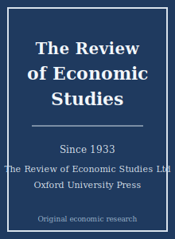

# Review of Economic Studies Skills（经济研究评论技能包）

<p align="center">
  
</p>

[](LICENSE)
[](https://academic.oup.com/restud)
[](https://academic.oup.com/restud)
[](https://github.com/anthropics/claude-code)

[English](README.md) | 简体中文

面向 **The Review of Economic Studies（REStud，经济研究评论）** 投稿的智能体技能栈——经济学“五大刊（top-5）”之一，由 The Review of Economic Studies Ltd 主办、牛津大学出版社（OUP）出版。

本仓库立场鲜明：它**不是**通用经济学写作工具箱，而是一套**专为 REStud 定制**的技能栈，覆盖原创性贡献的选题、文献定位、最前沿的因果识别、含线上附录证明的严谨理论建模、苛刻的稳健性、简洁的图表、REStud 行文风格、复现包、审稿人策略、投稿前检查，以及多轮 R&R 回复。

REStud 源自欧洲传统，以**对青年学者友好**著称——每年的 REStud Tour /“五月会议（May Meetings）”专门展示青年经济学家处于就业市场阶段的工作。

---

## 为什么需要独立的 REStud 技能栈？

REStud 与 AER / QJE / JPE / Econometrica 同处五大刊，但其重心独具特色：

| 约束维度       | The Review of Economic Studies                       | 含义                                                   |
|----------------|------------------------------------------------------|--------------------------------------------------------|
| 学科范围       | 理论**与**应用经济学，覆盖所有领域                    | 领域无关；干净的理论文与应用文同样受欢迎               |
| 标志性贡献     | 一个新模型、一种新识别策略，或一个引人注目的新事实    | “熟练套用已知工具”不够                                  |
| 标准           | 原创性 + 技术卓越 + 优雅简洁                          | 经济学含义须能被快速读懂                               |
| 识别           | 最前沿因果设计**或**严谨的结构识别                    | TWFE、弱工具、朴素 RDD 会被挑刺；假设须明确陈述         |
| 理论           | 完整、正确的证明，置于**线上附录**                    | “没有清晰经济学回报的理论”会被拒                        |
| 参考文献       | 著者—年份（Harvard）格式                              | 数字编号制不符合本刊风格                               |
| 复现           | 录用的实证论文须提供数据/代码（OUP 政策）             | 尽早规划复现包；以官网最新规则为准                     |
| 审稿           | 审稿人苛刻；强稿在多轮中被培育成型                    | 把 R&R 视为合作，而非终审判决                          |
| 青年学者       | REStud Tour / 五月会议专门展示青年工作                | 一个锋利的贡献胜过一篇庞杂的论文                       |

通用的“科学写作”或“经济学写作”技能包无法覆盖这些约束。易变的具体信息（现任主编、确切费用、确切字数限制）会变化——本技能栈给出**持久性规范**，并提示你前往期刊官网核实具体数字。

---

## 快速开始

### 方式 A —— Claude Code 插件（推荐）

```bash
/plugin marketplace add https://github.com/brycewang-stanford/restud-skills
/plugin install restud-skills
/reload-plugins
```

### 方式 B —— 手动复制

```bash
git clone https://github.com/brycewang-stanford/restud-skills.git
cd restud-skills

mkdir -p ~/.claude/skills && cp -R skills/restud-* ~/.claude/skills/
# 或
mkdir -p ~/.codex/skills && cp -R skills/restud-* ~/.codex/skills/
```

### 第一条指令

```
用 restud-workflow 告诉我，我的 REStud 稿件下一步该用哪个技能。
```

---

## 默认工作流

```text
restud-topic-selection
        ▼
restud-literature-positioning
        ▼
restud-identification   ──┐  （实证分支）
        ▼                 │
restud-theory-model     ──┘  （理论分支；理论+实证两者皆用）
        ▼
restud-robustness
        ▼
restud-tables-figures
        ▼
restud-writing-style    （润色）
        ▼
restud-replication-package
        ▼
restud-referee-strategy
        ▼
restud-submission
        ▼
restud-rebuttal
```

`restud-workflow` 是路由器——它根据你所处阶段告诉你下一步用哪个技能。`restud-identification` 与 `restud-theory-model` 是并行分支。

---

## 技能列表

| 技能                          | 用途                                                          |
|-------------------------------|---------------------------------------------------------------|
| `restud-workflow`             | 路由器——决定下一步调用哪个子技能                              |
| `restud-topic-selection`      | 五大刊门槛测试 + 一句话原创贡献模板                            |
| `restud-literature-positioning`| 正面对比最接近的 3–5 篇文献；陈述边际贡献                     |
| `restud-identification`       | 最前沿因果设计（DID / IV / RDD / SCM / RCT）                  |
| `restud-theory-model`         | 模型构建；证明置于线上附录；强调经济学回报                     |
| `restud-robustness`           | 预判审稿人的检验；结论不依赖单一脆弱设定                       |
| `restud-tables-figures`       | 三线表、矢量图，每个图表只承载一个结果                         |
| `restud-writing-style`        | 清晰、经济的行文；结果先行的引言与摘要；著者—年份格式          |
| `restud-replication-package`  | 数据/代码复现包、README、复现性审计（以 OUP 政策为准）         |
| `restud-referee-strategy`     | 勾勒审稿人画像；投稿前预先化解其异议                           |
| `restud-submission`           | 投稿前检查 + 稿件模板（匿名、格式）                            |
| `restud-rebuttal`             | R&R 回复信结构；分类处理与“先改稿后回信”原则                   |

### 资源

- [`skills/restud-submission/templates/manuscript_template.md`](skills/restud-submission/templates/manuscript_template.md) —— REStud 稿件骨架（摘要、理论与实证主干、著者—年份文献、线上附录）
- [`skills/restud-submission/templates/checklist.md`](skills/restud-submission/templates/checklist.md) —— 8 大类投稿前自检清单
- [`resources/external_tools.md`](resources/external_tools.md) —— 经济学数据源（IPUMS、PSID、FRED、Compustat/CRSP、WDI、Comtrade 等）+ Stata / R / Python / 结构估计软件包

---

## 与其他五大刊技能栈的差异

| 维度           | The Review of Economic Studies        | AER                          | Econometrica                  |
|----------------|---------------------------------------|------------------------------|-------------------------------|
| 重心           | 原创贡献 + 优雅                        | 跨子领域关注度 / 政策意义     | 形式化 / 方法论深度           |
| 理论           | 一等公民，回报须可读                   | 受欢迎，但偏好有实证抓手      | 复杂机制本身即贡献            |
| 青年学者       | 明确展示（五月会议）                   | —                            | —                             |
| 文献格式       | 著者—年份                              | 著者—年份                    | 著者—年份                     |

若稿件是金融专属（JF / JFE / RFS），或抽象到实质是一篇数学论文，使用其他技能栈更合适。

---

## 相关链接

- [awesome-journal-skills](https://github.com/brycewang-stanford/awesome-journal-skills) —— 期刊专属技能包索引
- [AER-skills](https://github.com/brycewang-stanford/AER-skills) —— American Economic Review
- [qje-skills](https://github.com/brycewang-stanford/qje-skills) —— Quarterly Journal of Economics

---

## 许可证

MIT
