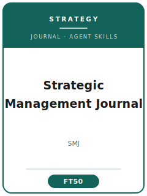

# 战略管理期刊 Skills

<p align="center">
  
</p>

[](LICENSE)
[](https://onlinelibrary.wiley.com/journal/10970266)
[](https://onlinelibrary.wiley.com/journal/10970266)
[](https://github.com/anthropics/claude-code)

[English](README.md) | 简体中文

面向 **Strategic Management Journal（SMJ，《战略管理期刊》）** 投稿的 Agent Skill 工具栈。SMJ 是战略管理领域的旗舰期刊，由 **Wiley** 为 **战略管理学会（Strategic Management Society, SMS）** 出版。

本仓库刻意**不通用**——它不是泛化的"管理学写作助手"，而是针对 SMJ 审稿口味的方法论沉淀，覆盖**以战略为本的选题、理论构建、文献定位、识别导向的研究设计、攻克内生性的数据分析、贡献表述、自洽图表、写作风格、ScholarOne 投稿、多轮评审流程、修改回复**等环节。

> 关于准确性：本工具栈描述的是**长期稳定的规范**。易变的具体信息（现任编辑、确切字数 / 篇幅限制、费用或开放获取选项、参考文献格式）会随时间变化——投稿前务必在 SMJ 官方作者指南页面核实。

---

## 为什么要为 SMJ 单独做一套 Skills？

SMJ 的约束维度与综合管理类期刊（AMJ / ASQ）以及纯理论期刊（AMR）**显著不同**：

| 约束维度     | Strategic Management Journal              | 隐含含义                                       |
|------------|-------------------------------------------|--------------------------------------------|
| 学科定位    | 战略：企业绩效与竞争优势                       | 泛"管理"或纯组织行为（OB）选题不契合              |
| 核心构念    | 企业 / 业务单元 / 联盟层面的绩效或优势结果       | 以个体态度为因变量属于范围错配                    |
| 理论        | 必须有明确的因果机制，而非带符号的预测            | "X 与 Y 相关"却无逻辑＝理论薄弱                  |
| 识别        | 必须用研究设计正面处理内生性                     | 绩效回归不处理内生性是**头号拒稿原因**            |
| 反向因果    | 必须靠设计破解，仅加滞后项不够                   | 横截面相关被视为非因果                          |
| 自选择      | 必须处理进入该战略选择的自选择问题                | 忽视自选择极易被拒                              |
| 方法门槛    | 面板固定效应 + IV / DID / 匹配 / Heckman；安慰剂与稳健性 | OLS + 控制变量通常不够             |
| 贡献        | 改变战略学者的认知                            | 罗列结论不等于贡献                              |
| 流程        | ScholarOne；执行编辑 + 多位审稿人；多轮评审       | 首轮"大修"是常见且积极的结果                     |

通用的"科研写作"或"管理学写作"Skill 包不会处理这些约束。

---

## 快速开始

### 方式 A —— Claude Code 插件（推荐）

```bash
/plugin marketplace add https://github.com/brycewang-stanford/smj-skills
/plugin install smj-skills
/reload-plugins
```

### 方式 B —— 手动拷贝

```bash
git clone https://github.com/brycewang-stanford/smj-skills.git
cd smj-skills

mkdir -p ~/.claude/skills && cp -R skills/smj-* ~/.claude/skills/
# 或
mkdir -p ~/.codex/skills && cp -R skills/smj-* ~/.codex/skills/
```

### 第一条 Prompt

```
用 smj-workflow 告诉我这份 Strategic Management Journal 目标稿子下一步该做什么。
```

---

## 默认工作流

```text
smj-topic-selection
        ▼
smj-theory-development
        ▼
smj-literature-positioning
        ▼
smj-methods
        ▼
smj-data-analysis
        ▼
smj-contribution-framing
        ▼
smj-tables-figures
        ▼
smj-writing-style       （polish）
        ▼
smj-submission
        ▼
smj-review-process
        ▼
smj-rebuttal
```

`smj-workflow` 是路由器，会根据当前阶段告诉你下一个该用哪个 Skill。

---

## Skill 一览

| Skill                       | 用途                                                       |
|-----------------------------|----------------------------------------------------------|
| `smj-workflow`              | 路由器：判断当前阶段，推荐下一个 skill                        |
| `smj-topic-selection`       | 战略契合度检验（绩效 / 优势）+ 研究问题打磨                   |
| `smj-theory-development`    | 机制优先的论证与假设构建                                     |
| `smj-literature-positioning`| 进入特定学术对话；强调理论缺口而非情境缺口                    |
| `smj-methods`               | 样本、分析单位、测量、识别设计                               |
| `smj-data-analysis`         | 攻克内生性 / 反向因果 / 自选择；机制检验 + 稳健性             |
| `smj-contribution-framing`  | 让贡献落在"战略理论"，而非泛化的管理学                       |
| `smj-tables-figures`        | 自洽图表、边际效应图与事件研究图                            |
| `smj-writing-style`         | 后段文字 polish 与期刊体例                                  |
| `smj-submission`            | ScholarOne 投稿前检查 + 清单 + 稿件模板                     |
| `smj-review-process`        | 读懂决定信；围绕关键症结规划修改                            |
| `smj-rebuttal`              | 逐条修改回复信结构                                          |

### 附属资源

- [`skills/smj-submission/templates/manuscript_template.md`](skills/smj-submission/templates/manuscript_template.md) —— SMJ 风格稿件骨架（摘要、假设、变量定义表、识别策略段、参考文献）
- [`skills/smj-submission/templates/checklist.md`](skills/smj-submission/templates/checklist.md) —— 投稿前 8 类自检清单
- [`resources/external_tools.md`](resources/external_tools.md) —— 战略研究数据源（Compustat / CRSP / SDC / BoardEx / Orbis / 专利）+ Stata / R / Python 识别工具箱

---

## 与 AMJ / ASQ / AMR 的差异

| 维度        | Strategic Management Journal | AMJ / ASQ（综合管理）        | AMR（纯理论）          |
|------------|------------------------------|----------------------------|----------------------|
| 核心问题    | 企业绩效与竞争优势              | 广义组织现象                  | 概念性推进             |
| 数据        | 必需（或强质性 / 形式化建模）     | 必需                        | 无                   |
| 识别门槛    | 极高（内生性是核心）             | 高                          | 不适用                |
| 贡献检验    | 推进**战略**理论               | 推进管理 / 组织行为理论        | 提出新理论本身         |
| 最常见拒因  | 内生性未处理；贡献偏离战略         | 契合度 / 理论                | 理论新意不足           |

---

## 这个仓库不做什么

- 不替你写出可直接投稿的稿件
- 不模拟某位具体编辑或审稿人的偏好
- 不收录 SMJ 的拒稿率、影响因子或现任编委名单（请在官网核实）
- 不替你判断贡献是否真有原创性——这是研究者本人的判断

---

## 相关仓库

- [awesome-journal-skills](https://github.com/brycewang-stanford/awesome-journal-skills) —— 期刊 Skill 索引
- [amj-skills](https://github.com/brycewang-stanford/amj-skills) —— Academy of Management Journal
- [amr-skills](https://github.com/brycewang-stanford/amr-skills) —— Academy of Management Review（纯理论）

---

## License

MIT
